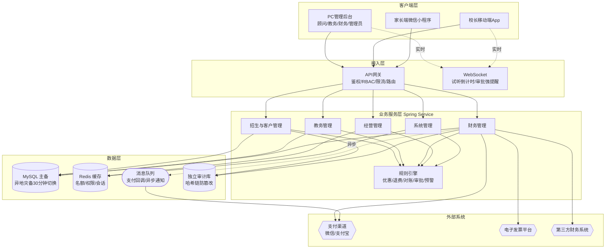
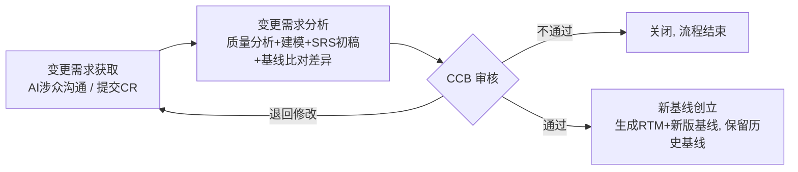

# 软件需求规格说明书（SRS·正式基线版 BL-20260623-01）· 教育培训机构教务收费管理系统

| 项目项 | 内容 |
|---|---|
| 文档名称 | 软件需求规格说明书（SRS） |
| 项目名称 | 教育培训机构教务收费管理系统 |
| 项目编号 | EDU-SRS-2026 |
| 文档版本 | V1.0.0（正式基线版） |
| 基线版本 | BL-20260623-01（已冻结） |
| 编制人 | A4 需求文档智能体（DeepSeek deepseek-v4-pro）/ 项目负责人审阅 |
| 编制日期 | 2026-06-21 |
| 审核人 | A5 需求验证智能体（已执行，见需求验证报告 v1.0） |
| 批准人 | CCB（已批准，见同目录 CCB 评审记录） |
| 密级 | 内部 |

## 修订历史记录
| 版本号 | 修订日期 | 修订人 | 修订类型 | 修订内容简述 | 审批人 |
|---|---|---|---|---|---|
| V0.1.0 | 2026-06-21 | A4 | 新建 | 据需求清单 v1.0（125 REQ）+ CCB 裁决记录 v1.0（24 ISSUE 收口）+ A3 UML 模型，生成 SRS 初稿 | 待 CCB |
| V1.0.0 | 2026-06-23 | A6 | 定版 | 经 CCB 评审通过，A5 备案项终裁，冻结为初始基线 BL-20260623-01；状态正式基线 | CCB |
| V0.2.0 | 2026-06-21 | A5 | 修订 | 据《需求验证报告 v1.0》CCB 复核裁定修订：消 FR 重号 4 处、修断引用 3 处、补覆盖缺口（CRM-004/005、BIZ-003、DR-003、ACC-003）、对齐 CCB 裁决（候补排序/试听性能/迟到与病假扣课时/退费三级审批/单边账术语/审批快照/值班校长）、收敛越界字段、量化模糊词 | 待 CCB |

> 本 SRS 由需求工程流水线产出：A1 获取 → A2 分析 → A3 建模 → **A4 生成（本文档）** → A5 验证 → CCB 审批 → A6 基线。
> 上游产物：[[需求清单-v1.0]]、[[CCB裁决记录-v1.0]]、[[UML建模说明-v1.0]]、[[需求问题清单-v2.0]]。见 [[00_项目总作战计划]]。

# 1 引言

## 1.1 编制目的

本软件需求规格说明书（SRS）旨在为 EDU 教育培训机构教务收费管理系统提供完整、清晰、可验证的功能与非功能需求定义，作为后续系统设计、编码实现、测试验证、部署验收、运行维护及变更控制的唯一权威依据。本文档面向以下读者群体：

- **项目投资方与决策层**：校长、集团负责人等，用以确认系统建设目标与业务边界。
- **业务团队**：课程顾问、教务老师、授课教师、财务人员、校区主管等，用以理解系统将如何支撑其日常工作流，并为验收测试提供业务场景参照。
- **技术团队**：架构师、开发工程师、测试工程师、运维工程师，用以统一对系统行为的理解，驱动模块划分、接口定义、编码与质量保证。
- **外部干系人**：第三方支付平台对接人员、电子发票平台集成人员、合规审计方等，用以明确系统边界与交互要求。
- **项目管理人员**：项目经理、变更控制委员会（CCB），用以追踪需求基线，评估变更影响。

本文档所载需求均已通过涉众访谈、原型确认和优先级排序，构成需求基线（Baseline）。任何后续需求变更均须经由 CCB 裁决并正式登记为 CR（变更请求），以保证需求的可追溯性。

## 1.2 文档范围

### 1.2.1 包含范围

本 SRS 完整覆盖 EDU 教育教务收费管理系统的全部五类子系统及跨子系统的全局需求，具体包括：

1. **招生与客户管理子系统**：覆盖线索获取、手机号聚合客户画像、客户家庭视图、撞单提醒、试听管理（试听名额锁定/释放、候补、改期、冲突推荐）、意向等级标注、历史报价、转介绍匹配等全部客户获取与跟进功能。
2. **教务管理子系统**：涵盖排课冲突三维度检测（教师、教室、学员）、教室间转换时间配置、家长不可用时段维护与强制排课覆盖、班级容量管理（满员候补、弹性容量、容量独立配置）、双模式签到（全员签到/扫码签到）、迟到/早退/请假规则及扣费策略、考勤修改分权审批、补课管理（自动生成补课额度、有效期及催办、补课课时费归属）、转班流程（家长端/老师端，差价按实际支付单价及赠课处理规则计算）、调课管理（权限控制、冲突检测、通知、课费联动）及多维度课时报表等全部教务运营功能。
3. **财务管理子系统**：覆盖支付渠道对账单自动拉取与匹配（含单边账处理）、收款认领强制关联订单、线下收款拆分审批、收入确认（消课确认制、赠送课时成本单独核算、旷课不计收入可例外审批、跨月消课调整）、退费计算（总课时均价、赠课不折现、折价系数、参数冻结、自动红冲）、发票管理（第三方平台对接、部分开票、红冲状态校验）、教师薪资结算（代课费独立核算、赠课计提比例、严格按实际考勤结算）、欠费管理（欠费判定、阶梯式催缴、续费提醒）、财务报表（校区营收利润表、欠费账龄分析、课程盈利分析）等核心财务核算与资金安全闭环。
4. **经营管理子系统**：覆盖校长及集团管理者所需的手机端经营看板（核心指标、趋势分析、周末聚合、数据刷新）、渠道健康度分析（投入产出、净利润）、招生与续费预警（转化周期、超期未续费排名、待续费预警）、教师效能综合视图、班级请假率/满班率监控、实时课消看板与确认收入、日终四方对账（收款-报名-课消-余额）、分级审批流程、跨校区数据权限控制、集团级资金安全强制统一、移动端异常预警与审批集成，以及家长端小程序（成长档案、自助请假调课、报名缴费实时同步）。
5. **系统管理子系统**：覆盖组织架构无限级树管理、跨校区受限角色与数据权限控制、权限模板化与批量授权、即时生效与继承叠加模式、业务政策配置中心（多维度组合配置、校验与模拟试算、规则变更的遗留数据处理）、核心数据异地灾备与自动切换、备份恢复演练与安全管控、不可篡改的审计日志、安全策略强制（密码、锁定、会话超时、双因素认证、高危操作告警）、支付异常全自动兜底与单边账处理等。

此外，本文档还需覆盖跨子系统的全局需求，例如：基于 RBAC 的多校区数据隔离、全链路操作留痕与审计日志不可篡改、核心交易数据灾备与故障切换、第三方支付/发票/财务系统的接口契约，以及满足等级保护与财务数据≥3年留存等合规要求。

### 1.2.2 排除范围

以下内容明确不纳入本 SRS 范围，由其他机制或项目解决：

- **基础硬件采购与机房建设**：服务器、网络设备的采购与物理部署，以及机房基建（供电、空调、消防等），假设已具备可用的基础设施。
- **第三方支付渠道本身的内部实现**：微信支付、支付宝等支付平台的内部流程与系统不在本系统定义范围内，仅定义与这些外部系统的接口交互要求。
- **第三方电子发票平台的自有功能**：发票平台的发票生成、存储、流转逻辑不在本系统范围内，仅定义对接接口及触发条件。
- **家长端小程序的界面视觉设计与品牌包装**：家长端 UI/UX 的具体视觉风格、品牌色、图标设计等属于 UI 设计文档范畴，本 SRS 仅规定功能行为与数据交互。
- **非功能性需求的定量测试细则**：如具体的性能压力测试脚本、安全渗透测试用例等，将由测试计划与测试用例文档承接。
- **运营管理制度与流程**：如人工审批细则、招生顾问话术、印章管理等纯管理制度，不属软件需求。
- **数据迁移与历史数据清洗**：假定历史数据已按规定格式准备完毕，数据迁移工具与一次性脚本的实施由单独的数据迁移方案负责。

## 1.3 引用文件

下列文件是本 SRS 的基础或参考，若引用文件发生修订，需评估对本 SRS 的影响并触发相应 CR。

1. GB/T 9385-2008《计算机软件需求规格说明规范》
2. IEEE Std 830-1998《IEEE Recommended Practice for Software Requirements Specifications》
3. 《EDU 教育培训机构教务收费管理系统 —— 需求清单 v1.0》（含 REQ- 编号的全部功能/非功能需求）
4. 《EDU 项目 CCB 裁决记录 v1.0》（记录需求评审会决议、冲突裁决及优先级调整结果）
5. 《EDU 项目 UML 建模说明 v1.0》（用例图、活动图、类图、状态图等建模产物）
6. 《EDU 项目涉众访谈记录合集》（包含课程顾问组、教务组、财务组、校长组、系统管理员组等五次专题访谈原始纪要）

## 1.4 术语、缩略语与定义

| 术语/缩略语 | 定义 |
|---|---|
| **SRS** | Software Requirements Specification，软件需求规格说明书，即本文档。 |
| **CCB** | Change Control Board，变更控制委员会，负责审核与决策需求变更的授权组织。 |
| **CR** | Change Request，变更请求，对已基线化的需求提出修改、新增或删除的正式记录。 |
| **FR** | Functional Requirement，功能需求，描述系统必须执行的行为或提供的服务。 |
| **NFR** | Non-Functional Requirement，非功能需求，描述系统的性能、可靠性、安全性等属性。 |
| **IFR** | Interface Requirement，接口需求，描述系统与外部实体（如支付平台、发票平台等）之间的交互契约。 |
| **RTM** | Requirements Traceability Matrix，需求跟踪矩阵，维护需求从来源到设计、实现、测试的追踪关系。 |
| **需求基线** | 经正式评审、批准并纳入版本控制的需求集合，作为后续开发与验收的唯一基准。 |
| **课时** | 一次标准教学活动的计量单位，通常对应固定的时间长度（如45分钟/60分钟）；系统以课时作为排课、消课、计费与退费的核心粒度。 |
| **消课** | 学员实际参加课程并完成签到，系统据此扣减其课包中的剩余课时，并触发收入确认。 |
| **课消率** | 已消课时数 ÷ 购买总课时数（含赠送）× 100%，反映学员课包使用进度，是财务确认收入和运营健康的重要指标。 |
| **收入确认** | 按照消课进度将预收款项转为财务报表中的营业收入，遵从“消课确认收入”原则，杜绝按收款额直接列收的财务失真。 |
| **预收款** | 学员预先缴纳的课程费用，在未消课前记为负债（预收账款），系统须严格区分收款与收入。 |
| **赠课** | 报名时作为优惠赠予的额外课时，不计入实际支付金额基数，消课时按规则参与课消，但退费时不折现、不作为退款计算基数。 |
| **试听锁定** | 课程顾问为潜在学员临时占用试听名额的操作，锁定后席位独占15分钟，超时自动释放，避免并发冲突。 |
| **候补** | 当班级满员或试听名额已罄时，学员可加入的排队序列，名额释放后按序自动通知补位。候补可分级，支持付费试听优先等策略。 |
| **满班率** | 班级实际报名学员数 ÷ 班级配置容量上限 × 100%，反映教室/教师资源的利用率。 |
| **续费率** | 在统计期内，课程包到期后继续报读下一周期的学员数 ÷ 到期学员总数 × 100%，是衡量教学质量和客户粘性的关键指标。 |
| **单边账** | 支付渠道存在成功扣款记录但系统未生成对应收款单（或反之）的未平账项，是中资金对账中需重点处理的对象。 |
| **总课时均价** | 学员购买课程包的实际支付总额 ÷（购买正课课时数 + 赠送课时数），用于退费计算和成本分析的第二单价基准。 |
| **RBAC** | Role-Based Access Control，基于角色的访问控制，系统通过角色配置实现不同用户的数据范围与操作权限隔离。 |
| **消课确认收入** | 见“收入确认”，本系统核心财务核算准则。 |
| **四方勾稽** | 指收款、报名、课消、资金余额四个维度的数据在日终对账时须相互校验一致，确保资金流与业务流无偏差。 |

## 1.5 业务背景概述

随着民办教育培训行业的竞争加剧和监管趋严，连锁/多校区机构普遍面临以下核心痛点：

- **预收费制下的收入确认难题**：家长预缴大额学费后，机构银行账户的“收入”虚高，但真实经营状况需由课消进度决定，手工计算误差大且易被人为调节，导致管理层决策依据失真。
- **退费政策混乱与财务纠纷频发**：退费时赠课折算、优惠分摊、剩余价值计算口径不一，各校区执行标准不透明，引发家长投诉与监管风险。
- **多校区运营的数据孤岛**：各校区独立采用不同记账工具甚至手工台账，排课、考勤、缴费、课消等数据割裂，集团层面难以实时掌握整体运营状况，教师跨校区串课、学员转校等场景需反复人工核查。
- **资金安全与对账效率低下**：多种收款方式（微信、支付宝、刷卡、银行转账）下，收款流水与报名订单的人工对账耗时耗力，单边账长期挂账无人处理；票据与退费审批缺乏不可篡改的审计痕迹，存在资金挪用风险。
- **教务管理效能瓶颈**：排课冲突、试听名额管理混乱、考勤修改随意、补课跟进遗漏、调课联动不足等导致教学秩序不佳，家长体验差，续费率下滑。

基于以上背景，EDU 系统建设目标明确为：

1. **全流程数字化与数据贯通**：打通“招生获客 → 报名缴费 → 排课考勤 → 课消确认 → 退费转班 → 财务对账 → 经营决策”全链路，消灭手工台账，实现多校区数据实时共享。
2. **真实经营状况反映**：坚决贯彻“消课确认收入”原则，自动计算课消率并生成符合会计准则的收入凭证，结合四方对账，向管理层呈现真实的盈利能力和资金安全状态。
3. **资金流严格勾稽与风险闭环**：构建“收款-报名-课消-余额”四维校验体系，日终自动对账，单边账实时预警，退费强制红冲，全操作留痕，确保每一分钱的来龙去脉可追溯、可审计。
4. **量化业务目标**：系统上线后6个月内，预期达成：对账人员每日对账时间从平均3小时降低至20分钟以内；退费计算纠纷下降80%；课消率报表自动生成，人工编制报表工作量降至零；多校区核心经营数据汇总延迟从3天缩短至实时；异常退费/折扣审批全部线上化，无纸化率达到100%。

系统目标使用群体包括：集团的校长/负责人、各校区的校区主管、直接面对客户的课程顾问、管理日常教学的教务老师、授课教师、进行资金核算的财务人员、负责系统配置与安全的系统管理员，以及通过家长端小程序自助服务的广大学员家长，共八类角色。系统将依据 RBAC 模型实现严格的跨校区数据隔离，保障业务灵活性与数据安全性的统一。

# 2 总体描述

## 2.1 产品概述

EDU 教育培训机构教务收费管理系统是一个面向连锁/多校区机构的综合性软件平台，致力于以“消课确认收入”为核心财务理念，重构教务、收费、对账、经营分析全业务链，实现业务与财务的一体化。产品定位为机构数字化转型中枢，通过将分散在各校区的手工记账、排课 EXCEL、个人收款码等原始作业模式，统一收敛至一个集中、安全、可审计的系统，解决收入确认难、退费口径乱、数据孤岛严重、资金风险高等行业固有痛点。

**核心价值**可以概括为：
- **一本总账**：基于统一客户主数据（以手机号为核心）和课包模型，确保所有校区的合同、收费、消课、退费数据全局一致，支撑企业级经营分析。
- **一条资金链**：实现从收款到收入确认的全程自动勾稽，通过四方对账机制堵死资金漏洞，配合不可篡改的审计日志，满足财务合规与税务稽查要求。
- **一套规则引擎**：内建可配置的业务政策中心，统一管理优惠叠加、退费计算、赠课策略、迟到请假扣费、欠费联动等复杂规则，消除各校区、各人执行差异，并支持模拟试算和变更溯源。
- **一部移动驾驶舱**：为校长和校区主管提供实时经营看板，异常指标主动预警，审批流程在移动端实现闭环，让管理者随时掌握真实盈利、续费风险、课消进度等关键信息。

在架构思想上，系统遵循经典的四层分层架构（与后续将统一提交的架构图呼应）：
- **表现层（Controller / 前端）**：提供课程顾问、教务、财务等不同角色的 Web 管理后台，以及面向家长的微信小程序。支持 PC 与移动双端，注重交互体验，如试听锁定倒计时、冲突弹窗、审批声音振动强提醒等。
- **业务服务层（Service）**：集中封装全部业务逻辑，包括客户画像聚合、冲突检测引擎、报价与优惠试算、课消与收入计算、退费退差算法、对账匹配策略、审批流引擎、预警规则引擎等。服务层保持无状态，易于横向扩展。
- **数据访问层（Repository / DAO）**：通过 ORM 框架操作 MySQL 关系库，并利用 Redis 缓存热点数据（如组织架构、角色权限、课表临时状态、试听名额计数等），保障高并发下的响应性能。
- **领域模型层（Model / Domain）**：抽象客户（家庭）、学员、课程包、班级、排课、考勤、收款单、课消记录、退费单等核心实体及其关系，确保数据的一致性与完整。

此外，系统设计了一组基础设施支撑特性，如基于哈希链的审计日志防篡改、独立审计库、核心库的异地灾备与自动切换、消息队列驱动的异步通知等，以满足金融级的安全与可靠性要求。

### 系统总体架构图（四层分层，Mermaid 可渲染）


## 2.2 运行环境要求

### 2.2.1 硬件环境

- **应用服务器**（推荐 x86 架构，Linux 操作系统）：
  - 生产环境：至少 4 节点集群，每节点 8 核 CPU、32 GB RAM、500 GB SSD，千兆及以上网络带宽。
  - 测试/预发布环境：2 节点，每节点 4 核 CPU、16 GB RAM、200 GB SSD。
- **数据库服务器**：
  - 主数据库（MySQL）：2 台物理机或同等性能云主机组成高可用（主备），每台 16 核 CPU、64 GB RAM、2 TB SSD 存储（RAID 10），支持 10K QPS 以上读写。
  - 缓存服务器（Redis）：集群模式至少 3 主 3 从，每节点 8 核 CPU、32 GB RAM。
- **文件存储与备份**：独立的 NAS 或对象存储，用于存放审计日志快照、电子发票文件、备份文件等，容量按年增量预估 ≥10 TB。
- **客户端**：支持 PC 端（建议 i5 处理器、8 GB 内存以上），移动端 Android 8.0+ / iOS 13+ 手机，任意主流品牌设备。

### 2.2.2 软件环境

- **服务器操作系统**：CentOS 7.9+ / Ubuntu 20.04 LTS 或同等 Linux 发行版。
- **Java 运行时**：JDK 11 或 17 LTS 版本。
- **应用框架**：Spring Boot 2.7.x / Spring Cloud（如需微服务拆分），Tomcat 嵌入式容器。
- **数据库**：MySQL 8.0+（InnoDB 引擎，支持事务与行级锁），推荐开启 GTID 用于灾备切换。
- **缓存**：Redis 6.2+ 集群模式。
- **消息中间件**：RocketMQ 4.9+ 或 RabbitMQ 3.9+，用于支付回调异步处理、通知推送等。
- **Web 服务器（前端）**：Nginx 1.22+ 作为反向代理与静态资源服务。
- **客户端浏览器**：支持 Chrome 90+、Edge 90+、Safari 14+ 等现代浏览器，移动端可嵌入微信小程序 WebView。
- **第三方集成**：
  - 支付：微信支付 V3 API、支付宝开放平台 API。
  - 电子发票：对接航信/百望等税控发票平台 HTTPS 接口。
  - 短信/推送：阿里云短信服务、微信模板消息/公众号消息接口。

## 2.3 用户角色与特征

| 角色名称 | 职责描述 | 操作权限 | 使用频次 | 技能要求 |
|---|---|---|---|---|
| **课程顾问** | 负责招生获客、线索跟进、试听预约、报价签约、转介绍激活；是系统最主要的一线销售角色。 | 拥有招生与客户管理子系统的全部功能，包括查询客户画像、录入线索、预约/锁定/释放试听名额、报价、发起报名缴费、查看个人业绩数据；无教务排课、财务退费操作权限。 | 日常工作高频使用，每日在线时长约 6-8 小时，处理数十至上百条线索与约听。 | 基本电脑操作，会使用微信与客户沟通，经系统培训 3 天后可熟练操作。 |
| **教务老师** | 负责日常排课、调课、考勤管理、补课安排、转班处理、课时统计等教务运行保障工作。 | 拥有教务管理子系统全部功能，包括排课冲突检测、教室容量配置、调课留痕、考勤修正（当日）、补课额度发放与确认、转班差价计算、教师/班级/学员维度报表导出等；通常无财务退费、经营看板自定义权限。 | 高频使用，排课季或开学初集中排课，日常调课、考勤操作每日数 10 次。 | 熟练使用 EXCEL 进行课表排布与统计，了解校区日常运作，经 1 周实训后可独立操作。 |
| **授课教师** | 负责课程教学、课堂考勤标记（全员签到或学员扫码）、课堂评价、学员成长反馈等。 | 拥有教学相关的权限：查看个人课表、所带班级学员信息、一键全员签到或引导学员扫码签到、录入课堂表现与点评、申请调整考勤（当日）、查看个人课时费报表；无排课、调课权限，也无财务操作权限。 | 每日上课前、后使用，每节课签到及课后反馈各 1-2 次。 | 能使用手机 App 或 PC 完成简单签到、录入文字或语音点评，经 1 小时培训即可。 |
| **财务人员** | 负责收款核对、支付对账、退费审批、发票管理、收入成本核算、教师薪资结算、逾期催缴等财务工作。 | 拥有财务管理子系统全部功能及报表，包括对账单拉取与匹配、待认领收款处理、在线/线下收款拆分审批、退费计算确认与红冲、发票开票与冲红、薪资计算、欠费催收配置与执行、财务报表生成与导出等；可查看但无权限修改教务数据。 | 每日需处理对账与日常资金流水，月初月末薪资及结账期使用频次密集。 | 财务专业背景，熟悉会计准则及教育行业财务实务，接受过 2 天系统专项培训。 |
| **校区主管** | 负责单个校区的整体运营管理，包括教务监督、销售转化率监控、退费审批（限额内）、教学质量管理等。 | 拥有本校区范围的经营管理与审批权限：查看本校区的经营看板、渠道健康度、续费率、满班率、教师效能等报表；可审批本校区的调课、考勤修正（跨日）、限额内退费、折扣特批等；无跨校区数据访问权限，无权修改集团级规则配置。 | 每日登录查看昨日/今日关键指标，审批操作按需随时处理，周末亦可能处理紧急审批。 | 管理经验，熟悉校区业务全貌，能理解各项经营指标含义，经 1 天培训后可掌握。 |
| **校长/集团负责人** | 负责整个教育集团的战略决策、多校区资源调配、财务风控、组织架构与政策审批。 | 拥有最高数据访问权限：可查看集团及所有校区实时经营数据，接收异常预警；审批大额退费、深度折扣、全校性政策调整；可以配置集团统一的组织架构、业务规则、审批流程。无直接排课、具体学员操作的必要，但可钻取到明细数据。 | 每日早、中、晚查看核心指标及预警，审批操作集中在移动端，随时处理。 | 教育行业高层管理经验，关注关键绩效指标，经 30 分钟移动端操作讲解即可上手。 |
| **系统管理员** | 负责系统日常运维、用户账号/权限管理、系统配置、安全策略维护、备份恢复等工作，不参与具体业务操作。 | 拥有系统管理子系统全部权限：组织架构树维护、角色与权限模板配置、批量授权、安全策略（密码策略、2FA）启用、审计日志查看、灾备切换、业务规则配置等；无业务模块的数据修改权限（如修改考勤、录入收费），仅做配置与管理。 | 平时按需配置，系统上线初期配置频繁，后续每月或每季维护。 | 具备 IT 运维经验，理解 RBAC、数据库、网络等基本概念，经过 2 天专项培训。 |
| **家长（家长端/小程序）** | 学员的监护人，通过微信小程序与系统交互，实现查看课表、请假、补课预约、缴费、接收通知等自助服务。 | 拥有家长端功能：查看关联子女的课程表、考勤明细、剩余课时及课消进度、成长档案；发起请假、转班申请、补课预约、续费报名；接收缴费通知、审批结果、调课提醒等。无后台业务管理权限。 | 按需使用，上课日每日查看课表或通知，每周约 2-3 次交互。 | 会使用微信小程序，无需额外培训，界面有引导。 |

## 2.4 系统运行模式

系统设计为支持以下三种运行模式，以确保在不同场景下的服务连续性、资金安全和用户体验：

- **正常模式**：所有基础设施与服务单元全面可用，用户通过正常鉴权登录，核心业务流程（招生报名、排课考勤、支付结算、对账审批等）按预设逻辑全自动流转。缓存（Redis）加速热数据访问，消息队列保障异步任务（如通知推送、支付主动查单）的可靠执行。数据库读写分离，主库负责写入，备库承担报表生成等只读任务。日终自动执行对账与消课收入结转任务。此模式下，试听锁定倒计时、审批超时催促等前端实时特性均基于 WebSocket 长连接实现秒级同步。

- **异常降级模式**：当个别外部依赖（如第三方支付平台回调延迟、电子发票平台临时不可用）或部分非核心服务出现中断时，系统自动进入降级模式，以保护核心交易链路。
  - **支付降级**：支付回调超时时，系统在用户支付确认页面显示“支付结果确认中”，同时后台启动主动查单（每 15 秒查询一次，最多 3 次），若渠道侧已扣款，则系统自动补登收款单并更新订单状态。超过设定的重试窗口仍未明确状态，则该笔交易自动标记为“在途”，并推送到财务人员工作台的异常处理清单，同时记录至单边账监控报表。期间学员正常上课的功能不受影响（基于报名状态而非支付确认）。
  - **发票服务降级**：开票服务不可用时，系统暂存开票请求，界面提示“开票服务繁忙，我们将在恢复后自动为您开具电子发票”，支付流程不因此阻塞。服务恢复后自动批量补开。
  - **查询报表降级**：当数据库主库压力过高时，复杂报表查询自动切换至只读备库或预先计算好的快照缓存中，保证经营看板核心指标仍可近似实时查看，但明细下钻可能略有延迟，界面给出“当前为降级模式，数据有约5分钟延迟”的提示。
  - **消息通知降级**：短信通道故障时，系统自动将通知降级为站内信，并记录未触达记录，待通道恢复后补发。

- **维护模式**：当进行系统版本升级、数据库主备切换演练、重大配置变更等计划内维护操作时，管理员可切换至维护模式。此时所有外部用户（课程顾问、教务、财务、家长、校长）的登录页面将显示友好维护提示——“系统升级中，预计 XX:XX 恢复服务”，禁止不可预见的操作。但对于正在上课期间的考勤操作，系统允许授课教师通过离线缓存方式完成签到数据暂存（支持本地存储并网络恢复后自动同步）。所有支付接口在维护模式开始前 10 分钟暂停发起新的支付请求，已进行中的支付回调不受影响（通过消息队列持久化保证不丢失）。维护完成后，系统强制触发一次完整的数据一致性校验（收款、报名、课消、余额四方对账），确认无缺口后切换回正常模式。

## 2.5 设计与实现约束

### 2.5.1 技术约束

- **后端技术栈**：服务器端必须基于 Java 语言开发，采用 Spring Boot 框架，遵循分层架构：Controller（接收 Web 请求）、Service（业务逻辑）、Repository（数据访问）、Model（领域模型）。禁止在 Controller 层编写复杂业务逻辑，Service 层应采用事务性边界，确保数据一致性。
- **数据库**：核心业务数据存储于关系型数据库 MySQL 8.0，需充分利用 InnoDB 的事务、行级锁及外键约束（逻辑外键可酌情使用）特性。对于课表容量计数、试听名额锁定等高频并发场景，必须基于数据库行锁或 Redis 原子操作实现，避免超卖。
- **缓存策略**：使用 Redis 作为分布式缓存，主要解决会话管理、高频读取的组织架构数据、教室/教师容量状态、试听锁定临时状态、反查黑名单、短期令牌等。缓存数据必须设置合理的失效时间，并在数据变更时主动失效或更新，保持与数据库的最终一致性。
- **接口通信**：与第三方支付平台、电子发票平台、财务系统的交互基于 HTTPS 协议，采用 RESTful API 或官方 SDK 进行。所有外部接口调用必须包含完整的超时、重试、熔断机制，并在网络请求/响应层记录摘要日志，支付相关接口需记录全量请求与响应（脱敏后）至审计库。接口传输的敏感字段（如银行卡号、支付密码除外）必须加密或经商户密钥签名。
- **前端技术**：后台管理前端推荐使用 Vue.js / React 等 SPA 框架，家长端依托微信小程序原生框架。前端与后端通过 JSON 数据交互，对于实时性要求高的功能（如试听名额变化、审批倒计时）采用 WebSocket 长连接。
- **构建与部署**：系统应基于 Maven/Gradle 构建，实现自动化打包；支持 Docker 容器化部署，配合 Kubernetes 或 Docker Compose 进行编排管理，便于多节点水平扩展。

### 2.5.2 合规约束

- **信息安全等级保护**：系统整体需不低于信息安全等级保护第二级要求，核心交易模块（支付、退费、财务数据）应参照第三级可信环境保护。必须实现身份鉴别、访问控制、安全审计、通信保密性、数据完整性等基本安全措施。
- **财务数据留存**：所有财务相关数据（收款单、消课记录、退费单、发票、对账报表、凭证分录）必须在线保留至少 3 年，支持随时查询与导出。超过 3 年的数据允许归档至独立存储，但须保证可在 24 小时内恢复查询。
- **审计合规**：审计日志必须记录操作人、操作时间、IP 地址、操作模块、动作类型、操作前后的数据快照。日志存储于独立审计库，实施基于哈希链的防篡改机制，任何角色（包括系统管理员、DBA）无物理删除或修改审计日志的能力。审计日志的保留期不少于 5 年。
- **支付合规**：系统不得存储客户的银行卡支付密码、CVV 码，支付令牌由第三方渠道管理。收付款流程需符合人民银行支付结算相关规定，确保资金流转合法合规。
- **隐私保护**：学员和家长个人信息的采集、使用、存储需符合《个人信息保护法》要求，提供家长端隐私政策确认入口，支持用户查询、更正、删除个人数据（在财务留存法规冲突时，删除操作仅做标记并记录依据，物理数据保留到法定期限）。

### 2.5.3 接口约束

- **支付渠道接口**：系统统一生成平台收款单，用户支付时跳转至微信/支付宝收银台。支付结果必须以后台异步通知（回调）为准，前端不可作为最终状态依据。系统需每日主动下载渠道对账单（TXT/CSV 格式），并按定义好的统一内部格式解析入库。
- **电子发票接口**：通过第三方发票平台 API 进行发票开具、查询、红冲。接口需支持开票抬头二次确认，且开票金额不得修改，必须与系统内收款单金额一致。红冲操作必须传原发票流水号，红冲完成后系统实时更新发票状态。
- **第三方财务系统**：财务凭证接口采用标准的凭证导入格式（如用友/金蝶格式的 Excel 模板或 API），每天日终对账后将收入确认凭证、退费凭证、成本结转凭证等导出或推送至财务系统。支持手动补推及异常重试。

### 2.5.4 数据约束

- **多校区数据隔离**：学员、课程包、班级、教师、收款单等核心实体均带有校区属性。系统必须在数据访问层默认根据登录用户所属校区及授权范围过滤数据，避免越权访问。集团负责人可选择切换校区视角查看全局。
- **数据一致性**：涉及资金、课消、课包操作的关键业务（如报名缴费、消课签到、退费）必须确保数据库事务的 ACID 特性。复杂的跨表更新逻辑需在 Service 层采用细粒度锁或乐观锁控制并发，避免数据错乱。
- **灾备约束**：核心业务数据库（MySQL）必须实现跨机房主备同步，故障时可在 30 分钟内完成自动或人工切换，切换时需保证数据零丢失（强同步或最大保护模式）。Redis 集群同样需要跨机房备份持久化数据。

## 2.6 假设与依赖

### 2.6.1 前提假设

1. **机构管理规范假设**：假设各校区在系统上线前能够统一内部流程（如请假提前 2 小时、退费计算口径等），并接受系统固化的规则，不再沿用校外私下的变通操作。
2. **基础网络通畅**：假设所有校区已具备稳定的互联网连接，带宽满足日常操作要求，无频繁断网故障。
3. **用户培训到位**：假设所有角色（尤其是课程顾问与教务老师）在上线前已完成系统操作培训，并能熟练使用。
4. **数据初始化完备**：假设历史学员、课包、课程、教师数据已整理清洗，并按要求的格式导入系统，导入后数据完整、准确。
5. **支付账户正常**：假设机构已在微信支付、支付宝等平台完成商户入驻，API 密钥、证书等已正确配置于系统内。
6. **电子发票平台接入**：假设第三方电子发票平台提供标准的 API，且机构已完成税控盘、发票库存等必要配置。
7. **审批权责明确**：假设集团已明确各层级审批权限的金额、折扣阈值等规则，系统依此配置后不再频繁变更。

### 2.6.2 外部依赖

1. **支付渠道依赖**：系统的收款、退款流程高度依赖微信支付、支付宝的 API 可用性。若渠道服务宕机或限流，系统收款功能将进入降级模式，需渠道恢复后继续处理。
2. **电子发票平台依赖**：发票开具、冲红功能依赖第三方电子发票平台的接口服务。平台服务中断将导致系统无法正常开票，但不影响支付与上课核心流程。
3. **短信/消息推送服务依赖**：通知提醒（如审批催促、排课变更通知）依赖阿里云短信或微信模板消息等服务。若推送服务故障，系统将降级为站内信，待恢复补发。
4. **外部财务系统依赖**：凭证推送依赖上游财务系统的接口可用性及数据格式兼容性。若财务系统处于封闭升级期，凭证文件可暂存系统内，待恢复后手动或自动补推。
5. **网络与 DNS 依赖**：系统正常运行依赖 DNS 解析服务、CDN 服务、负载均衡器等基础设施的稳定。
6. **时间同步依赖**：分布式环境下，试听锁定倒计时、考勤时间判定、对账时间窗口等功能依赖服务器时间与 NTP 时间服务器保持同步，否则可能产生误解或错账。

# 3 具体需求

## 3.1 功能需求（FR）

> 编号规则：FR-<模块缩写>-<三位序号>；优先级 P0(必实现)/P1(重要)/P2(次要)；每条可追溯到 REQ 与 A3 用例/活动图。

### 3.1.1 招生与客户管理子系统

#### FR-CRM-001 查询客户画像与历史
- **优先级**：P0
- **参与角色**：课程顾问
- **前置条件**：顾问已登录系统并获得RBAC授权。
- **触发方式**：在客户咨询页输入“手机号”并发起查询。
- **业务流程**：
  1. 顾问在客户咨询页输入客户手机号并点击查询。
  2. 系统校验手机号格式。
  3. 系统在客户信息库中检索该手机号。
  4. 若命中，系统聚合展示客户历史画像；若未命中，提示“新客户”，并引导创建档案。
  5. 画像聚合内容必须包含：家长身份信息、关联的所有孩子档案、历史咨询/试听/报价/跟进记录、最新意向等级、归属顾问、转介绍来源、关联学员的试听上课记录(上课日期、任课老师、课堂表现、家长课后反馈)、历次报价的完整方案(报价日期、课程包、价格、优惠方案、未成交原因)。
  6. 系统提供一键跳转至任一关联孩子的详情、试听记录或报价单页面。
- **业务规则**：
  - BR-CRM-001: 手机号查询响应时间 P95 ≤ 3秒。
  - BR-CRM-002: 一个手机号可绑定并同屏展示至少2个学员档案。
- **输入/输出**：
  - 输入：11位手机号。
  - 输出：客户完整历史画像聚合视图。
- **后置状态**：客户画像信息加载完成，顾问可进行后续跟进操作。
- **异常处理**：
  - 手机号格式非法：输入框实时校验，提示“请输入有效的11位手机号”。
  - 查询超时（>3秒）：提示“网络繁忙，请稍后重试”。
- **验收标准**：
  - 输入已存在手机号查询，界面在3秒内完整加载聚合画像，包含所有规定字段。
  - 一个手机号下关联≥2个孩子时，家庭视图清晰展示每个孩子的独立信息。
- **追溯**：REQ-CRM-001, REQ-CRM-002, REQ-CRM-004, REQ-CRM-005；用例：查询客户画像与历史。

#### FR-CRM-002 录入客户线索
- **优先级**：P0
- **参与角色**：课程顾问
- **前置条件**：顾问获得“新建客户”权限。
- **触发方式**：点击“新建客户”按钮并开始录入信息。
- **业务流程**：
  1. 顾问录入新客户信息，必填手机号。
  2. 手机号输入框失去焦点或提交时，系统执行实时查重。
  3. 若命中已有客户，系统不阻断录入，但强制弹窗提示：
     - a. 该客户已有归属顾问(姓名按配置脱敏展示)；
     - b. 最近一次跟进记录的摘要；
     - c. 顾问可选择仍作为“潜在冲突”新建，或放弃转入原客户详情 - c. 顾问可选择仍作为“潜在冲突”新建，或放弃转入原客户详情页。
  4. 若未命中，正常完成建档。
  5. 新建成功后，系统自动将当前顾问设为“归属顾问”。
- **业务规则**：无额外CCB规则。
- **输入/输出**：
  - 输入：客户基本信息（手机号必填，姓名、来源渠道等可选）。
  - 输出：创建成功的客户档案，或撞单提示弹窗。
- **后置状态**：
  - 未撞单：新客户档案创建成功，状态为“潜在客户”。
  - 撞单：新建客户档案被标记为“归属冲突”，并记录此次事件。
- **异常处理**：
  - 必填字段（手机号）缺失：保存按钮置灰，提示“请填写手机号”。
- **验收标准**：
  - 录入已存在的手机号，系统100%弹出撞单提示，且信息准确。
  - 撞单提示不阻断业务，仍可成功新建档案。
- **追溯**：REQ-CRM-003；用例：录入客户线索。

#### FR-CRM-003 标注客户意向等级
- **优先级**：P1
- **参与角色**：课程顾问
- **前置条件**：客户已建档。
- **触发方式**：在客户详情页或客户列表页进行操作。
- **业务流程**：
  1. 顾问选择一个客户，点击“标注意向”下拉菜单。
  2. 从选项（高、中、低）中选择一个等级。
  3. 系统保存标注结果。
  4. 在顾问的跟进任务列表中，待跟进客户默认按意向等级由高到低排序。
- **业务规则**：无额外CCB规则。
- **输入/输出**：
  - 输入：意向等级（高/中/低）。
  - 输出：更新后的客户意向等级。
- **后置状态**：客户意向等级更新，跟进任务列表排序实时调整。
- **异常处理**：无。
- **验收标准**：
  - 标注为“高”的客户在跟进任务列表中排在最前，其后是“中”，最后是“低”。
- **追溯**：REQ-CRM-006；用例：标注客户意向等级。

#### FR-TRIAL-001 查看试听名额
- **优先级**：P0
- **参与角色**：课程顾问
- **前置条件**：顾问已登录，当前校区下有已排课的试听班级。
- **触发方式**：在试听预约页面选择课程、校区等条件，点击查询或展开班级详情。
- **业务流程**：
  1. 顾问选择筛选条件：课程、校区、日期范围、适合年龄段。
  2. 系统展示符合条件的试听班级列表，含：课程名称、上课时间、任课老师、剩余试听名额。
  3. 顾问点击任一班级展开详情，系统在2秒内显示该班级的精确剩余名额。
  4. 名额数据必须实时，反映当前并发锁定状态。
- **业务规则**：
  - BR-TRIAL-001: 数据实时性要求P99≤3秒，目标≤1秒；>5秒触发告警。
  - BR-TRIAL-002: 班级试听名额 = 教室最大容量 - 常规学员数 - 已被锁定或预约的试听名额。
- **输入/输出**：
  - 输入：筛选条件。
  - 输出：试听班级列表及其剩余名额。
- **后置状态**：界面当前名额数据可见，可进行锁定操作。
- **异常处理**：
  - 名额查询接口超时（>5秒）或失败：界面提示“名额信息加载失败，请刷新重试”，并禁用锁定按钮。
- **验收标准**：
  - 展开班级详情到显示剩余名额的时间≤2秒。
  - 同一时段名额，在A顾问锁定的瞬间，B顾问界面名额同步扣减。
- **追溯**：REQ-TRIAL-001, REQ-TRIAL-004；用例：查看试听名额。

#### FR-TRIAL-002 锁定试听名额
- **优先级**：P0
- **参与角色**：课程顾问
- **前置条件**：目标班级的剩余可锁试听名额 > 0。
- **触发方式**：在班级详情页点击“锁定名额”按钮。
- **业务流程**：
  1. 顾问点击锁定。
  2. 系统进行并发冲突检测，判定依据为“含前后各5分钟缓冲的完整占用时段”是否与任何已有占用重叠。
  3. **路径A（锁定成功）**：
     - a. 系统记录锁定关系，为该客户生成一个15分钟的倒计时占位。
     - b. 将剩余试听名额减1，并在所有相关界面实时同步。
     - c. 客户记录状态变为“试听锁定中”。
     - d. 顾问界面显示“锁定成功”及15分钟倒计时，并提供“立即释放”按钮。
  4. **路径B（锁定冲突）**：
     - a. 若检测到时段冲突，锁定失败。
     - b. 界面立即（≤2秒）弹窗提示冲突，并自动推荐同课程、同一周的备选时段。
  5. 15分钟倒计时结束，若客户未转为正式预约，系统自动释放名额。
  6. 顾问可随时点击“立即释放”手动释放名额。
- **业务规则**：
  - BR-TRIAL-003: 锁定占用检测基于“前缓冲(5分钟)+课程时段+后缓冲(5分钟)”模型。
  - BR-TRIAL-004: 占用互斥，同一时段同一班级的试听名额，先锁定者独占。
  - BR-TRIAL-005: 锁定状态保留15分钟，到期自动触发释放。
- **输入/输出**：
  - 输入：锁定指令。
  - 输出：锁定成功（含倒计时）或锁定冲突推荐（含备选时段列表）。
- **后置状态**：
  - 成功：该时段试听名额被锁定15分钟，他人不可再锁定。
  - 失败：名额不变，弹出冲突推荐。
  - 到期/手动释放：名额回池+1，客户锁定状态变为“已释放”。
- **异常处理**：
  - 锁定过程中网络中断：在恢复后需重新查询最新名额状态。
- **验收标准**：
  - 两个顾问同时锁定同一时段最后一个名额，只有一人成功，另一人收到冲突弹窗。
  - 锁定成功后15分钟，若未操作，名额自动释放。
- **追溯**：REQ-TRIAL-002, REQ-TRIAL-004；用例：锁定试听名额，处理锁定冲突推荐。

#### FR-TRIAL-003 处理锁定冲突推荐
- **优先级**：P0
- **参与角色**：课程顾问
- **前置条件**：触发FR-TRIAL-002中的路径B（锁定冲突）。
- **触发方式**：系统自动弹出。
- **业务流程**：
  1. 系统检测到锁定冲突后，弹窗显示“该时段名额已被锁定”。
  2. 系统自动查询并展示该课程未来2周内仍有名额的班级。
  3. 推荐列表按优先级排序：（时间最近 > 剩余名额最少）。
  4. 列表项包含：上课日期、时间、任课老师、剩余名额。
  5. 顾问可在弹窗内直接点击“锁定此名额”进行抢占，或点击“加入候补”为当前时段排队。
- **业务规则**：
  - BR-TRIAL-006: 冲突弹窗响应时间 ≤ 2秒。
  - BR-TRIAL-007: 备选时段排序逻辑可由管理员配置，默认：主排序为日期由近及远，次排序为剩余名额由少至多。
- **输入/输出**：
  - 输入：锁定失败事件。
  - 输出：备选时段推荐弹窗。
- **后置状态**：顾问跳转锁定备选时段或加入原时段候补。
- **异常处理**：
  - 若未来两周内完全没有可选班级，弹窗提示“该课程暂无其他试听名额，建议加入候补或联系教务”，并提供“加入候补”按钮。
- **验收标准**：
  - 冲突发生后，2秒内弹出推荐窗口。
  - 推荐列表中的班级，时间、老师、名额信息准确。
- **追溯**：REQ-TRIAL-004；用例：处理锁定冲突推荐。

#### FR-TRIAL-004 改期/取消试听
- **优先级**：P0
- **参与角色**：课程顾问
- **前置条件**：存在一个状态为“已预约”或“已锁定”的试听记录。
- **触发方式**：在预约详情页点击“改期”或“取消”。
- **业务流程**：
  1. **改期**：
     - a. 顾问点击“改期”，进入班级选择页面，原时段被高亮。
     - b. 顾问选择一个同课程其他班级，点击“确认改期”。
     - c. 若目标时段有空余名额，系统自动执行：释放原时段（名额回池），并按FR-TRIAL-002锁定目标时段。
     - d. 若目标时段已满，系统提示“目标时段已满”，并提供“加入候补”入口，将原时段释放。
  2. **取消**：
     - a. 顾问点击“取消”。
     - b. 系统弹窗要求必填“取消原因”（如：时间冲突、找到更合适课程等），并选填“备注”。
     - c. 确认后，系统立即释放名额，试听记录状态变为“已取消”。
  3. 每次改期操作，系统自动记录改期次数和原因，更新客户画像。
- **业务规则**：无额外CCB规则。
- **输入/输出**：
  - 输入：改期目标班级、取消原因。
  - 输出：操作成功/失败提示。改期成功则更新预约信息；取消成功则释放名额。
- **后置状态**：
  - 改期：原时段释放，新时段被锁定。
  - 取消：名额回池，记录原因，客户画像更新。
- **异常处理**：
  - 改期过程中目标时段被并发锁定：回退操作，原时段保留，并返回冲突提示和备选方案。
- **验收标准**：
  - 改期操作，前后端两端名额一增一减，总名额数恒定。
  - 取消时必须选择原因，否则无法提交。
- **追溯**：REQ-TRIAL-003, REQ-TRIAL-006, REQ-TRIAL-009；用例：改期/取消试听。

#### FR-TRIAL-005 管理候补队列
- **优先级**：P1
- **参与角色**：课程顾问
- **前置条件**：目标班级试听名额为0。
- **触发方式**：在班级详情页或冲突推荐弹窗中点击“加入候补”。
- **业务流程**：
  1. 顾问点击“加入候补”。
  2. 系统弹出候补登记窗，自动填充学员信息。
  3. 系统按报名来源自动判定队列类型：
     - a. 付费试听报名学员进入“高级队列”；
     - b. 普通咨询学员进入“普通队列”。
  4. 顾问可手动标注“家长意向优先级”（非此时段不可/优先此时段/任意时段均可）作为独立的次要排序权重。
  5. 提交后，学员加入候补队列，按综合优先级排序。
  6. 当该时段名额因取消、释放等原因回池时，系统立即（≤1分钟）按排序从候补队列中取出首个匹配的学员，并向其归属顾问发送补位通知。
- **业务规则**：
  - BR-TRIAL-008: 试听候补队列综合排序权重（由高到低）：队列类型(付费试听高级队列 > 普通咨询队列) > 家长紧急程度(1天内 > 3天内 > 7天内 > 其他) > 进入时间；其中家长意向优先级（非此时段不可/优先此时段/任意时段均可）为独立的次要排序权重，仅在家长紧急程度相同时生效。
  - BR-TRIAL-009: 名额释放后，通知生成时间 ≤ 1分钟。
  - BR-TRIAL-010: 通知统一通过“通知中心”发送，渠道优先级：微信 > 短信 > 站内信。
- **输入/输出**：
  - 输入：候补学员信息、家长意向优先级（可选）。
  - 输出：进入候补队列的确认信息。
- **后置状态**：学员进入指定时段试听候补队列。
- **异常处理**：
   - 若多个名额同时释放，系统需保证每次只为队列中的下一人分配名额，防止一单多占。
- **验收标准**：
  - 付费试听学员在名额释放时优先于普通咨询学员获得补位通知。
  - 从名额回池到生成“补位”通知的时间不超过1分钟。
- **追溯**：REQ-TRIAL-005, REQ-TRIAL-007, REQ-TRIAL-008；用例：管理候补队列。

#### FR-ORDER-001 计算优惠与报价
- **优先级**：P0
- **参与角色**：课程顾问
- **前置条件**：已选择报读课程、课时数等基本订单信息。
- **触发方式**：在订单创建页面，勾选或取消勾选优惠方案。
- **业务流程**：
  1. 顾问进入报价页面，系统展示所有可用的优惠方案。
  2. 顾问勾选一项或多项优惠。
  3. 系统实时（≤1秒）进行规则检查：
     - a. 判断勾选的优惠项之间是否存在明确的互斥规则。
     - b. 若不存在互斥，则自动计算出最终待支付价格。
     - c. 若存在互斥，系统阻止同时勾选，并给出明确的文字提示，说明互斥原因（如“早鸟优惠与连报优惠不可同享”）。
     - d. 若规则模糊或组合后超出常规优惠范围，系统界面在展示最高优惠报价的同时，提供“申请特批”入口。
  4. 系统清晰展示：课程原总价、每一项已用优惠及减免金额、最终应付金额。
- **业务规则**：
  - BR-ORDER-001: 勾选优惠后，系统响应时间 ≤ 1秒。
  - BR-ORDER-002: 互斥优惠识别并阻止叠加，提供明确的互斥规则说明。
  - BR-ORDER-003: 规则冲突/模糊时，按“最高优惠方案”预报价，并触发审批流程（延续至FR-ORDER-002）。
- **输入/输出**：
  - 输入：订单基础信息，勾选的优惠项。
  - 输出：动态计算的最终报价单，或“申请特批”入口。
- **后置状态**：展示最终报价，或者为生成特批申请做准备。
- **异常处理**：
  - 优惠规则计算引擎异常：提示“价格计算失败，请稍后重试”，禁用下一步。
- **验收标准**：
  - 勾选互斥的两项优惠，系统100%阻止并显示具体原因。
  - 勾选优惠到显示最终价格，响应时间≤1秒。
- **追溯**：REQ-ORDER-001, REQ-ORDER-002；用例：计算优惠与报价。

#### FR-ORDER-002 匹配转介绍优惠
- **优先级**：P0
- **参与角色**：课程顾问
- **前置条件**：处于订单计算优惠环节。
- **触发方式**：在“介绍人信息”处输入介绍人手机号。
- **业务流程**：
  1. 顾问在订单页面“转介绍”栏输入介绍人手机号。
  2. 系统在1秒内查询并匹配介绍人信息。
  3. **若匹配成功**：
     - a. 界面展示介绍人姓名及适用的转介绍优惠规则摘要（例如：“老带新：新生立减200元，老生得200元优惠券”）。
     - b. 将对应的转介绍优惠自动纳入总价计算。
  4. **若匹配失败**：
     - a. 提示“未找到该介绍人信息，请确认手机号”。
  5. 订单支付成功后，系统正式建立介绍人（老学员）与被介绍人（新学员）的关联关系。
- **业务规则**：
  - BR-ORDER-004: 介绍人手机号查询匹配及优惠应用，响应时间 ≤ 1秒。
- **输入/输出**：
  - 输入：介绍人手机号。
  - 输出：匹配成功则返回介绍人姓名、优惠规则摘要、优惠后价格；失败则返回提示。
- **后置状态**：订单价格因转介绍优惠而更新。支付成功后，生成转介绍关联记录。
- **异常处理**：
  - 介绍人查询接口超时：提示“网络繁忙，请稍后重试或跳过”。
- **验收标准**：
  - 输入正确的介绍人手机号，1秒内展示介绍人姓名和优惠规则摘要，总价自动扣减。
  - 支付完成后，可在老客户档案中查看到新的转介绍关联记录。
- **追溯**：REQ-ORDER-004；用例：匹配转介绍优惠。

#### FR-ORDER-003 发起特批审批
- **优先级**：P0
- **参与角色**：课程顾问
- **前置条件**：在FR-ORDER-001报价环节，系统判定需“申请特批”或顾问主动申请。
- **触发方式**：点击报价页的“申请特批”按钮。
- **业务流程**：
  1. 顾问点击“申请特批”。
  2. 系统自动生成审批单，其内容包含：
     - a. 订单详情（课程、课时、原价）。
     - b. 申请的优惠组合方案及最终折后价。
     - c. 触发特批的原因（由系统根据规则自动填入或顾问手动补充）。
     - d. 审批参数快照（生成审批单时的优惠规则版本）。
  3. 顾问提交审批单。
  4. 系统根据预置三级路由规则，判定审批流：
     - a. **规则A（小额高效）**：订单金额 ≤ 5000元 且 折扣 ≥ 约定折扣， → 路由至**校区主管**。≥30分钟主管未审批，系统自动通过并标记为“异常通过”，同步抄送校长与财务。
     - b. **规则B（大额风控）**：订单金额 > 约定金额 或 折扣 < 约定折扣 或 课时数 > 约定课时， → 路由至**校长**。校长节点超时规则：工作日4h/非工作日8h，绝不自动通过也不自动拒绝，超时升级至值班校长，再超时升为最高级告警通知集团负责人。
     - c. **规则C（代理人）**：≤5分钟未处理提醒代理人；≥30分钟未处理转值班校长；代理人15分钟未处理则订单自动拒绝。
  5. 审批结果以强提醒方式（声音+震动，由通知中心配置）推送给顾问。
- **业务规则**：
  - BR-ORDER-005: 审批三级路由阈值：金额 ≤ 5000元 且 折扣 ≥ 9折 → 校区主管审批。金额 > 10000元 或 折扣 < 85折 或 课时 > 150课时 → 校长审批。
  - BR-ORDER-006: 审批时限：主管审批超30分钟自动通过；校长审批超时（工作日4h/非工作日8h）绝不自动通过也不自动拒绝，超时升级至值班校长，再超时升为最高级告警通知集团负责人。
  - BR-ORDER-007: 审批发起即刻生成“优惠规则快照”绑定审批单，审批期间政策变更不影响此单。
  - BR-ORDER-008: 审批推送10秒内到达主管/校长端并触发声音+震动；顾问端显示动态倒计时；等待超2分钟，系统向审批人发起二次强提醒。
- **输入/输出**：
  - 输入：特批申请提交指令。
  - 输出：审批单流转状态及倒计时。
- **后置状态**：订单状态变为“待审批”，审批完成前锁定不可支付。
- **异常处理**：
  - 审批单路由失败：提示“提交审批失败，请联系管理员”，订单回滚至待报价状态。
- **验收标准**：
  - 创建一个金额≤5000元、折扣≥9折的审批单，正确路由至校区主管。
  - 审批推送在10秒内到达主管手机，顾问端可见动态倒计时。
  - 主管审批超30分钟，订单状态自动变为“已通过（异常通过）”，并触发抄送。
- **追溯**：REQ-ORDER-002, REQ-ORDER-003；用例：发起特批审批。

#### FR-ORDER-004 审批特批申请
- **优先级**：P0
- **参与角色**：校区主管、校长/集团负责人、值班校长（代理人）
- **前置条件**：存在一条路由给自己的“待审批”特批申请。
- **触发方式**：收到审批通知（移动端或PC端）后，点击进入审批详情。
- **业务流程**：
  1. 审批人点击通知进入审批详情页。
  2. 查看审批单信息：申请顾问、客户、课程包、原价、申请优惠方案、折后价、申请原因。
  3. 进行决策：
     - a. **批准**：点击“批准”，填写审批意见（可选）。
     - b. **驳回**：点击“驳回”，必须填写驳回理由。
  4. 提交审批结果。
  5. 系统实时更新订单状态（已通过/已驳回），并将结果以强提醒方式通知课程顾问。
  6. 若批准，订单恢复可支付状态；若驳回，订单回到报价页，且特批优惠组合失效。
- **业务规则**：
  - BR-ORDER-009: 审批结果通知须立即触达顾问，遵循强提醒规则。
  - BR-ORDER-010: 审批操作及快照全量记录至审计日志。
- **输入/输出**：
  - 输入：审批决策（批准/驳回）及意见。
  - 输出：订单状态变更通知。
- **后置状态**：订单状态变为“已通过（待支付）”或“已驳回”。
- **异常处理**：
  - 提交审批结果时网络故障：前端须有重试机制，确保操作生效。
- **验收标准**：
  - 审批人驳回申请，顾问端订单状态立即变为“已驳回”，展示驳回原因，且再次进入报价优惠组合已重置。
- **追溯**：REQ-ORDER-003；用例：审批特批申请。

#### FR-ORDER-005 统一收款
- **优先级**：P0
- **参与角色**：课程顾问、家长（外部用户）
- **前置条件**：订单状态为“待支付”，且已生成官方支付订单号。
- **触发方式**：顾问或家长在订单确认页点击“立即支付”。
- **业务流程**：
  1. 系统展示统一的支付页面，聚合所有线上渠道（微信、支付宝等）。
  2. 用户（顾问代客或家长自付）选择一个支付渠道。
  3. 系统调用对应支付渠道接口，生成支付参数。
  4. 用户完成支付操作。
  5. 系统异步接收支付渠道的回调通知。
  6. 支付成功，系统更新订单状态为“已支付”，并记录支付流水号、支付渠道、支付时间。
  7. 页面展示支付成功结果，并向家长端推送支付成功通知。
- **业务规则**：
  - BR-ORDER-011: 严禁在顾问/教务端提供任何线下收款（现金/POS/个人转账）入口；线下拆分等操作仅限授权财务人员在后台模块执行。
  - BR-ORDER-012: 支付即生成订单快照，锁定退费规则（ISSUE-019）。
  - BR-ORDER-013: 所有支付流水纳入日终对账，日切点为每日18:00。
- **输入/输出**：
  - 输入：选择的支付渠道。
  - 输出：支付渠道的收银台引导或支付结果。
- **后置状态**：支付成功后订单状态变为“已支付”，进入后续排课/确认流程。
- **异常处理**：
  - 用户支付失败：界面明确提示失败原因（如余额不足、超时）。
  - 支付回调异常（掉单）：系统根据支付渠道对账单定时（如每5分钟）查询，确认已支付则补录状态为“已支付”，并触发告警。
- **验收标准**：
  - 支付流程中，顾问/教务端无任何线下收款入口。
  - 支付成功后，订单状态在10秒内更新为“已支付”。
- **追溯**：REQ-ORDER-005；用例：统一收款。

### 3.1.2 教务管理子系统

#### FR-SCH-001 管理排课与冲突检测
- **优先级**：P0
- **参与角色**：教务老师
- **前置条件**：
  1. 教务老师已登录系统，并具有排课权限。
  2. 已维护教师、教室、学员不可用时段等基础数据。
- **触发方式**：教务老师在排课界面添加新课节或修改现有课节后点击保存。
- **业务流程**：
  1. 教务老师填写或修改课程排课信息（班级/课程、教师、教室、学员、开始时间、结束时间、日期范围/周重复模式）。
  2. 系统自动计算**占用时段**＝课程开始前缓冲时间 + 课程时段 + 课程结束后缓冲时间（缓冲时间默认 5 分钟，可按教室对配置）。
  3. 基于含缓冲的占用时段，依次检测以下三类冲突：
     - **教师冲突**：同一教师在任何已排定课节（含缓冲）的时间段内是否已有其他排课。
     - **教室冲突**：同一教室在任何已排定课节（含缓冲）的时间段内是否已被占用。
     - **学员冲突**：课程涉及的所有学员，其不可用时段（由家长维护，见 FR-SCH-002）或已排定课节（含缓冲）是否存在重叠。
  4. 若任一维度存在冲突，系统 **拦截保存**，弹出明确提示窗口，列出冲突对象（教师名/教室名/学员名）及冲突的时段，保存按钮置灰，不允许提交。
  5. 若无任何冲突，系统执行保存，生成课节记录，并更新教师与教室的占用日历；若该课节为新建，同步更新学员课表与剩余课时计划。
- **业务规则**：
  - 占用时段 = 前缓冲 + 课程时段 + 后缓冲。默认前后缓冲各 5 分钟，可通过后台配置成教室对粒度（参见 CCB ISSUE-013）。
  - 冲突判定基于占用时段是否发生**任何重叠**（含边界值）。
  - 家长填报的学员不可用时段视为与课程占用同等效力，纳入学员维度冲突计算。
  - 排课占用检测必须复用同一套含缓冲的占用模型，确保试听锁定、调课等场景一致（CCB ISSUE-013、ISSUE-022）。
- **输入/输出**：
  - 输入：班级、课程、教师、教室、学员列表、开始时间、结束时间、重复规则。
  - 输出：保存成功则返回课节详情；冲突则返回冲突列表（对象、时间）。
- **后置状态**：
  - 成功：课节数据持久化，教师/教室占用日历更新，学员课表更新。
  - 失败：页面保持编辑状态，冲突提示展示。
- **异常处理**：
  - 若排课过程中教师、教室或学员信息发生并发变更（如学员请假占用时段被修改），保存时需重新检测，若冲突则返回冲突提示。
  - 系统超时或服务异常时，前端提示“排课暂时无法完成，请稍后重试”，并记录日志。
- **验收标准**：
  1. 教师/教室/学员任意维度冲突时，保存必定失败，并给出包含冲突对象与时段的具体提示。
  2. 含缓冲的占用时段计算正确，以默认前后各 5 分钟进行验证。
  3. 同一学员连续两节课在不同教室时，占用时段自动包含转换时间（依据教室对配置）。
- **追溯**：REQ-SCH-001、REQ-SCH-002；关联用例：管理排课与冲突检测；CCB ISSUE-013、ISSUE-022。

#### FR-SCH-002 维护学员不可用时段
- **优先级**：P0
- **参与角色**：家长（家长端小程序）、教务老师（后台查看）
- **前置条件**：学员信息已存在，家长已绑定对应学员。
- **触发方式**：家长通过家长端进入“学员可用时间”或“不可用时段”维护页面，新增/修改/删除时段后提交。
- **业务流程**：
  1. 家长在家长端选择对应学员，进入不可用时段管理界面。
  2. 家长可新增不可用时段：支持按周循环（如每周一 14:00-16:00）或指定具体日期（如 2026-07-10 全天）。
  3. 提交后，系统保存不可用时段记录，并记录操作人、操作时间、变更详情（日志不可篡改）。
  4. 排课冲突检测（FR-SCH-001）自动将该学员的所有不可用时段视为占用，纳入学员维度冲突判定。
  5. 教务老师可在后台查看学员的不可用时段列表及变更历史。
- **业务规则**：
  - 不可用时段增改删历史必须完整记录，支持追溯。
  - 多次提交的不可用时段按并集处理；若与已有排课冲突，保存不可用时段时不做冲突检测（仅影响后续排课）。
- **输入/输出**：
  - 输入：学员ID，不可用时段类型（周循环/指定日期），开始时间，结束时间。
  - 输出：保存成功提示，当前不可用时段列表。
- **后置状态**：不可用时段数据更新，影响后续排课检测；历史日志追加。
- **异常处理**：若网络异常导致保存失败，提示家长稍后重试；若家长解绑后重新绑定，历史不可用时段仍保留。
- **验收标准**：
  1. 家长端可维护多组不可用时段，正确按周循环或指定日期显示。
  2. 排课保存时，若新课程时段与学员不可用时段重叠，系统必须拦截并提示学员冲突。
  3. 历史操作记录可查询，包含修改前后的值。
- **追溯**：REQ-SCH-003；关联用例：维护学员不可用时段。

#### FR-SCH-003 强制覆盖不可用时段
- **优先级**：P0
- **参与角色**：教务老师
- **前置条件**：已存在学员不可用时段（由家长维护），教务老师尝试在冲突时段排课。
- **触发方式**：教务老师在排课界面确认覆盖冲突后二次确认提交。
- **业务流程**：
  1. 当排课保存时检测到学员不可用时段冲突，系统弹窗提示“该课段与学员不可用时段冲突”，并列出冲突学员及不可用时段详情，提供“强制覆盖”按钮。
  2. 教务老师点击“强制覆盖”，系统弹出二次确认对话框，明确告知将生成覆盖日志并通知家长，需再次确认。
  3. 教务老师确认后，系统保存课节（跳过学员不可用时段的冲突拦截），同时自动生成覆盖操作日志，记录执行人、时间、被覆盖的不可用时段。
  4. 保存成功后，系统立即通过通知中心向对应家长推送提醒，渠道遵循微信>短信>站内信优先级。通知内容包含：课程时间、课程名称、覆盖说明“根据教务安排，该时段已安排上课，原不可用时段此次自动忽略”。
  5. 覆盖日志不可删除，可在审计或教务后台查询。
- **业务规则**：
  - 覆盖操作不需要审批，但必须二次确认，且日志强制留痕。
  - 通知必须在保存成功后 5 分钟内触达家长。
- **输入/输出**：
  - 输入：冲突课节信息，教务确认指令。
  - 输出：课节保存成功结果，家长推送通知记录。
- **后置状态**：课节生成，原学员不可用时段仍保留不变，但该课节不计入后续冲突。覆盖日志写入审计库。
- **异常处理**：若通知发送失败，系统记录失败日志并生成待办任务，由教务人工跟进。
- **验收标准**：
  1. 覆盖操作必须经二次确认，否则无法保存。
  2. 每次覆盖均产生一条不可篡改的日志，包含操作人、时间和覆盖的时段。
  3. 家长端在课节保存后 5 分钟内收到通知（测试环境模拟）。
- **追溯**：REQ-SCH-004；关联用例：强制覆盖不可用时段。

#### FR-CLS-001 管理班级容量与候补
- **优先级**：P0
- **参与角色**：教务老师、系统自动
- **前置条件**：已创建班级并配置容量、教室、班型等信息。
- **触发方式**：
  - 教务老师新建班级时系统自动根据教室-班型配置带入默认容量。
  - 学员报名/排课时触发容量校验。
  - 满员时自动开启候补。
- **业务流程**：
  1. 教务老师在后台维护教室-班型容量配置表，支持增删改查，设定各教室下不同班型（大班/小班/一对一）的容量上限。
  2. 新建班级时，选择教室和班型后，系统自动带入默认容量上限，教务老师可手动微调。
  3. 学员报名或排课增员时，系统校验当前班级已确认人数是否小于班级设定容量：
     - 若未满，正常报名/排课。
     - 若满员，系统自动关闭直接报名入口，班级状态变更为“已满”，并开启候补队列。
  4. 班级满员后，前端显示“已满，可候补”，家长可申请候补；系统按申请时间严格排序（精确到毫秒），不可人为插队。特殊紧急插入需经 CCB 审批（需特殊场景）。
  5. 对于一对一及小班（班型容量≤某个可配置值），系统支持弹性容量判定：若所选教师当前时段无其他占用，教务老师可手动突破预设容量增员，但需弹窗确认“该班级/教师预设容量已满，强行添加将自动扩容”，确认后班级容量自动更新，操作记入日志。
- **业务规则**：
  - 容量校验以班级实际配置值为准。
  - 候补队列严格按申请时间先后排序（正课候补），与试听候补的加权排序区分（CCB ISSUE-009）。
  - 弹性容量突破仅限一对一/小班，且需教师时段空闲。
  - 容量配置变更历史须留痕。
- **输入/输出**：
  - 输入：教室-班型容量配置；班级创建/编辑时容量值；报名或排课请求。
  - 输出：容量校验结果；候补申请提交确认。
- **后置状态**：班级容量更新，若满员则候补队列激活；弹性扩容时变更班级容量并记录日志。
- **异常处理**：并发报名导致超容时，先到先得，后续报名自动进入候补队列，系统提示“已满，已自动进入候补”。
- **验收标准**：
  1. 教室-班型容量配置可维护，新建班级时正确带入默认容量。
  2. 班级满员后，前端无法直接报名，且候补入口可见。
  3. 候补队列按时间序，不可在前端进行插队操作。
  4. 小班弹性增员操作后，班级容量上限自动增加，且有日志记录。
- **追溯**：REQ-CLS-001、REQ-CLS-003、REQ-CLS-004；关联用例：管理班级容量与候补；CCB ISSUE-009。

#### FR-CLS-002 办理候补转正式
- **优先级**：P0
- **参与角色**：教务老师、家长、系统自动
- **前置条件**：班级有空余名额释放，且存在候补队列。
- **触发方式**：班级名额释放（如正式学员退班、增容）后系统自动触达；或教务老师手动触发候补转确认流程。
- **业务流程**：
  1. 当班级名额释放，系统自动按候补队列顺序选中首位候补学员，向其家长推送候补转正通知（微信/短信），并附带 24 小时倒计时。
  2. 家长在家长端查看转正确认页面，页面展示：
     - 原登记时价格（加入候补时锁定的班级价格）
     - 当前班级实时价格
     - 差价（如有）
  3. 若存在差价（涨价或降价），系统需高亮提示，并需要家长二次确认差价。
  4. 家长在 24 小时内确认接受，则系统自动将该候补转为正式报名，扣除对应名额，并从队列中移除该学员。
  5. 若家长在 24 小时内未确认，系统自动取消该候补，名额顺延至下一位候补学员，重新启动 24 小时倒计时；原取消的候补学员状态变为“超时失效”，可重新申请候补但排至队尾。
  6. 整个确认过程留痕，差价确认记录保存。系统同步向教务老师推送待办，含候补学员信息与差价明细，教务老师可后台核验。
- **业务规则**：
  - 候补转正需显式对比价格，差价需家长确认后方可提交。
  - 倒计时 24 小时不可缩短；超时自动释放名额。
  - 若转正后需补款，系统生成收款二维码或接入支付流程。
- **输入/输出**：
  - 输入：候补学员信息、当前班级价格；家长确认指令。
  - 输出：正式报名记录、扣减名额；通知家长报名成功。
- **后置状态**：候补转为正式学员，班级名额-1，候补队列更新。相关财务流水生成。
- **异常处理**：若名额在确认过程中再次被占用（并发），系统提示“该名额已被占用，请重新候补”，并保持候补队列不变。
- **验收标准**：
  1. 名额释放后，首位候补学员 1 分钟内收到通知。
  2. 家长端确认页面正确展示原登记价、当前价、差价。
  3. 超时未确认，系统自动顺延，日志记录超时取消。
  4. 候补转正后，班级名额正确减少。
- **追溯**：REQ-CLS-002；关联用例：办理候补转正式。

#### FR-ATT-001 教师全员签到
- **优先级**：P0
- **参与角色**：授课教师（或助教）、系统
- **前置条件**：课节已排定，当前时间在课节开始前后一定允许签到的时间窗口内（如课前15分钟至课后15分钟）。
- **触发方式**：教师在教师端班级/课程页面点击“全员签到”按钮。
- **业务流程**：
  1. 教师选择对应的课节，系统展示该课节应到学员列表。
  2. 教师点击“全员签到”，系统弹出确认框“确认将所有应到学员标记为出勤？”，确认后系统将所有未签到学员一次性标记为“出勤”，签到时间记录为当前系统时间，签入人记录为当前教师。
  3. 若学员因请假已被系统自动审批或手动标记，则该学员状态不变，不被全员签到覆盖。
  4. 如果班级配置了必须扫码签到，则全员签到按钮不可用，仅允许学员扫码签到。
  5. 签到完成后，系统实时更新考勤状态，并计算该课节学员出勤数据。
- **业务规则**：
  - 全员签到仅针对状态为“待签到”的学员，已请假/缺勤等状态不更改。
  - 签到时间必须在后台配置的签到窗口内，超出窗口则按钮置灰。
  - 考勤状态依据统一状态机：正常出勤 > 迟到 > 早退 > 迟到且早退 > 请假 > 旷课（CCB ISSUE-010）。
- **输入/输出**：
  - 输入：课节ID，教师确认指令。
  - 输出：被标记学员的考勤记录更新。
- **后置状态**：学员考勤状态更新为“出勤”，签到时间记录。
- **异常处理**：网络延迟导致重复点击，系统应幂等处理；若部分学员签到失败，提示教师手动补充；全员签到操作记录日志。
- **验收标准**：
  1. 一键全员签到后，所有待签到学员状态变为“出勤”。
  2. 已请假学员状态不受影响。
  3. 签到时间精确到秒，操作人记录正确。
- **追溯**：REQ-ATT-001；关联用例：教师全员签到；CCB ISSUE-010。

#### FR-ATT-002 家长扫码签到
- **优先级**：P0
- **参与角色**：家长（学员）、系统
- **前置条件**：学员已持有系统生成的固定二维码（电子或打印学员卡），且班级启用了扫码签到模式。
- **触发方式**：家长在课前通过家长端扫描签到终端或出示学员二维码由教师/设备扫描。
- **业务流程**：
  1. 家长打开家长端小程序，展示学员专属二维码（包含学员唯一标识，加密防伪）。
  2. 在教室的扫码设备或教师端扫描该二维码，系统自动识别学员，并匹配当前时段的排课课节。
  3. 若匹配成功且学员处于可签到状态，系统自动记录签到，签到时间取服务器时间，标记状态为“出勤”，并扣减对应课时（依据到课规则）。
  4. 若学员迟到（签到时间晚于课程开始时间），系统自动计算迟到时长，状态标记为“出勤（迟到）”，记录迟到时长，并按到课规则正常扣减整次课时。
  5. 若学员提前离场需签退：家长可再次扫码签退，系统记录离场时间。若离场时间早于课程结束时间且未请假，则状态标记为“早退”，并按照整课时扣除课时（不减半），记录离场时间。
  6. 任何签到签退操作均实时更新学员剩余课时及教师课时费预统计（依据实际考勤结果）。
- **业务规则**：
  - 扣课时以是否到课为准：到课即按课程规则扣减整次课时，迟到仅记录迟到时长与状态（出勤-迟到），不影响扣课时。
  - 早退判定：签退时间早于排课结束时间且未请假，状态标记为“早退”，课时整次扣除。
  - 课时扣减以“是否到课”为准，迟到/早退不影响扣课数量（除请假等特殊情况按请假规则执行），仅记录时间（CCB ISSUE-010 状态机）。
  - 扫码签到模式由班级/课程设置控制，启用后必须扫码方可完成签到，教师端全员签到按钮置灰。
  - 学员固定二维码与学员ID绑定，打印的学员卡包含二维码及姓名等信息。
- **输入/输出**：
  - 输入：学员二维码信息、扫描时间。
  - 输出：签到成功提示，包含学员姓名、签到时间、迟到时长（如有），剩余课时更新。
- **后置状态**：学员考勤记录生成，剩余课时扣减（如适用），教师课时费预统计更新。
- **异常处理**：二维码无效或无法识别时提示“无效学员，请确认”；重复签到幂等返回“已签到”；网络中断时离线缓存签到记录，恢复后同步。
- **验收标准**：
  1. 模拟迟到 10 分钟签到，状态为“出勤（迟到）”，正常扣减 1 课时、剩余课时减 1。
  2. 迟到 20 分钟签到，状态为“出勤（迟到）”，正常扣减 1 课时。
  3. 课程中签退早于结束时间 10 分钟，状态标记“早退”，课时扣除 1 次。
  4. 重复扫码提示“已签到”，不重复记录。
- **追溯**：REQ-ATT-001、REQ-ATT-002、REQ-ATT-003；关联用例：家长扫码签到；CCB ISSUE-010。

#### FR-ATT-003 提交请假申请
- **优先级**：P0
- **参与角色**：家长、教务老师（审批）、系统
- **前置条件**：学员已排课，课程开始时间在 2 小时之后（普通请假）或 2 小时内（临时病假）。
- **触发方式**：家长在家长端选择课节发起请假申请。
- **业务流程**：
  1. 家长端进入课表，选择需要请假的课节，点击“请假”。
  2. 系统判断当前时间与课程开始时间的关系：
     - 若距离课程开始 > 2 小时：允许提交普通请假，无需上传证明，状态自动为“已请假”，不扣课时。
     - 若距离课程开始 ≤ 2 小时且 > 0：仅允许提交“临时病假”，需上传合规诊断证明（3个工作日内合规机构出具的诊断证明）；若未上传，申请被拒绝。
  3. 家长填写请假原因并上传证明（如需），提交后系统生成请假申请单。
  4. 对于普通请假（提前 > 2 小时），系统自动审批通过，状态更新为“已请假”，不扣课时，同时自动为该学员生成等额补课额度（参见 FR-MAKEUP-001）。
  5. 对于临时病假（提前 ≤ 2 小时），需要教务老师后台审批。教务老师核查诊断证明，审批通过后状态更新为“临时病假”，免扣课时；若不通过或未提供证明，则状态为“缺勤”，按缺勤规则扣除整次课时。
  6. 任何请假审批生效后，系统自动通知家长，并触发补课额度计算（如适用）。
- **业务规则**：
  - 普通请假截止时刻 = 课程开始时间 - 2 小时。
  - 临时病假凭3个工作日内合规诊断证明，审批通过后免扣课时；无证明或未通过审批者按缺勤规则扣课时。
  - 请假审批通过后，补课额度立即生成，有效期自请假审批通过日起算 3 个月（CCB ISSUE-012）。
  - 临时病假诊断证明必须为合规机构出具，且日期在3个工作日内有效；否则审批拒绝。
  - 考勤状态机优先级：请假状态覆盖迟到/早退等。
- **输入/输出**：
  - 输入：课节ID、请假原因、诊断证明附件（临时病假必选）。
  - 输出：请假单状态、课时扣除结果、补课额度（如适用）、通知家长。
- **后置状态**：考勤记录更新为“已请假”或“临时病假”或“缺勤”；剩余课时扣减（如适用）；补课额度生成。
- **异常处理**：家长重复提交请假，系统提示“已有处理中的请假申请”；审批超时（教务未在课程开始前审批）则自动按缺勤处理。
- **验收标准**：
  1. 提前 3 小时请假，自动通过，不扣课时，补课额度生成。
  2. 提前 1 小时提交临时病假，上传有效诊断证明，审批通过后免扣课时。
  3. 未上传证明的临时病假被拒绝，记录为缺勤，课时全扣。
- **追溯**：REQ-ATT-004、REQ-ATT-005；关联用例：提交请假申请；CCB ISSUE-006、ISSUE-012。

#### FR-ATT-004 修改考勤记录
- **优先级**：P0
- **参与角色**：授课教师、教务老师、校区主管/教学主任
- **前置条件**：课节已结束，已生成初始考勤记录；操作人有相应权限（当日修改仅授课教师或教务；跨日修改需审批）。
- **触发方式**：教师或教务在考勤管理界面发起修改请求。
- **业务流程**：
  1. 进入课节考勤明细，选择需修改的学员记录，点击“修改考勤”。
  2. 系统判断当前时间是否在课程所在自然日（日切 18:00 前视为当日，18:00 后视为次日）：
     - **当日内修改**（自课程开始时间至当日 23:59:59）：拥有权限的教师或教务可直接修改考勤状态（出勤/迟到/早退/请假/缺勤等），填写修改原因（必填），系统自动生成一条修改日志（原状态、新状态、操作人、时间、原因），并将该日志纳入审计链。
     - **跨日修改**（课程日期次日 00:00 起）：原记录锁定只读，修改人点击“申请修改”，系统弹出申请窗口，填写修改理由并上传附件（支持监控截图、聊天记录等），提交进入审批流。
  3. 跨日修改审批流程（详见 FR-ATT-005）。
  4. 无论当日还是跨日，考勤修改生效后，系统立即通过通知中心向对应家长推送考勤变更通知，内容包含学员姓名、课程、原状态、新状态、修改时间、操作人/审批人，并记录已读状态。
- **业务规则**：
  - 日切点统一为 18:00（CCB ISSUE-014），即当日考勤修改权限窗口截止到次日 18:00 前可视为“当日”，但为简单，采用自然日+日切判定。
  - 任何修改操作不可删除历史记录，日志不可篡改，审计库记录包含设备指纹、IP、操作人、秒级时间、改前后值（CCB ISSUE-021）。
  - 修改后状态须符合统一考勤状态机。
- **输入/输出**：
  - 输入：课节ID、学员ID、新考勤状态、修改原因、附件（跨日）。
  - 输出：更新后的考勤记录，日志，家长通知。
- **后置状态**：考勤记录更新，学员剩余课时、教师课时费预统计同步调整；通知家长。
- **异常处理**：并发修改同一记录时，后提交的操作提示“记录已被修改，请刷新后重试”；审批驳回后状态回滚至修改前，并通知申请人。
- **验收标准**：
  1. 当日修改成功后，日志记录完整，家长在 2 分钟内收到通知。
  2. 跨日修改点击后正确进入审批流，原记录未直接更改。
- **追溯**：REQ-ATT-006、REQ-ATT-007；关联用例：修改考勤记录；CCB ISSUE-014、ISSUE-021。

#### FR-ATT-005 审批跨日考勤修改
- **优先级**：P0
- **参与角色**：校区主管/教学主任（审批人）、教务老师（申请人）
- **前置条件**：存在已提交的跨日考勤修改申请。
- **触发方式**：审批人登录后台待办中心，查看待审批的考勤修改单。
- **业务流程**：
  1. 审批人在待办列表看到考勤修改申请，点击进入详情。
  2. 详情页展示：学员姓名、课节信息、原考勤状态、申请修改后状态、修改原因、附件（可查看/下载）、申请人、申请时间。
  3. 审批人可执行：同意或驳回。若驳回需填写驳回理由。
  4. 若同意，系统执行考勤状态更新，生成审批记录（审批人、时间、结果），关联原申请单。
  5. 修改生效后自动通知申请人（教务/教师）及对应家长。
- **业务规则**：
  - 跨日审批必须由校区主管或教学主任角色操作，不可由申请人自己审批。
  - 审批超时（如课程后 7 天未处理）系统自动标记“过期未审批”，生成异常待办抄送校长。
- **输入/输出**：
  - 输入：审批结果、驳回理由。
  - 输出：更新考勤，通知相关方。
- **后置状态**：考勤记录更新为申请值（同意）或保持不变（驳回）；日志追加审批记录。
- **异常处理**：审批人在审批时发现证据不足，可补充索要附件，系统向申请人发送补充材料通知。
- **验收标准**：
  1. 审批通过后考勤变更，通知家长和申请人。
  2. 驳回后考勤不变，申请人可见驳回理由。
- **追溯**：REQ-ATT-006；关联用例：审批跨日考勤修改。

#### FR-MAKEUP-001 管理补课
- **优先级**：P0
- **参与角色**：教务老师、家长、系统自动
- **前置条件**：学员已存在有效的补课额度（由请假审批或机构取消课程等触发）。
- **触发方式**：家长通过家长端发起补课预约；或教务老师后台手动安排补课。
- **业务流程**：
  1. 当学员获得补课额度（如请假通过后自动生成），系统记录额度明细：补课节数、起算日期（请假审批通过日）、截止日期（+3个月），并在家长端展示。
  2. **家长在线选课**：家长进入“补课预约”，按科目、时段筛选系统展示的可补课程（未满员正常班次或专用补课时段），选择意向课程提交预约。
  3. 提交后，系统生成待办任务推送至教务后台，教务老师或原任课老师确认可安排，系统自动排课并扣减对应补课额度，同时通知家长和任课老师。
  4. **补课额度生命周期管理**：
     - 系统每月推送不少于 2 次补课提醒，临期前 7 天每天推送 1 次强提醒，触达家长端（微信优先）。
     - 额度到期后（截止日期 23:59:59），系统自动将未使用的额度清零，并记录清零日志，家长端额度显示为 0。
     - 清零后不可恢复，不作延期或折算。
  5. **补课课时费归属**：补课确认后，系统根据原请假单/调课单的原因类型自动判定课时费归属：
     - 若为教师原因（如教师请假调课），补课课时费归原教师。
     - 若为学员原因（如学员请假），补课课时费归实际补课教师。
     - 归属结果在教师课时报表中体现。
- **业务规则**：
  - 补课额度有效期：自请假审批通过日（或机构取消课程确认日）起 3 个月（CCB ISSUE-012）。
  - 补课提醒频次：每月至少 2 次；临期前 7 天每天 1 次，消息通过通知中心统一发送。
  - 禁止补课额度延期、转让、折现。
  - 补课预约冲突检测复用排课冲突检测（含缓冲），保证补课不与现有排课冲突。
  - 补课课时费归属规则按原因二进制区分，不可手改（教师原因/学员原因）。
- **输入/输出**：
  - 输入：学员ID，补课课程选择，教务确认指令。
  - 输出：补课排定记录、剩余额度更新、通知各方。
- **后置状态**：补课额度减少，课节生成，考勤待签到；教师课费预统计更新。
- **异常处理**：家长选课提交后，若教务 48 小时内未确认，系统自动向教务主管推送超时提醒；若最终无法安排，协商后可转为其他形式或延后。
- **验收标准**：
  1. 请假通过后，补课额度立即显示，有效期3个月。
  2. 家长成功预约补课并经教务确认后，额度正确扣减，课节排定。
  3. 临期7天内，每天收到1次提醒；到期后额度自动清零。
  4. 教师报表中补课记录正确归属课时费。
- **追溯**：REQ-MAKEUP-001、REQ-MAKEUP-002、REQ-MAKEUP-003；关联用例：管理补课；CCB ISSUE-012。

#### FR-TRF-001 提交转班申请
- **优先级**：P0
- **参与角色**：家长、教务老师
- **前置条件**：学员已报名某班级且有有效课包，目标班级存在且允许转入。
- **触发方式**：
  - 家长在家长端发起转班申请。
  - 教师或教务在后台发起“内部推荐转班”。
- **业务流程**：
  1. **家长发起**：家长端选择需要转出的班级，填写转班原因及意向目标班级，提交申请。
  2. **内部推荐发起**：教师在教师端或教务在后台为学员发起“推荐转班”，填写推荐理由和目标班级，提交后生成待办任务至教务审核。
  3. 两种发起方式均需经教务老师审核：教务收到待办，审查学员课包、原班级进度、目标班级名额等，可以继续办理或拒绝。
  4. 若教务初步通过，进入转班费用计算流程（FR-TRF-002）。
- **业务规则**：
  - 转班申请一旦进入费用确认环节，原班级名额即时锁定，不可再报其他操作，直至流程结束（成功或取消）。
  - 内部推荐流程必须留痕，记录推荐人、时间、理由。
- **输入/输出**：
  - 输入：学员ID、原班级ID、目标班级ID、原因。
  - 输出：转班申请单，状态为“待费用确认”或“已拒绝”。
- **后置状态**：申请单生成，学员状态标记为“转班处理中”，原班级预留名额锁定。
- **异常处理**：目标班级在审核期间满员，系统提示“目标班级已满”，转班流程可转候补或取消。
- **验收标准**：
  1. 家长端可提交转班申请，教务后台可见待办。
  2. 内部推荐记录包含推荐人信息。
  3. 转班审核拒绝后，学员状态回退。
- **追溯**：REQ-TRF-001；关联用例：提交转班申请。

#### FR-TRF-002 确认转班费用
- **优先级**：P0
- **参与角色**：教务老师、家长、系统
- **前置条件**：转班申请已教务初审通过。
- **触发方式**：教务老师触发费用计算，生成费用确认单推送给家长。
- **业务流程**：
  1. 系统根据转班计算模型（“退旧买新”）自动生成费用单：
     - 原班剩余价值 = 剩余正课课时 × 原班实际支付单价（若多课包，按加权平均实际单价）。
     - 可转目标班课时 = 原班剩余价值 ÷ 目标班实际支付单价（向下取整）。
     - 差价 = 原班剩余价值 - (可转课时 × 目标班实际单价)，若为正则需退，若为负则需补。
  2. 系统处理赠课：根据后台配置的赠课处理策略（作废或按比例折算），赠课折算后的课时不计入正课剩余价值，仅作展示或补充说明。在费用单中单独列示“赠课处理：原赠课X节，作废/折算为Y节补充课时（价值¥0.00）”。
  3. 若有管理费，系统根据配置（固定金额/比例）计算并加总。
  4. 生成“转班费用确认单”，内容清晰展示：
     - 原班剩余正课课时、实际单价、剩余价值
     - 目标班实际单价、折合课时
     - 差价
     - 管理费（如有）
     - 赠课处理明细
     - 最终退/补金额
  5. 教务老师审核费用单后，推送给家长端。家长在家长端查看费用构成，必须显式点击“确认并支付”（如需补款）或“确认转班”（无补款），并同意补充协议（如有）。
  6. **退补规则**：
     - 应退金额默认转入学员机构余额，家长可手动选择“原路退回”，若选原路退回则触发退款审批流（主管/校长审批），审批通过后由财务执行原路退款，并记录退款流水。
     - 补款时系统生成收款二维码或线下支付凭证，支付成功后自动更新课包并完成转班。
  7. 家长确认且款项结清后，系统执行转班：学员从原班移除，加入目标班，剩余课时更新为可转课时（加上可能折算赠课补充），原班名额释放。
- **业务规则**：
  - 所有单价均采用“实际支付单价”，即学员购买时锁定的折后单价，不变。
  - 多期/多课包时，实际支付单价 = 总支付金额 ÷ 总正课课时（精确到小数点后两位，四舍五入）。
  - 转班差价计算基准：原班剩余价值 = 剩余正课课时 × 实际支付单价。赠课不参与计算，只做展示处理。
  - 管理费规则在后台配置，支持按班级、金额或比例设定。
  - 原路退款须审批，审批阈值参照转班退款金额，若 ≤5000 元且满足条件可由校区主管审批；大于则需校长审批。审批超时 30 分钟自动通过并标记“异常通过”抄送校长/财务（CCB ISSUE-008）。
  - 转班费用确认后，系统生成参数快照，后续变更不影响该笔转班（CCB ISSUE-016）。
- **输入/输出**：
  - 输入：转班申请ID，目标班信息，家长确认。
  - 输出：费用确认单、转班结果、退/补款流水。
- **后置状态**：学员转班成功，课包更新，原班级容量+1，目标班容量-1，财务流水生成。
- **异常处理**：补款支付超时或失败，转班流程挂起，提醒家长重新支付；若取消，名额锁定释放，学员恢复原状。退款审批驳回则转班失败，钱款不退（因未确认），可重新协商。
- **验收标准**：
  1. 费用单正确展示各项明细，差价计算使用实际支付单价。
  2. 赠课作废模式，转班后学员剩余正课不含赠课，费用单赠课显示作废。
  3. 补款支付后，学员课包和班级自动更新。
  4. 选择原路退款，触发审批流；审批通过后财务执行退款。
- **追溯**：REQ-TRF-002、REQ-TRF-003、REQ-TRF-004、REQ-TRF-005、REQ-TRF-006；关联用例：确认转班费用；CCB ISSUE-011、ISSUE-007、ISSUE-008、ISSUE-016。

#### FR-RSCH-001 执行调课操作
- **优先级**：P0
- **参与角色**：教务老师（排课权限）
- **前置条件**：已有排定的课节，教务老师有调课权限（仅教务角色可执行）。
- **触发方式**：教务老师在课表界面拖拽或编辑课节时间、教室、教师等信息后保存。
- **业务流程**：
  1. 教务老师进入课表，选择需调整的课节，进入编辑模式，修改开始时间、结束时间、教室或任课教师等字段。
  2. 系统实时重新计算占用时段（含缓冲）并触发排课冲突检测（复用 FR-SCH-001 规则）。若存在冲突，弹出冲突提示，保存按钮不可用，禁止提交。
  3. 冲突解决（如调整时段或更换教室）后，保存时系统检测是否涉及节数变动或课程单价变化。
  4. 保存成功后：
     - 系统自动向所涉及学员的所有家长推送调课通知（微信/短信/站内信），内容包含原排课信息与新排课信息、变更时间、操作人。
     - 追踪每条通知的已读状态，系统于每日日切后自动生成上一日调课通知中仍未读的家长待办清单，推送至教务待办中心。
     - 若调课导致节数增加或减少，学员剩余课时同步增减。
     - 若调课导致教师变更，教师课时费预统计自动调整：原老师该时段课时费作废，新老师增加。涉及差价退补时，触发转退款流程。
  5. 每一次调课操作均生成一条完整日志，记录：操作人、操作时间、班级/课程、原时段/教室/老师、新时段/教室/老师，日志不可删除不可篡改，支持按班级、教师、时间范围查询导出。
- **业务规则**：
  - 调课权限仅教务角色所有，授课教师无权限直接修改排课。
  - 调课冲突检测规则与初次排课完全一致。
  - 节数变动时，剩余课时调整以新排课节数为准。
  - 教师课时费严格按实际考勤结算，调课仅影响排课计划，最终结算以签到结果为准（但未发生授课不计费）。
- **输入/输出**：
  - 输入：课节ID，新时段/教室/教师等信息。
  - 输出：更新后的课节信息，通知记录，日志记录。
- **后置状态**：课节更新，相关学员课表、教师日历调整；通知家长；日志写入审计库。
- **异常处理**：并发修改同一课节，后者保存时提示“课节信息已被他人修改，请刷新重试”。通知推送失败记录待办。
- **验收标准**：
  1. 授课教师尝试修改排课，前端无编辑入口且API返回无权限。
  2. 调课引发冲突时，保存必然被拦截，并明确指出冲突对象。
  3. 调课成功后，家长 5 分钟内收到通知（可验证）。
  4. 调课日志完整，支持按班级、教师、时间查询。
- **追溯**：REQ-RSCH-001、REQ-RSCH-002、REQ-RSCH-003、REQ-RSCH-004、REQ-RSCH-005；关联用例：执行调课操作；CCB ISSUE-013。

#### FR-RSCH-002 查看空档推荐
- **优先级**：P1
- **参与角色**：教务老师
- **前置条件**：已选定待调课节，系统已知原课程关联的教师和学员。
- **触发方式**：在调课界面点击“查看可用时段”。
- **业务流程**：
  1. 教务老师点击“查看可用时段”按钮，系统获取原课节涉及的教师列表和学员列表。
  2. 系统基于当前校区所有空闲教室、教师和学员的空闲时段进行匹配：
     - 教师空闲：教师在该时段无已排课节（含缓冲），且非校历闭锁日。
     - 学员空闲：所有学员在该时段均无其他课节且不在不可用时段。
     - 教室空闲：教室该时段未被占用。
  3. 系统返回所有无冲突的时段-教室组合列表，按时间顺序排列。与现有课表冲突的时段标红不可选。
  4. 教务老师可点击推荐结果快速填入调课表单，完成调课。
- **业务规则**：
  - 空档计算同样采用含缓冲的占用模型。
  - 若原课程为教师请假等原因，可指定替课教师，空档推荐基于替课教师与学员匹配。
  - 推荐结果仅展示未来 N 天（可配置，默认 30 天）内的空档。
- **输入/输出**：
  - 输入：课节ID（及可选的替课教师）。
  - 输出：可用的时段-教室列表。
- **后置状态**：无持久化状态变化，仅展示。
- **异常处理**：若无任何可用空档，系统提示“经查询近期无满足所有学员和教师的空档，建议分批调课或联系教务主管”。
- **验收标准**：
  1. 点击后 3 秒内返回推荐结果。
  2. 推荐结果中任一时段-教室组合用于实际调课保存时，不会引发冲突。
  3. 冲突时段正确标红不可选。
- **追溯**：REQ-RSCH-006；关联用例：查看空档推荐。

#### FR-TRP-001 查看教务报表
- **优先级**：P0（P0出勤/消课/退费预警报表；P1教师课时报表按维度）
- **参与角色**：教务老师、校区主管、校长
- **前置条件**：系统中已有足够的排课、考勤、课消数据。
- **触发方式**：用户进入报表中心，选择相应报表维度筛选查询。
- **业务流程**：
  1. **校区出勤率日报**：系统每日自动生成前一日出勤率报表，按班级、课程、日期统计。出勤率 = (实际出勤学员数 ÷ 应到学员数) × 100%。支持设置预警阈值（如低于 60% 标红），异常班级突出显示。
  2. **消课率监控报表**：用户可按到期日、班级筛选。展示消课率 = (已消课时 ÷ 购买总课时) × 100%。支持按到期日远近、消课率低高双维度排序。可设置预警线（如到期前 30 天消课率低于 70%），达标学员自动高亮。
  3. **退费预警报表**：基于风险模型（剩余课时 ≤ X 节且近 30 天请假次数 ≥ Y 次，X/Y 可配置）自动生成高风险学员列表，展示剩余课时、请假明细、最后出勤日期。高风险置顶标红，支持一键生成沟通待办。
  4. **教师课时明细报表**：支持按教师、班级、学员三种维度查询和导出。
     - 按教师：显示教师姓名、学员姓名、班级、课程、上课日期与时段、课时费单价、原定教师、实际上课教师、补课原因（教师/学员）、备注。底部汇总总课时与总课时费。
     - 按班级：显示班级名称、上课节数、每节出勤人数。
     - 按学员：显示学员姓名、出勤节数、请假节数、缺勤节数、剩余课时。所有维度报表均支持日期范围筛选与导出。
  5. **考勤与课消数据实时性**：报表指标按准实时（≤5分钟）刷新，保证教务快速掌握动态（CCB ISSUE-017）。
  6. 教师课时费结算单：系统按月度自动生成教师课时费结算单，区分课类型（正常授课/补课/代课/试听课），仅统计实际考勤为“出勤”或“出勤（迟到）”的课次。机构原因取消课程给教师的补贴走单独科目，不计入课时费报表。结算单支持导出为财务标准格式（Excel/CSV），并可对接财务系统（见 FR-FIN-001）。
- **业务规则**：
  - 教师课时费结算严格以实际考勤为准，未实际发生的排课不计。
  - 代课记录课时费归属实际授课人，报表中标记代课关系（原定教师 → 实际上课教师）。
  - 出勤率低于预警阈值的班级自动标红，阈值可配置（默认60%）。
  - 退费预警参数 X（剩余课时阈值）、Y（请假次数阈值）后台可配，默认X=5，Y=3。
  - 报表数据保留≥3年，符合财务审计要求。
- **输入/输出**：
  - 输入：筛选条件（日期、班级、教师、学员、维度等）。
  - 输出：报表视图（表格/图表），可导出为 PDF/Excel。
- **后置状态**：无持久化变更，仅数据展示。
- **异常处理**：大数据量查询超时，系统提示“查询数据量较大，请缩小范围或稍后重试”，并建议使用异步导出。
- **验收标准**：
  1. 出勤率日报正确计算，异常班级标红。
  2. 消课率监控报表按到期日和消课率排序，预警线高亮准确。
  3. 退费预警列表高风险学员置顶，可生成待办。
  4. 按教师/班级/学员维度报表数据准确，导出文件内容完整。
  5. 教师课时费结算单只含实际到课记录，补课、代课标记正确。
- **追溯**：REQ-RPT-001、REQ-RPT-002、REQ-RPT-003、REQ-TCH-001、REQ-TCH-002、REQ-TCH-003、REQ-TCH-004、REQ-FIN-001（部分）；关联用例：查看教务报表。

#### FR-TREF-001 办理退费
- **优先级**：P0
- **参与角色**：家长（发起）、教务老师、财务人员、校区主管/校长（审批）
- **前置条件**：学员存在有效课包且有剩余课时，填写退费申请。
- **触发方式**：家长在家长端发起退费申请；或教务后台发起。
- **业务流程**：
  1. 家长端进入“我的课包”，选择需退费的课包，点击“申请退费”，填写原因并提交。
  2. 系统自动生成退费计算单，规则如下：
     - 退费单价 = 学员购买该课包时的实际支付总额 ÷ 含赠送的总课时（CCB ISSUE-007），该单价在首次退费时锁定，此后不变。
     - 应退金额 = 剩余正课课时 × 退费单价。
     - 赠课余额（剩余赠送课时）自动作废，不折现，在退费确认单中分项展示：购买正课 X 节（已上/剩余），赠送 Y 节（已上/剩余，价值 ¥0.00），退费单价及公式说明。
     - 若学员曾参与优惠活动且规则约定退费需扣减优惠金额，系统按订单快照自动计算。
  3. 系统生成退费确认单，推送至家长端。家长需查看并显式确认费用构成。
  4. 家长确认后，系统提交退费审批：
     - 退费金额 >5000 且 ≤10000，或折扣 ≥85折 且 <9折，或课时>150 → 校长强制审批。
     - 退费金额 ≤5000 且折扣 ≥9折 且课时 ≤150：进入校区主管审批，30分钟超时自动通过，并标记“异常通过”抄送校长/财务。
     - 退费金额 >10000 或折扣 <85折 或涉及捆绑销售等复杂场景：进入校长强制审批，工作日 4h、非工作日 8h 内处理，绝不自动通过；若审批人 5 分钟未响应转值班校长，30 分钟未处理转代理人，代理人 15 分钟仍未处理则自动拒绝。
  5. 审批通过后，应退金额默认转入学员机构余额，若家长选择原路退回，系统生成退款指令推送至财务，财务执行原路退款（微信/支付宝等），并记录退款流水关联退费单。若审批驳回，退费终止，家长可查看驳回原因。
  6. 退费生效后，课包剩余课时清零，退费记录存档。系统同时更新学员课消统计数据。
- **业务规则**：
  - 退费单价锁定不变，多次退费保持一致。
  - 赠课一律不折现，只作废。
  - 审批路由严格按区间：退费金额 >5000 且 ≤10000，或折扣 ≥85折 且 <9折，或课时>150 → 校长强制审批（CCB ISSUE-008）。退费金额 ≤5000 且折扣 ≥9折 且课时 ≤150 走主管审批；退费金额 >10000 或折扣 <85折 走校长强制审批。
  - 所有审批基于下单时的规则快照，政策变更不影响已提交审批。
  - 财务退款操作留痕，原路退款必须由财务岗位执行，教务无权限。
- **输入/输出**：
  - 输入：学员ID、课包ID、退费原因、家长确认。
  - 输出：退费计算单、审批流结果、退款流水（如适用）。
- **后置状态**：课包结清，课时清零，退费金额转入余额或原路退回，相关流水、审计日志生成。
- **异常处理**：审批超时拒绝后的订单可通过申诉重新提交，但须补充说明。退款渠道失败（如账户注销）转为余额并通知家长。
- **验收标准**：
  1. 退费计算单正确使用含赠送总课时的单价，赠课价值¥0.00展示。
  2. 小额退费30分钟自动审批通过并存异常标记。
  3. 大额退费强制校长审批，无自动通过。
  4. 退款金额默认入余额，家长可切换原路退，切换后触发财务退款流。
- **追溯**：REQ-REF-001，REQ-TRF-006（部分），CCB ISSUE-007，ISSUE-008；关联用例：办理退费；act_05 退费。

#### FR-MCAM-001 管理多校区数据
- **优先级**：P0
- **参与角色**：教务老师、校区主管、校长
- **前置条件**：系统已配置多校区结构，用户账号已被赋予相应校区数据权限。
- **触发方式**：用户登录后，在顶部校区切换器选择全集团或特定校区。
- **业务流程**：
  1. 用户可全局查看所有有权限的校区数据，或切换至特定单一校区。支持“全集团/多校区汇总”视图，汇总展示所有授权校区的排课、考勤数据。
  2. 排课时，教师列表按所选校区过滤，教室列表仅显示该校区资源；但教师若拥有跨校区授课权限，可在教师列表中显示并标注其常驻校区。
  3. 跨校区事务：
     - 学员信息与课包余额跨校区实时共享，转校区上课可直接扣除同一课包，无需重新购买。
     - 跨校区排课时，若涉及不同校区教室，系统根据教室对配置的转换时间（包括跨校区额外缓冲，默认30分钟，CCB ISSUE-002）自动计算占用时段，冲突检测基于此执行。
     - 教师跨校区上课，其跨校区出行时间计入教师空闲判定（即前一个课节结束后 + 跨校区缓冲时间空闲）。
  4. 数据隔离：基于 RBAC 模型，用户仅能查看被授权的校区数据；任何跨校区访问均记录审计日志。
  5. 教务报表支持按校区汇总或对比。
- **业务规则**：
  - 跨校区转换缓冲默认30分钟（可配置），叠加普通教室转换时间。
  - 课包跨校区共享，但赠课、优惠等规则仍按原购买校区政策锁定（快照），转校区不改变权益。
  - 权限配置中心统一管理校区数据访问范围。
- **输入/输出**：
  - 输入：校区选择、查询条件。
  - 输出：相应校区数据视图。
- **后置状态**：无持久化变更，仅影响数据视图。
- **异常处理**：若切换校区后无权限，显示“当前校区无访问权限”。
- **验收标准**：
  1. 教务切换校区后，课表、学员列表正确过滤。
  2. 学员课包在不同校区消费均能正常扣减同一课包。
  3. 跨校区排课时，占用时段包含30分钟跨校区缓冲，冲突检测生效。
  4. 无权限用户无法看到非授权校区数据。
- **追溯**：REQ-MCAM-001；关联用例：管理多校区数据；CCB ISSUE-002。

#### FR-FIN-001 教师课时费自动结算与财务对接
- **优先级**：P0
- **参与角色**：系统自动、财务人员
- **前置条件**：已完成月度考勤统计，教师课时费规则已配置（单价、代课/补课费率等）。
- **触发方式**：每月固定日期（如每月1日）系统自动生成上月结算单；或财务手动触发。
- **业务流程**：
  1. 系统根据实际考勤记录（状态为“出勤”或“出勤（迟到）”）、补课记录、代课关系，按教师维度汇总课时数。
  2. 根据教师课时费单价（可设基础单价、代课上浮比例、补课归属规则）计算应发金额：
     - 正常排课出勤：课时数 × 单价。
     - 代课课时：课时数 × 单价 × 代课系数（代课教师），原教师不计费。
     - 补课课时：若为学员原因，课时费归实际补课教师；若为教师原因，归原教师。单价相同。
     - 机构原因取消的课程，不计入教师课时费；改用“补贴”科目单独核算。
  3. 生成教师课时费结算单，包含：教师姓名、月份、课时明细（日期、班级、学员、课型、课时费、代课标记等）、应发总额。支持审批流（校区主管审批后交财务）。
  4. 结算单审批通过后，系统生成标准化财务接口文件（如Excel/CSV，含教师、金额、日期、审批状态等），可通过API对接第三方财务系统或手动导出，供工资发放。
  5. 同时，退费相关数据（应退金额、审批结果）包装成财务对账数据接口，与支付渠道流水及内部台账比对，纳入统一对账（见财务管理子系统）。
- **业务规则**：
  - 教师课时费仅统计实际授课记录，未实际发生不纳入。
  - 代课课时费归属实际授课人，且在结算单中清晰标记原定教师。
  - 试听课是否计费依据试听策略配置，可配置为不计费或按比例计费。
  - 数据导出格式需与主流财务软件兼容（如用友、金蝶数据格式标准）。
- **输入/输出**：
  - 输入：结算月份、校区范围。
  - 输出：教师课时费结算单，财务接口文件。
- **后置状态**：结算单生成并冻结，不可再修改本月考勤数据（如考勤修正需发起反向流程）。对账数据推送至财务系统或下载。
- **异常处理**：若生成结算单后发现考勤变更（如跨日修改审批通过），系统标记异常并生成调整单，纳入下月核算。
- **验收标准**：
  1. 教师课时费结算单数据与考勤实际记录完全一致。
  2. 代课、补课归属正确，结算单导出文件格式符合要求。
  3. 结算单审批通过后，教务后台对应月份考勤记录锁定，不可直接修改。
- **追溯**：REQ-FIN-001，REQ-TCH-003，REQ-TCH-004；关联用例：教师课时费结算。

### 3.1.3 财务管理子系统

#### FR-RECON-001 拉取对账单
- **优先级**：P0
- **参与角色**：财务人员、系统管理员
- **前置条件**：系统已配置支付渠道（微信/支付宝）的对接参数，且支付渠道服务可用。
- **触发方式**：① 定时触发：每日18:00系统自动执行；② 手动触发：财务人员在“对账中心”界面点击“立即拉取对账单”。
- **业务流程**：
  1. 系统向各支付渠道发起对账单下载请求，拉取T-1日（前一日）至拉取时刻的交易流水文件。
  2. 系统接收并解析原始对账单文件（支持多种格式适配），将每笔流水转换为系统内部统一格式，存入对账单临时表，状态标记为“原始”。
  3. 拉取成功后，系统自动触发 **FR-RECON-002 自动匹配对账流水与收款单**。
  4. 若定时任务执行失败或返回空数据，系统自动间隔5分钟后重试一次。
  5. 若手动触发，界面实时反馈拉取进度与结果摘要（总条目数、新增数）。
- **业务规则**：
  - **日切点**：每日18:00。18:00后拉取的流水归入次日对账周期。
  - **增量对账**：所有资金变动操作（退费/补款/单边账认领）在操作提交成功后，即时触发一次增量对账，仅比对本次变动相关的流水。
- **输入/输出**：
  - 输入：支付渠道代码、拉取时间范围（默认为上次拉取结束时间至当前时间）。
  - 输出：对账流水列表、拉取成功/失败状态、摘要信息。
- **后置状态**：对账单流水原始数据入库，进入待匹配状态；若失败，生成一条系统告警记录。
- **异常处理**：
  - 拉取失败或超时：系统记录错误日志，并在“统一告警中心”生成一条高优先级告警，通知角色为“财务人员”和“系统管理员”。
  - 数据格式解析异常：记录解析失败的原始报文，生成告警，标记该流水为“解析失败”，停止该笔的自动匹配，但不影响其他流水处理。
- **验收标准**：
  - 可配置自动拉取时间，默认每日18:00，时间可测试。
  - 手动拉取按钮点击后，前端即时反馈“拉取任务已创建”。
  - 未经篡改的支付渠道流水文件，数据格式转换成功率达到100%。
  - 拉取失败场景下，告警在1分钟内发出。
- **追溯**：REQ-RECON-001; 关联用例：拉取对账单。

#### FR-RECON-002 自动匹配对账流水与收款单
- **优先级**：P0
- **参与角色**：系统（自动任务）
- **前置条件**：FR-RECON-001成功执行，存在未匹配的对账单流水。
- **触发方式**：① 对账任务拉取成功后自动触发；② 增量对账事件触发。
- **业务流程**：
  1. 系统获取所有“待匹配”状态的对账单流水。
  2. 对该笔流水，优先使用**规则1**：用“支付渠道流水号”精确匹配系统内部收款单的“外部支付流水号”。
  3. 若规则1有且仅有一条匹配结果，则匹配成功，记录匹配类型为“流水号精确匹配”。
  4. 若规则1无结果，则降级使用**规则2**：在可配置的时间窗口（默认±2小时内），用“金额+付款人信息（账户名/昵称）+交易时间”进行模糊匹配。
  5. 规则2若有唯一匹配结果，则匹配成功，记录匹配类型为“备选规则匹配”。
  6. 若规则2有多条结果或无结果，则匹配失败，按以下情况分类：
     - 有流水无订单：执行 **FR-RECON-003 生成待认领收款**。
     - 有订单无流水：执行 **FR-RECON-004 标记待确认**。
     - 金额不符：执行 **FR-RECON-005 异常展示**。
- **业务规则**：
  - 匹配规则1的成功率目标为100%。
  - 时间窗口大小（默认为±2小时）为系统配置项，只有系统管理员可修改。
- **输入/输出**：
  - 输入：对账单流水记录、内部收款单记录。
  - 输出：匹配关系记录（流水号、收款单号、匹配类型）、异常分类记录。
- **后置状态**：成功匹配的记录状态更新为“已匹配”；对账单与收款单建立关联。
- **异常处理**：无。
- **验收标准**：
  - 相同流水号（规则1）的流水与收款单能100%自动配对。
  - 每笔已匹配记录在界面可清晰看到其采用的匹配规则。
  - 所有未匹配记录均被正确归类为“待认领”、“待确认”或“金额不符”。
- **追溯**：REQ-RECON-002; 关联用例：拉取对账单。

#### FR-RECON-003 处理“有流水无订单”对账异常
- **优先级**：P0
- **参与角色**：财务人员
- **前置条件**：FR-RECON-002执行后，存在有渠道流水但无法匹配任何内部收款单的记录。
- **触发方式**：待处理工作台出现新任务。
- **业务流程**：
  1. 系统自动为“有流水无订单”的记录生成一笔“待认领收款”，初始状态为“待认领”，记录包含支付平台、流水号、金额、付款人昵称、交易时间等信息。
  2. 财务人员在对账中心“待认领收款”列表看到此记录。
  3. 财务人员点击“认领”，系统弹出查询窗口，支持按学员姓名、学籍号、联系方式搜索学员。
  4. 选择目标学员后，系统展示该学员名下所有状态为“待缴费”的订单列表。
  5. 财务人员强制选择一笔具体的“待缴费订单”进行关联。
  6. 提交认领后，系统更新该“待认领收款”状态为“已认领”，更新所关联订单的缴费状态，并进行一次增量对账（FR-RECON-001业务规则）。
- **业务规则**：
  - 认领操作强制关联到系统内具体的一笔“待缴费订单”，不允许只挂到学员名下。
- **输入/输出**：
  - 输入：待认领收款记录、选择的学员ID、订单ID。
  - 输出：认领成功确认信息、更新的收款记录和订单状态。
- **后置状态**：收款记录变为“已认领”，关联订单变为“已收款”或“部分收款”，资金被正常勾稽。
- **异常处理**：
  - 若认领时发现学员或订单信息有误，可发起一个“认领冲销”流程，注释原因后将该收款回退至“待认领”状态，并留痕。
- **验收标准**：
  - 查所有“有流水无订单”的异常，系统均自动生成一条“待认领收款”记录，无遗漏。
  - 财务人员能成功将一笔待认领收款认领至指定学员的指定订单，且操作后订单缴费状态正确更新。
- **追溯**：REQ-RECON-003; 关联用例：处理对账异常。

#### FR-RECON-004 处理“有订单无流水”对账异常
- **优先级**：P0
- **参与角色**：财务人员
- **前置条件**：FR-RECON-002执行后，存在内部收款单（或订单）记录，但在对账单中未找到对应流水；或学员仅创建订单但长期未支付。
- **触发方式**：待处理工作台出现新任务。
- **业务流程**：
  1. 系统将订单标记为“待确认付款”状态，并在对账异常列表单独展示。
  2. 财务人员进入“待确认订单”列表，可对该订单执行两种操作：
     - **操作A：核实取消**：确认用户未支付，将订单状态从“待确认付款”更改为“已取消”或“已作废”。
     - **操作B：重新发起催缴**：通过通知中心向该学员发送催缴通知。
- **业务规则**：
  - “核实取消”操作必须在系统内留痕，包含操作人、时间、操作内容（前后状态快照）。
- **输入/输出**：
  - 输入：订单ID、操作指令。
  - 输出：操作结果，已更新的订单状态。
- **后置状态**：订单状态变为“已取消”或进入催缴流程。
- **异常处理**：无。
- **验收标准**：
  - 所有“有订单无流水”的记录，订单状态均显示为“待确认付款”。
  - 财务人员可以成功执行“核实取消”操作，且订单状态变更，能查看到该操作的操作日志。
- **追溯**：REQ-RECON-004; 关联用例：处理对账异常。

#### FR-RECON-005 处理金额不符与时间差异常
- **优先级**：P1
- **参与角色**：系统（自动任务）、财务人员
- **前置条件**：FR-RECON-002执行后，存在金额不符的交易，或当日因时间差（如次日到账）未匹配的记录。
- **触发方式**：日终对账任务自动处理；财务人员查询。
- **业务流程**：
  - **金额不符异常**：
    1. 规则2匹配到流水与收款单，但金额不一致，系统将该对账单流水和收款单一起列入“金额不符”异常列表，标红显示。
    2. 系统不做任何自动关联或金额修改。
    3. 财务人员在界面上查看详情，进行人工调查和处理（如联系支付渠道或家长）。
  - **时间差异常（在途处理）**：
    1. 对在可配置时间窗口内因时间差未能匹配的记录，系统将其标记为“在途”。
    2. 在次日的自动化对账任务中，“在途”记录会再次参与匹配。
    3. 若超过X天（X可配置，默认为2天）仍未匹配，系统自动将其状态从“在途”变为“异常-超时未到账”，移出自动匹配队列。
- **业务规则**：
  - 金额不符记录无任何自动处理逻辑。
  - “在途”转“异常”的阈值天数（默认2天）为可配置项。
- **输入/输出**：
  - 输入：金额不符的流水与收款单、标记为“在途”的记录。
  - 输出：异常列表、状态变更记录。
- **后置状态**：金额不符记录保持待处理异常；超时“在途”记录转为最终异常。
- **异常处理**：无。
- **验收标准**：
  - 模拟一笔金额不符的记录，查看系统仅将其单独列出并标红，未发生任何自动核销。
  - 模拟一笔时间差记录，首日被标记“在途”，次日自动匹配成功后状态变更为“已匹配”。
  - 修改“在途”超时阈值为1天，第2日时，未匹配的“在途”记录状态自动变更为“异常-超时未到账”。
- **追溯**：REQ-RECON-005; 关联用例：处理对账异常。

#### FR-PAY-001 教务认领收款
- **优先级**：P0
- **参与角色**：教务老师、课程顾问
- **前置条件**：存在状态为“待认领”的收款记录（由FR-RECON-003产生）。
- **触发方式**：教务/顾问进入“收款认领”工作台。
- **业务流程**：
  1. 教务/顾问在“待认领收款”列表中选择一条记录，点击“认领”。
  2. 系统首先提示选择学员，教务通过学籍号/姓名查找并选定学员。
  3. 选定学员后，系统**强制**教务继续从该学员的“待缴费订单”列表中选择一笔具体订单。
  4. 选择订单后，系统自动带出该订单的“应收金额”和“下单时间”，并高亮对比展示：
     - 认领金额 vs 银行流水金额
     - 认领时间 vs 银行流水时间
  5. 若有任何一项不一致，系统给出明确的不一致提示，教务需填写认领原因。
  6. 提交认领，该记录进入财务人员的“认领待审核”工作台。
- **业务规则**：
  - 认领操作**强制绑定到具体“待缴费订单”**，禁止跳过。
  - 金额或时间不一致时，不允许直接自动确认，必须由财务人员人工审核。
- **输入/输出**：
  - 输入：待认领收款ID、学员ID、订单ID、认领原因（如不一致）。
  - 输出：审核任务创建成功提示。
- **后置状态**：收款记录状态变为“待财务审核”；系统生成一条审核任务流转给财务角色。
- **异常处理**：无。
- **验收标准**：
  - 教务在认领时不选择具体订单，无法提交认领操作。
  - 模拟一笔金额不符的认领，提交后，财务人员在审核界面可见高亮的不一致提示，且无“一键确认”按钮。
- **追溯**：REQ-PAY-001; 关联用例：教务认领收款。

#### FR-PAY-002 审计认领收款
- **优先级**：P0
- **参与角色**：财务人员
- **前置条件**：存在状态为“待财务审核”的收款认领记录。
- **触发方式**：财务人员进入“认领审核”工作台。
- **业务流程**：
  1. 财务人员查看待审核列表，点击一条记录进入详情页。
  2. 详情页左侧展示银行/支付渠道流水信息，右侧展示教务认领的订单信息，不一致项目被高亮。
  3. 财务人员核对无误后，点击“审核通过”，收款记录状态变更为“已核销”，并正式关联到订单。
  4. 若核对有误，点击“审核驳回”，填写驳回理由，收款记录回退为“待认领”状态。
- **业务规则**：
  - 若认领信息与银行流水不完全一致，“一键确认”功能不可用。
- **输入/输出**：
  - 输入：认领审核记录ID、审批结果、驳回理由（非必填）。
  - 输出：审核结果，状态已更新的收款记录。
- **后置状态**：审核通过则收款核销、订单缴费状态更新；审核驳回则收款回退，教务可重新操作。
- **异常处理**：无。
- **验收标准**：
  - 模拟一条认领信息与流水不一致的记录，财务人员只能手动点“通过”或“驳回”，无法点“一键确认”。
  - 审核通过后，对应的“待缴费订单”状态更新为“已收款”。
- **追溯**：REQ-PAY-001; 关联用例：审核认领收款。

#### FR-PAY-003 家长回填付款信息
- **优先级**：P0
- **参与角色**：家长、系统
- **前置条件**：家长已通过线下转账等方式完成付款，并登录了家长端小程序。
- **触发方式**：家长在小程序“我的缴费”或类似模块点击“回填付款信息”。
- **业务流程**：
  1. 家长输入“学籍号”查询并锁定学员。系统展示学员姓名等脱敏信息以供确认。
  2. 家长填写转账信息：转账金额、转账时间、付款人账户名、上传转账凭证截图。
  3. 提交后，系统根据“学籍号+金额”规则，在学员的未支付订单中自动尝试匹配。
  4. 若匹配到唯一订单，则关联成功，生成一笔状态为“待财务审核”的收款匹配记录。
  5. 若匹配到多条或无匹配，该回填记录进入财务人员的“待处理回填”工作台，状态为“存疑待处理”，不直接生成收款单。
- **业务规则**：
  - 家长回填时必须通过“学籍号”锁定学员，以确保精准关联。
  - 系统仅做预匹配，所有匹配结果必须经财务人员最终审核。
- **输入/输出**：
  - 输入：学籍号、金额、时间、凭证。
  - 输出：匹配成功的提示，或“您的付款信息已提交，财务人员将在1个工作日内完成核实”的存疑提示。
- **后置状态**：匹配成功则等待财务审核；匹配存疑则进入财务待处理工作台。
- **异常处理**：
  - 财务人员有权对已关联订单的回填记录进行“反审核”，填写反审核原因后，该笔款项回退至“待处理”状态。
- **验收标准**：
  - 模拟一个匹配存疑的回填（如输入金额与所有待缴费订单都不符），该记录未生成收款单，而是出现在财务的“待处理回填”列表。
  - 财务人员能成功对一个已关联的回填记录执行反审核，状态回退。
- **追溯**：REQ-PAY-002; 关联用例：家长回填付款。

#### FR-PAY-004 发起收款拆分
- **优先级**：P0
- **参与角色**：财务人员
- **前置条件**：存在一笔通过官方渠道全额支付、且状态为“已收款”的线下收款单。
- **触发方式**：财务人员在收款单详情页点击“拆分”按钮。
- **业务流程**：
  1. 在收款单详情页，点击“拆分”操作入口。
  2. 系统弹出拆分窗口，显示原收款总金额。财务人员可动态增加N（N>1）条子记录。
  3. 每条子记录为必填项：关联学员、关联该学员的一笔“待缴费订单”、拆分金额。
  4. 系统实时计算所有子记录的拆分金额总和，若不等于原收款总金额，则“提交”按钮置灰，并提示“拆分总额不等于原收款金额”。
  5. 金额相等时，点击“提交预拆分”。系统生成一份拆分日志，包含拆分前后的所有明细和操作人信息。
  6. 系统发起一个需指定审批人（如部门主管/财务主管）的审批流程。
  7. 审批状态在该收款单详情页实时展示。
- **业务规则**：
  - 拆分操作仅限财务角色，顾问/教务端无此功能入口。
  - 所有子记录的拆分金额之和必须等于原收款总金额。
- **输入/输出**：
  - 输入：原收款单ID，N条拆分明细（学员ID、订单ID、金额）。
  - 输出：审核流程ID，拆分日志。
- **后置状态**：原收款单状态变为“预拆分审批中”；生成一个待办的审批任务。
- **异常处理**：
  - 若提交时存在网络延迟等，系统应保证操作的幂等性，防止重复提交生成多个审批流。
- **验收标准**：
  - 拆分总额不等于原收款金额时，无法提交。
  - 提交成功后，生成一条审批流，且审批人可在待办列表看到该任务。
- **追溯**：REQ-PAY-003; 关联用例：发起收款拆分。

#### FR-PAY-005 审批收款拆分
- **优先级**：P0
- **参与角色**：校区主管、财务主管等（作为指定审批人）
- **前置条件**：存在状态为“预拆分审批中”的收款拆分记录。
- **触发方式**：审批人收到待办任务，点击进入审批详情。
- **业务流程**：
  1. 审批人查看拆分详情，对比原收款单凭证和拆分后的子记录。
  2. 审批人可选择“通过”或“不通过”。
  3. 若“通过”，系统自动执行：
     - 原收款单状态变更为“已拆分-已核销”。
     - 为每个子记录生成对应的正式收款记录，关联至指定学员和订单，并核销订单。
     - 记录完整的审批日志。
  4. 若“不通过”，原收款单状态从“预拆分审批中”回退至“已收款”，审批人需填写退回理由，该任务退回至发起人（财务人员）处。
- **业务规则**：
  - 审批操作必须在全链路留痕，记录快照。
- **输入/输出**：
  - 输入：审批流ID，审批结果（通过/不通过），审批意见。
  - 输出：更新后的收款单及订单状态。
- **后置状态**：通过则拆分完成，新收款记录生成，原收款单核销；不通过则回退，允许修改后重新提交。
- **异常处理**：无。
- **验收标准**：
  - 审批通过后，原汇总收款单状态变为已核销，拆分出的各学员订单状态更新为“已收款”。
  - 审批不通过后，原收款单恢复原状，发起人可看到退回原因并重新发起拆分。
- **追溯**：REQ-PAY-003; 关联用例：审批收款拆分。

#### FR-REF-001 计算退费金额
- **优先级**：P0
- **参与角色**：财务人员
- **前置条件**：某学员存在已付费的课程订单，且该订单有未消耗的课时。
- **触发方式**：财务人员发起退费申请（FR-REF-002），系统在流程中自动执行本计算。
- **业务流程**：
  1. 系统获取该订单在支付时固化的参数快照（ISSUE-019）：实缴总额、购买课时数、赠送课时数、消耗顺序（先购买后赠送）。
  2. 调用固化公式计算**单课时均价**：`单课时均价 = 实缴总额 ÷ （购买课时数 + 赠送课时数）`。
  3. 确认消耗情况：首先确认已消耗的购买课时数。
  4. 根据消耗顺序规则，若有剩余未消耗的购买课时和赠送课时，系统按以下公式计算退费金额：
     - `退费金额 = (实缴总额 - 已消耗购买课时数 × 单课时均价) - (已消耗赠送课时数 × 课程原售价 × 赠送课时退费折价系数) - 其他可扣项`
  5. 系统将以上所有变量（实缴总额、已消耗购买课时、单课时均价、已消耗赠送课时、课程原售价、折价系数、其他可扣项）及计算过程，生成一份不可手动修改的《退费金额明细单》（试算单）。
- **业务规则**：
  - **消耗顺序硬规则**：必须先消耗购买课时，再消耗赠送课时。
  - **单价公式硬规则**：`单课时均价 = 实缴总额 ÷ （购买课时数 + 赠送课时数）`。此公式口径全局统一，任何角色不可修改。只有具备财务最高权限的角色才能申请修改此计算逻辑，但必须经过审批。
  - **赠送课时折价系数**：可为每门课程单独配置，默认值为1 (默认值，可配置，待 CCB 正式确认)。用于核算已消耗赠送课时的退费成本。
  - 此计算结果对家长端展示时，赠送课时剩余价值显示为“¥0.00”，并附上“赠课价值已折算进每节单价”的公式说明。
- **输入/输出**：
  - 输入：学员ID、订单ID。
  - 输出：《退费金额明细单》（含全部变量和计算过程）。
- **后置状态**：生成退费明细单，等待进入审批流程。
- **异常处理**：无。
- **验收标准**：
  - 为订单设置学员已消耗5次（含3次购买、2次赠送），启动退费计算，验证系统是否严格按照先扣减购买课时，再扣减赠送课时的顺序进行计算。
  - 修改一门课的“赠送课时退费折价系数”为0.5，验证退费明细单中的变量和最终金额是否正确反映了此变化。
  - 验证生成的《退费金额明细单》在界面上不可编辑。
- **追溯**：REQ-REF-001, REQ-REF-002, REQ-REF-003; 关联用例：计算退费金额。

#### FR-REF-002 发起退费申请
- **优先级**：P0
- **参与角色**：财务人员
- **前置条件**：财务人员已查询到目标学员及其订单，并已完成退费金额试算（FR-REF-001）。
- **触发方式**：财务人员在订单详情或学员详情界面的退费操作区，点击“发起退费”。
- **业务流程**：
  1. 输入或选择学员后，界面自动展示该学员的完整课时包信息（购买/赠送/消耗明细）和历次缴费及优惠记录。
  2. 点击“试算退费金额”，系统执行 **FR-REF-001** 生成《退费金额明细单》。
  3. 确认明细单无误后，点击“提交退费审批”。
  4. 系统在提交前，强制执行 **FR-INV-001** 的发票红冲状态校验(已开票未红冲则阻断并引导红冲)。
  5. 若校验通过，系统生成一个退费单，状态为“待审批”，将《退费金额明细单》作为附件关联，并依据三级审批路由（FR-REF-003）发起审批流。
- **业务规则**：
  - 提交审批前，必须调用 **FR-INV-001** 强制校验发票红冲状态(已开票未红冲则阻断并引导红冲)。
  - 退费发起时，系统自动生成全部计算参数的快照并绑定该退费单，审批过程中所有参数冻结。
- **输入/输出**：
  - 输入：关联订单ID、退费原因、《退费金额明细单》。
  - 输出：退费单及关联的审批流ID。
- **后置状态**：退费单生成，状态为“待审批”；所关联的课时、赠送课时仍为使用中状态，审批通过后执行FR-REF-004进行状态变更。
- **异常处理**：
  - 提交时若发票红冲校验不通过，系统弹出阻断窗口，展示需要红冲的发票列表并提供跳转链接。
- **验收标准**：
  - 模拟对一笔有“已开票未红冲”发票的订单发起退费，系统应阻断流程并给出明确指引。
  - 成功发起退费后，生成一条待办审批任务，且退费单中包含了《退费金额明细单》。
- **追溯**：REQ-REF-003, REQ-REF-004, ISSUE-016(审批参数快照); 关联用例：发起退费申请。

#### FR-REF-003 审批退费
- **优先级**：P0
- **参与角色**：校区主管、校长/集团负责人
- **前置条件**：存在状态为“待审批”的退费单。
- **触发方式**：审批人在待办任务中收到退费审批通知。
- **业务流程**：
  1. 审批人查看退费单详情，包括学员信息、订单信息、不可编辑的《退费金额明细单》、关联的发票状态（FR-INV-001）等。
  2. 系统根据退费单信息，按**预先配置的三级审批路由**自动决定当前审批流程级别和超时规则：
     - **一级（小额通道）**：退费金额 ≤ 5000元 且折扣 ≥ 9折 → 校区主管审批，30分钟超时自动通过并标异常通过抄送。
     - **二级（中级风控）**：退费金额 >5000且≤10000元，或折扣 ≥85折且<9折 → 工作日4小时/非工作日8小时超时自动通过。
     - **三级（严格风控）**：退费金额 > 10000元 或折扣 < 85折 或涉及课时 > 150课时 → 校长强制审批，绝不自动通过。
  3. 审批人点击“通过”或“驳回”。若超时自动通过，状态标记为“异常通过”，并强制抄送校长/财务负责人。
  4. **审批通过**：系统执行后续动作（FR-REF-004）。
  5. **审批驳回**：审批人填写驳回理由，退费单状态变为“已驳回”，退回给发起人。
- **业务规则**：
  - 审批阈值固化：`≤5000元且≥9折` 为小额通道；`>5000且≤10000元 或 ≥85折且<9折` 为中级风控；`>10000元 或 <85折 或 课时>150` 为严格风控。
  - 超时规则固化：`一级30分钟`；`二级工作日4h/非工作日8h`；`三级绝不自动通过`。
  - 审批代理人规则：代理人15分钟未处理则订单自动拒绝。
  - 审批发起即冻结参数快照，政策变更只对“新发起”的审批生效。
- **输入/输出**：
  - 输入：退费审批单ID、审批结果、意见。
  - 输出：审批日志、已更新的退费单状态。
- **后置状态**：退费单状态变为“已通过”或“已驳回”。
- **异常处理**：无。
- **验收标准**：
  - 模拟一个5000元/9折的退费单，审批路由为一级，校区主管30分钟未处理，状态自动变为“异常通过”并触发抄送。
  - 模拟一个15000元的退费单，审批路由为三级，必须校长手动操作，无论超时多久状态不变。
- **追溯**：REQ-REF-003, ISSUE-008(审批路由与时效); 关联用例：审批退费。

#### FR-REF-004 生成收入红冲凭证
- **优先级**：P0
- **参与角色**：系统（自动任务）
- **前置条件**：退费单状态刚变更为“已通过”。
- **触发方式**：退费审批通过的后续事件自动触发。
- **业务流程**：
  1. 退费审批通过事件被监听后，系统自动启动“红冲计算任务”。
  2. 计算逻辑：读取该订单历史收入确认记录（按消课确认），计算退费总金额对应的“已确认收入占比”，得出需冲减的收入金额。
  3. 系统自动生成一张**与退费单号唯一关联**的红字收入记账凭证。
  4. 凭证生成成功后，退费单流程继续（如更新学员课时状态为“已退费/已作废”、执行退款等）。
  5. 若凭证生成失败，系统立即挂起退费单的后续所有操作，并将其状态置为“红冲失败-待处理”。
- **业务规则**：
  - 红冲凭证与退费单号强制唯一关联，一一对应。
  - 红冲凭证生成**失败时，系统阻止退费单的后续执行**，禁止人工跳过。
- **输入/输出**：
  - 输入：退费单信息、订单历史收入确认数据。
  - 输出：红字收入记账凭证。
- **后置状态**：退费单状态正常流转；如失败则中断流程，生成一条P0级告警。
- **异常处理**：
  - 红冲任务执行失败：在“统一告警中心”生成一条针对财务人员和系统管理员的严重（P0级）告警。
- **验收标准**：
  - 模拟一笔退费审批通过，可查看到系统自动生成了与其关联的红冲凭证，凭证金额计算逻辑正确。
  - 模拟红冲任务执行失败，退费单状态显示为“红冲失败-待处理”，且未执行退款、课时状态也未变更。
- **追溯**：REQ-REF-004; 关联用例：生成收入红冲凭证。

#### FR-REF-005 调整跨月消课
- **优先级**：P0
- **参与角色**：财务人员
- **前置条件**：存在某学员在某月有已结算的补课/签到记录，需要调至实际补课的月份。
- **触发方式**：财务人员在收入确认模块进入“消课归属调整”界面。
- **业务流程**：
  1. 财务人员输入学员姓名/学籍号，系统列出该学员所有已确认的签到记录，每条记录显示原签到归属月份。
  2. 财务人员勾选需要调整的某条签到记录，点击“调整归属”。
  3. 系统弹出窗口，选择目标调整月份，并强制填写调整原因。
  4. 提交后，该签到记录归属的月份被修改为“目标月份”，操作被留痕。
  5. 系统依据调整后的数据，在后端重新计算并标记源月份和目标月份的“待重新出表”状态。
  6. 财务人员可手动或系统当晚定时重新生成受影响月份的收入确认报表。
- **业务规则**：
  - 调整操作必须填写原因并留痕。
  - 调整后，系统不直接修改已归档的报表，而是通过状态标记引导财务人员重出报表。
- **输入/输出**：
  - 输入：签到记录ID、目标归属月份、调整原因。
  - 输出：调整成功提示，源/目标月份报表状态变更。
- **后置状态**：签到记录归属月份变更；源和目标月份的报表状态变为“待重新生成”。
- **异常处理**：无。
- **验收标准**：
  - 将一条6月的签到记录调整至7月，成功后，6月和7月的报表状态均提示“待重新出表”。
  - 重新生成7月报表后，能看见该笔消课收入及其对应的签到明细。
- **追溯**：REQ-REV-003; 关联用例：调整跨月消课。

#### FR-REV-001 管理收入确认规则（旷课/赠课）
- **优先级**：P1
- **参与角色**：财务人员
- **前置条件**：系统已配置全局默认的收入确认规则。
- **触发方式**：财务人员进入“财务管理-收入确认规则”管理界面。
- **业务流程**：
  - **旷课不计收入规则**：
    1. 默认全局配置为“旷课不计入收入确认”，且该项默认关闭。
    2. 财务人员可为特定学员/订单开启“旷课计费”功能。开启时，系统强制要求上传家长签署的确认凭证作为附件。
    3. 开启后，该学员/订单的旷记录将单独标记，并在月底结转收入时，为该部分旷课生成收入确认凭证，并在凭证中附带家长签署确认单的附件链接。
  - **赠送课时消耗成本核算规则**：
    1. 系统在“消耗确认”环节，对每一节已签到课时，明确标识其来源类型：“购买课时”或“赠送课时”。
    2. 月底结转收入时，对于类型为“赠送课时”的消耗数据，系统**不生成**收入凭证，而是自动生成一张“销售费用-赠课成本”的记账凭证。
    3. 在所有收入类报表（如利润表）中，默认剔除赠送课时消耗所产生的收入贡献，赠课成本在利润表中单独列示为“赠课成本”。
- **业务规则**：
  - 旷课默认不计入收入确认，开启旷课计费必须上传家长签署的确认凭证。
  - 赠送课时消耗只结转成本（计入销售费用-赠课成本），**绝不**计入营业收入。
- **输入/输出**：
  - 输入：学员/订单的旷课计费开关、家长确认凭证附件。
  - 输出：更新后的收入确认规则配置；月底生成的收入凭证或成本凭证。
- **后置状态**：  - 默认配置下，一个学员旷课5次，月底收入确认报表中该学员的消课收入只包含正常出勤的课时。
  - 为某学员开启旷课计费并上传凭证后，其旷课在当月结转收入，且凭证详情中可查看附件。
  - 查看收入报表，确认赠送课时的消耗金额未出现在收入项下，而出现在“赠课成本”中。
- **追溯**：REQ-REV-001, REQ-REV-002, ISSUE-015(赠课成本科目); 关联用例：管理收入确认规则。

#### FR-FEE-001 管理欠费催缴策略
- **优先级**：P0
- **参与角色**：财务人员、系统（自动任务）
- **前置条件**：管理员已在后台完成催缴策略的基础配置。
- **触发方式**：系统每日定时巡检；财务人员手动修改策略配置。
- **业务流程**：
  1. **欠费判定**：系统支持两种欠费判定规则，可同时启用或任选其一：
     - **规则A·合同日期**：订单合同信息中录入了“分期缴费截止日期”，系统在截止日期次日仍未收到该期款项时，判定为欠费。
     - **规则B·课时消耗阈值**：设置一个“预警课时数”（如剩余课时≤X节），当学员该订单的剩余课时数触及该阈值时，系统自动判定为欠费。
  2. 每日定时巡检任务扫描所有订单，命中任一规则即自动将该订单标记为“欠费”状态。
  3. **欠费作用粒度**：欠费标签和所有后续动作仅针对该笔“欠费订单”，不影响同一学员名下其他正常缴费的订单。后续的催缴通知、约课/上课限制，仅对该欠费订单对应的课程生效。
  4. **阶梯式催缴动作**：根据欠费逾期天数，系统自动执行可配置的催缴策略，默认规则为：
     - **逾期1天**：通过通知中心发送短信/微信模板消息提醒。
     - **逾期3天**：生成企微/电话任务提醒，推送至对应的教务/财务人员。
     - **逾期15天**：自动暂停该欠费订单的约课和签到权限。
     - **逾期30天**：生成人工催收任务，转交至指定财务人员，并记录沟通日志。
  5. 系统记录每一次自动执行动作的操作日志，包括通知内容、任务指派等。
  6. **续费提醒**：系统提供独立于欠费催缴的续费提醒机制。对于即将到期的课程，系统默认提前7天向家长发送续费提醒，教务可在课程/班型维度上修改提醒天数（如3天、14天）。若首次提醒未被阅读或回复，间隔3天后自动重发，最多重发3次。第3次重发时，通知内容中附带教务/班主任联系电话。
- **业务规则**：
  - 欠费判定依据为可配置的两种规则（合同日期/课时消耗阈值）。
  - **欠费与限制仅作用于单个订单**，不牵连同一学员的其他课程。
  - 阶梯催缴的逾期天数及各阶梯动作可配置，默认值如上。
  - 续费提醒默认提前7天，重发间隔3天，最多3次。
- **输入/输出**：
  - 输入：欠费判定规则参数、催缴阶梯配置、续费提醒配置。
  - 输出：欠费订单列表、催缴/提醒通知记录、系统操作日志。
- **后置状态**：订单状态变更为“欠费”；依规则执行的催缴/限制动作生效。
- **异常处理**：
  - 若通知发送失败，系统记录发送失败日志，并在下一巡检周期重试一次。
- **验收标准**：
  - 设置订单A的缴费截止日期为昨日，今天巡检后其状态自动变为“欠费”。
  - 模拟一笔欠费订单逾期15天，验证该订单的约课权限被自动暂停，且同一学员的另一笔正常订单权限不受影响。
  - 修改续费提醒天数为3天，到期前3天的订单收到续费提醒。
- **追溯**：REQ-FEE-001, REQ-FEE-002, REQ-FEE-003, REQ-FEE-004, ISSUE-004(通知渠道); 关联用例：管理欠费催缴策略。

#### FR-INV-001 处理发票
- **优先级**：P0
- **参与角色**：财务人员、系统（自动任务）
- **前置条件**：系统已对接第三方电子发票平台，并完成基础配置。
- **触发方式**：支付成功后自动触发；财务人员手动操作。
- **业务流程**：
  - **自动开票**：
    1. 家长在支付页面填写发票抬头，支付成功后，系统弹窗提示“二次确认”抬头信息。
    2. 二次确认后，若订单金额低于或等于后台配置的“自动开票审核金额阈值”（如5000元），系统自动将开票请求推送至第三方电子发票平台。(默认值，可配置，待 CCB 正式确认)
    3. 若订单金额超过该阈值，发票申请进入财务人工审核队列，状态为“待审核”，需财务人员人工确认后才推送开票。
  - **部分开票与拆分抬头**：
    1. 财务人员进入订单发票管理界面，可对一笔订单执行“部分开票”或“拆分抬头”操作。
    2. 可指定开票金额（小于等于订单金额），并可拆分至多个不同抬头。
  - **发票红冲**：
    1. 对已开票的发票，财务人员可发起红冲申请，填写原因。
    2. 系统将红冲请求推送至第三方平台，成功后发票状态变更为“已红冲”或“已作废”，并记录原因。
  - **退费关联校验**：任何退费申请提交时，系统强制调用本模块的校验接口，检查关联订单的发票状态。若存在“已开票未红冲”的发票，阻断退费流程，并弹窗显示待处理发票列表及红冲指引链接。完成全部红冲后，自动解除阻断。
  - **状态直观展示**：在退费单详情页，设有“关联发票”卡片，实时展示发票状态：“已全部红冲”、“部分红冲”、“已开票（待红冲）”、“未开票”，并用不同颜色区分（待红冲为红色警示）。
- **业务规则**：
  - 自动开票审核金额阈值默认为5000元，可配置。(默认值，可配置，待 CCB 正式确认)
  - 退费审批强制校验发票红冲状态，存在未红冲发票则阻断。
- **输入/输出**：
  - 输入：开票信息、红冲申请、阈值配置。
  - 输出：电子发票、发票状态、阻断提示。
- **后置状态**：发票状态变更；退费单状态受发票状态影响。
- **异常处理**：
  - 第三方开票接口调用失败：记录日志并告警，发票状态置为“开票失败”，支持人工重试。
- **验收标准**：
  - 支付一笔4000元订单，二次确认后，发票自动开出。
  - 支付一笔6000元订单，系统未自动开票，财务人员可在“待审核发票”列表查看并手动通过。
  - 对一个存在“已开票”发票的订单发起退费，系统阻断并给出红冲指引。
  - 完成红冲后，退费单详情页的发票状态更新为“已全部红冲”。
- **追溯**：REQ-INV-001, REQ-INV-002, REQ-INV-003, REQ-INV-004; 关联用例：处理发票。

#### FR-PAYROLL-001 核算教师工资
- **优先级**：P0
- **参与角色**：财务人员
- **前置条件**：已完成本核算周期的课程考勤记录，且调课流程均已通过审批。
- **触发方式**：财务人员在工资核算模块手动启动核算任务（月度）。
- **业务流程**：
  1. 系统根据核算周期，拉取所有已签到的上课记录。
  2. 每条记录强制取“实际签到授课人”作为工资归属教师，而非原排课老师。
  3. 对于存在调课的记录，以通过审批后的最新排课及实际授课人为准。
  4. 区分正价课与赠送课：
     - 考勤记录自带“正价/赠送”标签，不可修改。
     - **正价课**：按教师对应的课时费单价计算工资。
     - **赠送课**：统一按该教师正价课时费的50%计提人工成本，即 `赠课课时费 = 正价课时费 × 50%`。
  5. 对于代课情况：
     - 系统支持按“代课老师 + 课程类型”组合预设置代课费单价。
     - 若实际授课人为代课老师，系统自动带出对应的预设代课费单价，不可手工修改。
     - 代课记录单独核算，生成独立的“代课成本”凭证，不混入原课程的标准成本。
  6. 核算完成后，生成教师工资单，其中正价课与赠送课的课时数、计费单价分开列示。
  7. 根据核算结果，自动生成相应会计凭证：教师正价课成本（主营业务成本）、赠课人工成本（销售费用-赠课成本）、代课成本（单独科目）。
- **业务规则**：
  - 工资以实际授课人考勤为准，依赖系统内的调课审批流程作为数据源。
  - 赠课课时费固化公式：`正价课课时费 × 50%`。
  - 代课费单价预设后，核算时自动带出，不可手工修改。
- **输入/输出**：
  - 输入：核算月份、校区/教师范围。
  - 输出：教师工资单（含正价/赠送/代课明细）、会计记账凭证。
- **后置状态**：生成当月工资数据，待财务审核及发放。
- **异常处理**：
  - 若某条考勤记录的授课人字段为空或无效，将其标记为“异常考勤”，生成待处理任务，不纳入本次核算。
- **验收标准**：
  - 教师A本月正价课20节、赠课10节，正价课时费100元，则工资单显示正价课2000元，赠课500元（100*50%*10）。
  - 教师B代课5节，预设代课费120元/节，工资单中代课部分为600元，且不影响原课程的成本。
- **追溯**：REQ-PAYROLL-001, REQ-PAYROLL-002, REQ-PAYROLL-003, ISSUE-015; 关联用例：核算教师工资。

#### FR-FRP-001 查看经营利润表
- **优先级**：P0
- **参与角色**：财务人员、校区主管、校长
- **前置条件**：系统已完成至少一个月的收入确认和成本核算。
- **触发方式**：用户进入报表中心，选择“校区营收利润表”。
- **业务流程**：
  1. 用户选择统计校区和月份，点击查询。
  2. 系统基于消课确认收入数据（而非预收款），从以下科目取数生成报表：
     - **收入**：消课确认收入（仅包含购买课时的消耗）。
     - **成本**：教师正价课时费、代课成本、赠课摊销成本（单独列示）等。
  3. 报表展示当月收入、各项成本、毛利及毛利率。
  4. 报表中的每个汇总数字均支持超链接下钻，可查看到构成该数字的原始凭证列表（如某笔消课确认记录、某笔工资凭证等）。
  5. 支持按校区横向对比，及按月的趋势图表。
- **业务规则**：
  - 收入取数源为“消课确认收入”，与预收款项严格区分。
  - 报表数据与财务模块的记账凭证保持溯源关系。
- **输入/输出**：
  - 输入：校区ID(可多选)、月份范围。
  - 输出：利润表（含数字、图表、下钻链接）。
- **后置状态**：无。
- **异常处理**：
  - 当月数据尚未完成结转，系统可给出“数据暂未完成”提示，并展示截至目前的最新快照数据。
- **验收标准**：
  - 查询6月利润表，收入金额等于6月所有已确认消课收入之和。
  - 点击成本数字，可下钻看到详细的工资凭证列表。
- **追溯**：REQ-RPT-001; 关联用例：查看经营利润表。

#### FR-FRP-002 分析欠费账龄
- **优先级**：P0
- **参与角色**：财务人员、校区主管
- **前置条件**：系统存在欠费订单。
- **触发方式**：用户进入报表中心，选择“欠费账龄分析”。
- **业务流程**：
  1. 系统以当前日期计算所有欠费订单的逾期天数，并按预设账龄分层展示：`<30天`、`30-60天`、`>60天`。
  2. `>60天`的欠费用红色高亮显示。
  3. 每个分层后的汇总数字（欠费人数、金额）可点击，穿透钻取至具体的欠费学员名单。
  4. 学员列表中，点击任一学员名字，可进一步钻取查看该学员的详细欠费订单信息、历史缴费记录、退费记录等。
- **业务规则**：
  - 账龄分层默认为30/60天，可配置。
- **输入/输出**：
  - 输入：校区、日期范围。
  - 输出：欠费账龄分析表及下钻明细。
- **后置状态**：无。
- **异常处理**：无。
- **验收标准**：
  - 某学员欠费45天，出现在“30-60天”分层中。
  - 点击“>60天”的汇总金额，展开的列表中不包含任何逾期≤60天的记录。
  - 从欠费学员列表可成功钻取到其“缴费记录”详情页。
- **追溯**：REQ-RPT-002; 关联用例：分析欠费账龄。

#### FR-FRP-003 查看课程盈利分析
- **优先级**：P1
- **参与角色**：财务人员、校长
- **前置条件**：系统具有各课程的收入、成本数据。
- **触发方式**：用户进入报表中心，选择“课程盈利分析”。
- **业务流程**：
  1. 选择课程和时间范围，系统计算并展示：
     - 课程总收入（消课确认收入）。
     - 课程总成本（含教师正价课时费、赠课摊销成本、其他分摊优惠活动成本等）。
     - 课程实际课时均价（实缴总额 / 总消耗课时，含赠送），及与标准售价的差异。
     - 利润率。
  2. 系统自动分摊优惠活动成本至具体课程，以计算真实利润。
  3. 报表所有汇总数字均支持超链接下钻，可直达构成该数字的原始财务单据列表（如退费单、发票列表、赠送课时消耗凭证等）。
- **业务规则**：
  - 成本项必须包含赠送课时的摊销成本。
  - 报表数据可追溯至原始单据。
- **输入/输出**：
  - 输入：课程ID、时间范围。
  - 输出：课程盈利报表及下钻链接。
- **后置状态**：无。
- **异常处理**：无。
- **验收标准**：
  - 查询某课程过去一年的盈利数据，实际课时均价等于该课程所有订单的（实缴总额/总消耗课时）。
  - 点击“赠课成本”数字，可查看到生成该成本的赠课消耗凭证列表。
- **追溯**：REQ-RPT-003; 关联用例：查看经营利润表（或用例：查看课程盈利分析，可单独用例）。

#### FR-FRP-004 导出报表
- **优先级**：P1
- **参与角色**：财务人员、校长
- **前置条件**：已生成所需的报表数据。
- **触发方式**：用户在任意报表界面点击“导出”按钮。
- **业务流程**：
  1. 用户在PC端报表界面，点击“导出Excel”或“导出PDF”。
  2. 系统按当前查询条件，在后端生成报表文件，并提供下载。
  3. 移动端（手机）支持实时查看核心指标和预警图表，但不提供复杂报表导出。
  4. 系统支持按月自动生成并归档PDF版本的财务报表（如利润表），存储于系统内供随时查阅。
- **业务规则**：
  - 导出的数据必须与系统在线报表中的数字完全一致。
- **输入/输出**：
  - 输入：报表类型、查询参数、导出格式。
  - 输出：Excel或PDF文件。
- **后置状态**：无。
- **异常处理**：
  - 大数据量导出超时：系统提示“数据量较大，将在后台生成后通过消息中心通知您下载”，并异步执行。
- **验收标准**：
  - 导出的Excel报表，数据总金额与在线报表一致。
  - 模拟移动端查看，能正常显示营收概览图表。
- **追溯**：REQ-RPT-004; 关联用例：导出报表。

#### FR-AUD-001 审计与数据追溯
- **优先级**：P0
- **参与角色**：财务人员、系统管理员（审计）
- **前置条件**：系统已配置审计日志功能。
- **触发方式**：用户从单据或报表界面点击“查看日志”；系统自动记录所有关键操作。
- **业务流程**：
  1. 系统对所有关键操作（退费审批、收款拆分、发票红冲、调课审批、修改欠费提醒/收入确认规则等）自动生成不可篡改的操作日志。
  2. 日志字段包含：操作人、操作时间（精确到秒）、IP地址、设备指纹、操作类型、操作前数据快照、操作后数据快照。
  3. 在退费单、收款单、报表数据等相关界面，提供“查看日志”按钮，一键展示该笔数据的所有变更历史。
  4. 操作日志对财务负责人和审计角色可见，且系统中无任何删除或修改日志的入口。
  5. 所有财务相关数据（收款、消课、退费、发票、报表等）在系统中至少保留3年，并支持查询和导出。
- **业务规则**：
  - 审计日志通过哈希链或独立审计库等技术确保不可篡改。
  - 财务数据保留期限≥3年，需保证查询的即时性（通过热数据或可即时访问的归档实现）。
- **输入/输出**：
  - 输入：查询条件（对象ID、操作人、时间范围）。
  - 输出：操作日志列表及快照详情。
- **后置状态**：无。
- **异常处理**：无。
- **验收标准**：
  - 模拟一次退费审批，在退费单界面点击“查看日志”，能看到完整的操作历史，包括提交、审批通过等步骤。
  - 尝试寻找日志删除入口，系统内应不存在任何可物理删除或修改日志的功能。
  - 查询3年前的一张发票记录，能成功显示其详情并导出。
- **追溯**：REQ-AUD-001, REQ-AUD-002, ISSUE-021(审计统一字段), ISSUE-016(审批参数快照); 关联用例：审计与数据追溯、查看操作日志。

### 3.1.4 经营管理子系统

#### FR-DASH-001 查看核心经营看板
- **优先级**：P0
- **参与角色**：校长/集团负责人、校区主管
- **前置条件**：用户已登录系统且具有相应校区或集团的数据查看权限；系统已完成当日数据初始化与增量计算。
- **触发方式**：用户访问移动端App首页(主视图)或PC后台首页，系统自动加载。
- **业务流程**：
  1. 系统根据当前用户角色与数据权限，加载看板数据。
  2. 系统按默认的“今日”时间维度，展示核心指标卡，包括：实时营收、续费率、净增学员数、满班率。
  3. 系统在每个指标卡上展示数值、环比（较昨日）、同比（较去年同月）的涨跌百分比，并使用红（涨）/绿（跌）/灰灯（平）视觉提示。
  4. 【分支】用户点击任一指标卡，系统触发数据钻取：
     - 路径为：集团→校区→班级→学员缴费/消课明细。
  5. 系统在页面顶部以醒目红框闪烁方式标识资金安全异常（当日日终对账存在未解决的差异）。
  6. 用户可一键切换查看指标的时间维度：昨日、本周、本月、上周同期、去年同月、本周末累计（聚合周六日）。
  7. 看板数据自动刷新：资金安全报警、今日收款/退款流水 ≤1分钟强制刷新；续费率、满班率、课消率等核心指标 ≤5分钟准实时刷新。
  8. 用户可手动下拉刷新页面数据。
- **业务规则**：
  - **时间聚合规则**：“本周末累计”选项下，系统自动聚合本周六、周日两天的数据。
  - **数据实时性分级**：
    - **强实时（≤1分钟）**：资金安全报警、审批超时状态、今日收款/退款流水、并发名额锁定状态。
    - **准实时（≤5分钟）**：续费率、满班率、课消率、招生与趋势图表、各校区排行。
  - **权限控制**：集团负责人默认查看全集团数据；校区主管默认仅查看本校区数据。若配置了临时跨校区权限，在有效期内可查看指定校区数据。
- **输入/输出**：
  - **输入**：时间维度选择、点击钻取操作、下拉刷新操作。
  - **输出**：包含数值、环比、同比、红绿灰灯状态的核心经营指标卡；资金安全异常报警标识；可下钻的数据列表。
- **后置状态**：系统页面保持最新数据状态，日志记录用户的访问与钻取行为。
- **异常处理**：若单点指标数据查询超时（>5s），指标卡置灰并显示“数据更新中”；若整体数据服务异常，页面顶部提示“数据服务异常，请稍后重试”。
- **验收标准**：
  1. 页面应在3秒内完成首次加载。
  2. 资金安全报警在数据产生后1分钟内必须在前端出现。
  3. 点击集团营收指标，能成功下钻至校区→班级→学员明细，每次钻取响应时间不超过2秒。
  4. 周末累计数据与单独查看周六、周日数据求和一致。
- **追溯**：REQ-DASH-001， REQ-DASH-003， REQ-MOBILE-002， REQ-CAMPUS-001， REQ-CAMPUS-004， ISSUE-017；用例：UC-DASH-01。

#### FR-DASH-002 分析指标趋势与同比
- **优先级**：P0
- **参与角色**：校长/集团负责人、校区主管
- **前置条件**：历史经营数据已存在于数据仓库或聚合表中。
- **触发方式**：用户在核心经营看板点击任一指标卡旁的“趋势”图标。
- **业务流程**：
  1. 系统展示该指标的折线图，默认显示“近30天”的数据趋势。
  2. 图表区域提供时间范围选择器：近7天、近30天、近季度。
  3. 页面提供“与去年同期对比”的开关。
  4. 【分支】开关开启，系统在同图表中叠加显示去年同期的数据曲线，并使用不同颜色区分，同时更新同比数据标签。
  5. 用户切换时间范围或开关状态，图表实时更新。
- **业务规则**：
  - **数据刷新频率**：趋势图数据为准实时（≤5分钟刷新）。
  - **同比对比规则**：当选择“近7天”时，对比去年同期的7天；选择“近季度”时，对比去年同季度。
- **输入/输出**：
  - **输入**：选择的时间范围（近7天/30天/季度）、开启/关闭“与去年同期对比”开关。
  - **输出**：带时间轴的折线图，包含本期与上年同期数据曲线及图例。
- **后置状态**：无数据变更。
- **异常处理**：若查询时间范围内无数据，图表区显示“该时段暂无数据”；若仅无去年同期数据，仅显示本期曲线并提示“无去年同期数据”。
- **验收标准**：
  1. 折线图应支持至少2个数据曲线的叠加显示。
  2. 切换“与去年同期对比”开关，图表重新渲染的时间不超过1秒。
  3. “近30天”必须包含当前日期往回推的30个自然日。
- **追溯**：REQ-DASH-002， ISSUE-017；用例：UC-DASH-02。

#### FR-ENROLL-001 管理渠道费用与健康度
- **优先级**：P0
- **参与角色**：校长/集团负责人、财务人员
- **前置条件**：系统中存在招生渠道及其带来的学员报名数据。
- **触发方式**：用户进入“渠道分析”看板，并点击“费用管理”。
- **业务流程**：
  1. 用户按月、按渠道录入或通过Excel模板导入市场总投入费用（单笔总金额）。
  2. 系统自动将录入的费用与同周期内该渠道带来的营收、续费、转介绍数据进行关联。
  3. 系统自动计算并展示渠道健康度看板，核心指标包括：渠道净利润、利润率、续费率、转介绍率。
  4. 看板默认按“渠道净利润”进行排名展示。
  5. 系统提供与第三方财务系统对接的接口，支持自动获取渠道费用数据。
- **业务规则**：
  - **费用归集口径**：按月、按渠道归集为一笔总金额。
  - **渠道净利润计算**：渠道净利润 = 该渠道本周期带来的全部确认收入 – 同期渠道投入费用。
  - **渠道利润率计算**：渠道利润率 = 渠道净利润 / 该渠道本期收入总额。
- **输入/输出**：
  - **输入**：费用月份、渠道名称、投入总金额，或导入的Excel文件。
  - **输出**：包含营收、费用、净利润、利润率、续费率、转介绍率的渠道健康度排名报表。
- **后置状态**：渠道费用数据更新，健康度报表重新计算。
- **异常处理**：若导入文件格式错误，系统提示具体异常行及原因；费用归集后若未关联到任何营收，视为无效投入，报表中展示为负利润。
- **验收标准**：
  1. Excel批量导入100条费用记录，应在5秒内完成校验并入库。
  2. 健康度看板中，利润率低于0%的渠道默认排在最后并高亮。
  3. 净利润计算结果须精确到小数点后两位。
- **追溯**：REQ-ENROLL-001；用例：UC-ENROLL-01。

#### FR-ENROLL-002 监控待续费与超期未续费
- **优先级**：P0
- **参与角色**：校长/集团负责人
- **前置条件**：系统中存在即将到期或已过期超过30天的学员。
- **触发方式**：系统定时任务触发预警；用户主动访问预警中心或看板。
- **业务流程**：
  1. 系统在PC和移动端看板的显著位置以红点或红框展示“待续费学员”总数。
  2. 【分支】当任一一级（校区/班级）的待续费学员数超过该校/班总学员数的10%或超过10人时，系统主动通过统一通知中心（微信优先）向校长及校区主管推送报警信息。
  3. 用户点击预警指标，下钻查看待续费学员列表，展示学员姓名、课程、到期日、归属课程顾问。
  4. 用户可在报表中切换至“超期未续费”视图（到期日距今超过30天）。
  5. 该视图按归属课程顾问进行学员人数排名。
  6. 用户点击顾问姓名，下钻查看其名下所有超期未续费学员详细名单及顾问最后一次跟进时间。
- **业务规则**：
  - **预警阈值1（待续费）**：校区/班级待续费学员占比超过10% 或 绝对数超过10人。
  - **预警阈值2（超期未续费）**：超过到期日30天仍未续费。
  - **通知渠道优先级**：微信（公众号/小程序）> 短信 > 站内信。
- **输入/输出**：
  - **输入**：点击下钻操作。
  - **输出**：预警标识、报警通知消息、按排名展示的顾问及名下超期未续费学员明细。
- **后置状态**：报警通知推送成功，日志记录预警生成与推送情况。
- **异常处理**：若推送失败，系统记录失败日志并尝试通过次优渠道（短信）重试一次。
- **验收标准**：
  1. 当某班级20人中有3人即将到期时，系统必须触发报警。
  2. 报警推送到用户手机的延迟不超过1分钟。
  3. 超期未续费报表中，必须准确记录并展示顾问最后一次跟进时间。
- **追溯**：REQ-ENROLL-002， REQ-ENROLL-004， ISSUE-004；用例：UC-ENROLL-02。

#### FR-ENROLL-003 分析顾问转化效能
- **优先级**：P0
- **参与角色**：校长/集团负责人
- **前置条件**：系统中存在学员线索、试听、报名缴费的完整闭环数据。
- **触发方式**：用户访问“顾问效能”看板。
- **业务流程**：
  1. 系统计算并展示每位课程顾问的“平均转化周期”指标（从试听日期到报名缴费日期的平均天数）。
  2. 系统支持按周/月维度展示该周期的变化趋势折线图，并叠加团队平均水平曲线进行对比。
  3. 在转化漏斗视图中，支持按“线索来源渠道”维度拆分查看每位顾问的转化率。
  4. 提供不同顾问在同一渠道上的转化率横向对比图表。
  5. 用户点击转化周期异常的顾问，可查看其名下所有正处在“跟进中”状态的线索及已停留时长。
- **业务规则**：
  - **平均转化周期计算**：所有已成功报名的学员从“创建线索日期”到“报名缴费日期”的天数总和 / 成功报名学员总数。
- **输入/输出**：
  - **输入**：筛选的时间范围（周/月）、选中的顾问。
  - **输出**：平均转化周期指标卡、趋势折线图、按渠道拆分的转化率对比表、异常顾问的跟进中线索列表。
- **后置状态**：无数据变更。
- **异常处理**：若某顾问在统计周期内无成功报名记录，其平均转化周期显示为“NA”。
- **验收标准**：
  1. 计算出的平均转化周期与人工Excel计算的误差小于0.5天。
  2. 趋势图应能清晰展示所选时间段的波动。
  3. 点击异常顾问后，能在3秒内加载出其跟进中线索列表。
- **追溯**：REQ-ENROLL-003， REQ-ENROLL-006；用例：UC-ENROLL-03。

#### FR-ENROLL-004 追踪营销活动效果
- **优先级**：P0
- **参与角色**：校长/集团负责人
- **前置条件**：已在系统内创建营销活动并配置了追踪标识。
- **触发方式**：用户进入“营销活动分析”看板，或在招生报表中选择按“营销活动”维度筛选。
- **业务流程**：
  1. 系统提供营销活动管理模块，用户可为活动创建唯一标识码或追踪链接。
  2. 通过报名或线索录入时自动或手动绑定活动标识，确保通过该活动产生的新增线索、试听、报名及最终缴费，都自动带上活动标签。
  3. 系统在“营销活动分析”看板中，展示每个活动的最终转化效果，包括：线索数、试听数、报名数、缴费金额总额。
  4. 系统自动计算每个营销活动的ROI（投资回报率），公式为：ROI = (活动带来的确认收入 - 活动投入费用) / 活动投入费用。
  5. 招生报表支持按“营销活动”维度进行筛选和下钻分析，精确查看每个活动在各转化阶段的学员名单。
- **业务规则**：
  - **ROI计算规则**：ROI = (活动产生的累积确认收入 – 活动总投入费用) ÷ 活动总投入费用。
  - **活动标签绑定规则**：缴费一旦完成，活动标签不可更改。
- **输入/输出**：
  - **输入**：营销活动名称、标识码、活动费用、筛选条件（活动维度）。
  - **输出**：活动ROI指标卡、转化漏斗图、带活动标签的招生明细报表。
- **后置状态**：营销活动分析数据更新。
- **异常处理**：若活动投入费用为0，ROI显示为“N/A”。
- **验收标准**：
  1. ROI计算结果保留两位小数。
  2. 招生报表按活动筛选出的数量必须与营销模块内展示的数据完全一致。
- **追溯**：REQ-ENROLL-005；用例：UC-ENROLL-04。

#### FR-CAMPUS-001 配置分级审批与数据权限
- **优先级**：P0
- **参与角色**：校长/集团负责人、系统管理员
- **前置条件**：系统已初始化角色和权限模型。
- **触发方式**：用户进入“系统配置”->“审批与权限”模块。
- **业务流程**：
  1. **【审批规则配置】**
     - 用户可指定某类申请的审批层级。例如：单笔退款金额≤5000元且折扣≥9折、调课≤5节的申请，由校区主管审批；退款金额>10000元、折扣<85折、调课>150课时或捆绑销售，由校长审批。
     - 系统为每个审批节点配置超时策略：校区主管级，30分钟超时自动通过，并标记“异常通过”，抄送校长/财务；校长级，工作日4小时内、非工作日8小时内处理，绝不自动通过。
     - 系统支持配置值班校长/代理人规则：30分钟转值班校长，代理人15分钟未处理则订单自动拒绝。
  2. **【数据权限配置】**
     - 系统提供标准的基于RBAC的数据隔离：校区主管默认仅能查看本校区数据。
     - 用户可为特定事件（如联合活动）配置临时跨校区权限，指定可访问的校区列表和权限过期时间。
- **业务规则**：
  - **分级审批阈值**：
    - **校区主管审批**：单笔退款金额 ≤ 5000元 且 折扣 ≥ 9折。30分钟超时自动通过，标记“异常通过”并抄送校长/财务。
    - **校长强制审批**：退款金额 > 10000元 或 折扣 < 85折 或 调课节数 > 150课时 或 捆绑销售。工作日≤4h、非工作日≤8h处理，绝不自动通过。若超时(工作日4h/非工作日8h)，系统绝不自动通过也不自动拒绝，而是升级为最高级告警，经统一通知中心通知集团负责人并在告警中心置顶。
    - **值班校长规则**：审批超时30分钟，系统自动转交值班校长处理；值班校长为多校区共同上级，由系统管理员在配置中指定。
    - **代理人规则**：教学/运营总监作为代理人。5分钟提醒，30分钟转值班校长，代理人15分钟未处理则申请自动拒绝。
  - **参数快照规则**：审批发起即生成参数快照并绑定审批单，审批完成前冻结；后续政策变更仅对新发起的审批生效。
- **输入/输出**：
  - **输入**：审批规则定义（申请类型、金额/折扣/课时阈值、审批人角色、超时策略）；数据权限配置（角色、可访校区、有效期）。
  - **输出**：配置保存成功提示；新规则立即对之后发起的申请生效，已发起审批不受影响。
- **后置状态**：新的审批规则和数据权限规则保存并立即生效。
- **异常处理**：若分级规则配置冲突（如同一申请匹配两条规则），系统按优先级：金额>折扣>课时，并提示用户存在规则重叠。
- **验收标准**：
  1. 一笔金额为4000元、9折的退款申请，能正确路由到校区主管审批。
  2. 一笔金额为11000元、9折的退款申请，能正确路由到校长审批。
  3. 校区主管审批节点超时30分钟后，申请状态自动变为“异常通过”，且校长和财务均收到抄送通知。
  4. 配置的临时跨校区权限过期后，相应主管无法再访问跨校区数据。
- **追溯**：REQ-CAMPUS-001， REQ-CAMPUS-002， REQ-APPROVAL-001， ISSUE-008， ISSUE-016， ISSUE-018；用例：UC-CAMPUS-01。

#### FR-OPS-001 查看教师效能综合视图
- **优先级**：P0
- **参与角色**：校长/集团负责人、校区主管
- **前置条件**：系统中存在教师及其授课班级、学员数据；教师已通过系统完成工作日志填报。
- **触发方式**：用户访问“教师效能”看板。
- **业务流程**：
  1. 系统提供一个教师工作日志功能入口：
     a. 教师可勾选“家校沟通已完成”等非授课工作选项，并填写简短的沟通纪要。
     b. 校区主管按周/双周审核教师的日志记录，并标记“已审核”。
  2. 系统自动聚合数据，生成教师效能看板，展示每位教师的效能综合视图，包含：周期内授课总时长、所带班级的平均满班率、名下学员的续费率、非授课工作完成/审核情况。
  3. 看板支持按周期（周/月/季度）筛选查看。
- **业务规则**：
  - **满班率计算**：所带班级的（实际学员数 / 班级容量）的平均值。
  - **续费率计算**：由系统根据REQ-CAMPUS-003的统一定义自动计算，不可人工修改。
- **输入/输出**：
  - **输入**：时间周期选择。
  - **输出**：每位教师对应周期内的授课时长、满班率、续费率、非授课工作完成情况的综合列表。
- **后置状态**：无数据变更。
- **异常处理**：若某教师在统计周期内无授课或无带班，相应指标显示“N/A”。
- **验收标准**：
  1. 教师工作日志需支持每天提交一次。
  2. 校区主管审核通过后，日志状态立即变为“已审核”。
  3. 效能看板中的数据与教师实际带班、学员续费情况一致。
- **追溯**：REQ-OPS-001；用例：UC-OPS-01。

#### FR-OPS-002 监控班级满班率与请假率
- **优先级**：P0
- **参与角色**：校长/集团负责人
- **前置条件**：班级和考勤数据完整。
- **触发方式**：系统定时任务触发预警；用户主动访问“班级运营预警”看板。
- **业务流程**：
  1. 系统提供“校区满班率排行榜”和“教师满班率排行榜”，默认按满班率由低到高排序。
  2. 用户可点击排行榜中的条目，钻取查看具体班级的学位空缺详情。
  3. 系统按校区和班级统计单周、单月的学生请假率。
  4. 【分支】当某班级请假率超过自定义阈值（默认单周20%、单月30%）时，系统通过统一通知中心自动向校长及该校区主管推送预警通知。
  5. 用户点击预警通知，可查看该班级近期请假详情列表及趋势图。
- **业务规则**：
  - **请假率预警阈值**：默认单周20%，单月30%，支持全局及单班级自定义配置。
  - **满班率计算**：校区满班率为该校区下所有班级满班率的平均值；教师满班率为教师所带全部班级满班率的平均值。
- **输入/输出**：
  - **输入**：预警阈值配置参数。
  - **输出**：满班率排行榜、钻取的学位空缺详情、请假率预警通知、请假详情列表。
- **后置状态**：预警通知推送成功。
- **异常处理**：若统计周期内无考勤数据，请假率显示为0%。
- **验收标准**：
  1. 一个容量为20人的班级，当前有15人，其满班率应显示为75%。
  2. 一个班级在一个月内40次签到记录中有14次请假，其请假率为35%，系统必须触发预警。
  3. 预警推送延迟不超过5分钟。
- **追溯**：REQ-OPS-002， REQ-OPS-003， ISSUE-004；用例：UC-OPS-02。

#### FR-FMN-001 查看实时课消与确认收入
- **优先级**：P0
- **参与角色**：校长/集团负责人、财务人员
- **前置条件**：排课、考勤、缴费数据准确关联。
- **触发方式**：用户进入“课消与收入”看板。
- **业务流程**：
  1. 系统按“今日/本周/本月/自定义”时间维度，展示各校区、各班级的课消率。
  2. 系统根据公式“累计确认收入 = 累计收款总额 × 累计课消率”，自动计算并显示“确认收入”。
  3. 用户可点击数据条目，钻取查看具体未消课学员名单及其剩余课时的账面价值。
- **业务规则**：
  - **确认收入计算公式**：确认收入 = 累计收款总额 × 累计课消率。
  - **课消率计算**：课消率 = 已消课课时数 / 该班级（或统计范围内）总购买课时数。
  - **数据刷新频率**：此看板为准实时（≤5分钟刷新）。
- **输入/输出**：
  - **输入**：时间维度选择、校区/班级下钻操作。
  - **输出**：课消率指标、确认收入金额、未消课学员与课时价值明细。
- **后置状态**：无数据变更。
- **异常处理**：若统计周期内无收款或课消记录，相关数值显示为0。
- **验收标准**：
  1. 确认收入金额等于手动按公式计算的结果。
  2. 钻取的未消课学员名单与其课时价值总和，应等于台账中该班级的剩余课时价值。
- **追溯**：REQ-FIN-001；用例：UC-FIN-01。

#### FR-FIN-002 监控剩余课时与未消课
- **优先级**：P0
- **参与角色**：校长/集团负责人
- **前置条件**：系统存在未消课记录的学员。
- **触发方式**：系统定时任务检测到异常时自动触发；用户访问预警中心。
- **业务流程**：
  1. 系统支持自定义预警阈值：班级“剩余课时占比”阈值（默认50%）；学员“连续未消课”周数阈值（默认3周）。
  2. 系统定时检测所有班级的剩余课时占比 = (班级总剩余课时 / 班级总购买课时) × 100%。
  3. 【分支】若某班级的剩余课时占比超过50%，系统自动将该班级标识为“剩余课时过高”风险。
  4. 系统检测所有学员最后一次课消日期，若距今连续未消课周数≥3周，标记为“连续未消课”风险学员。
  5. 触发预警后，在PC及移动端看板显著标识风险班级和学员数量，并通过统一通知中心向校长和相关教务人员推送通知。
  6. 用户点击预警信息，可下钻查看具体风险班级详情或风险学员列表。
- **业务规则**：
  - **预警阈值**：班级剩余课时占比默认50%；学员连续未消课默认3周。支持全局及单班级自定义。
- **输入/输出**：
  - **输入**：用户自定义的预警阈值。
  - **输出**：风险班级列表、风险学员列表、预警通知。
- **后置状态**：预警状态更新，通知推送成功。
- **异常处理**：若班级总购买课时为0，不计算占比，不触发相关预警。
- **验收标准**：
  1. 某个购买100节课、剩余51节课的班级，必须触发预警。
  2. 某个学员最后一次消课日期距今为21天（>=3周），必须被标记为风险学员。
- **追溯**：REQ-FIN-002， ISSUE-004；用例：UC-FIN-02。

#### FR-FIN-003 执行日终资金安全对账
- **优先级**：P0
- **参与角色**：校长/集团负责人、财务人员
- **前置条件**：系统记录当日所有收款、报名、课消数据；渠道流水已获取。
- **触发方式**：每日18:00系统自动触发；任何资金变动操作（退费/补款/单边账认领）在≤1秒内触发一次增量对账任务，对账结果≤1分钟反映至看板与告警中心。
- **业务流程**：
  1. 系统在每日18:00拉取支付渠道流水，自动执行日终对账，核对“收款-报名-课消-资金余额”的四方勾稽关系。
  2. 对账报告同时展示“收款 vs 报名”和“课消 vs 资金余额”的核对结果。
  3. 报告中对校区主管审批通过的资金变动订单进行单独标记（附带审批来源标记“异常通过”等）。
  4. 【分支】任何一组数据核对不符时，系统在报告顶部醒目报警，并将所有差异项标记为“对账不平”。
  5. 资金对账异常报警强制推送至所有集团负责人手机，不得下放屏蔽。
  6. 用户可点击差异条目，进行下钻查询和差异明细的导出。
- **业务规则**：
  - **日切时间**：每日18:00。
  - **增量对账**：所有资金变动操作(退费/补款/单边账认领)在≤1秒内触发一次增量对账任务，对账结果≤1分钟反映至看板与告警中心。
  - **四方勾稽**：当日收款总额 = 当日新增报名应收总额 + 历史报名在途补款；累计课消价值 = 累计确认收入变动；当日资金余额变动 = 收款 - 退款 + 其他调整。
  - **报警强制集中**：对账异常报警集团集中，校长可见，不随审批权限下放。
  - **在途处理**：日终对账报告标记“在途/跨日”调节项。
- **输入/输出**：
  - **输入**：无（系统自动）
  - **输出**：日终对账报告、差异报警通知、差异明细导出文件。
- **后置状态**：生成带时间戳的不可篡改的日终对账报告。
- **异常处理**：若日切时间点拉取渠道流水失败，系统每10分钟重试一次，直到成功，并记录在报告中。
- **验收标准**：
  1. 日切后5分钟内必须生成对账报告。
  2. 模拟一笔与报名记录不匹配的收款，报告必须清晰指出“收款-报名”差异。
  3. 对账异常报警必须在检测到后1分钟内推送到校长手机。
- **追溯**：REQ-FIN-003， REQ-CAMPUS-004， ISSUE-014， ISSUE-018；用例：UC-FIN-03。

#### FR-APPROVAL-001 处理关键财务审批
- **优先级**：P0
- **参与角色**：校长/集团负责人、校区主管、财务人员
- **前置条件**：存在符合强制审批规则（如大额退款、深度折扣）的待处理申请。
- **触发方式**：申请人提交申请，系统自动生成待办；审批人通过移动端或PC端收到待办通知。
- **业务流程**：
  1. 审批发起时，系统自动生成包含申请原价、折后价、申请原因、申请人等详情的参数快照，并冻结相关参数。
  2. 系统根据REQ-CAMPUS-002中配置的分级审批路由规则，将审批单推送给对应审批人。
  3. 审批人收到强通知（微信/短信/站内信），可在移动端或PC端查看申请详情。
  4. 【分支】审批人操作：
     - **同意**：申请通过，系统执行后续业务操作（如退款）。
     - **驳回**：申请被驳回，流程结束。
     - **转交**：审批人可将审批转交给另一名指定人员继续处理。
     - **驳回修改/补充材料**：审批人要求申请人补充说明或上传附件。申请人重新提交后，流程继续。
  5. 涉及审批超时，系统按配置规则自动处理（自动通过、自动拒绝或转代理）。
  6. 无论审批结果如何，所有操作（同意、驳回、转交、补充材料）均生成完整的、不可篡改的审计日志。
- **业务规则**：
  - **分级审批规则与阈值**：同 FR-CAMPUS-001 中的具体阈值。
  - **审批参数快照冻结规则**：审批单发起时即按 FR-CAMPUS-001 规则生成参数快照并冻结；流程中的审批单始终按发起时快照执行，后台配置变更只对新发起申请生效。
  - **审批追溯**：审批流转记录必须清晰显示每一步的操作人、时间、意见和动作，并记录审批所使用的参数快照版本。
- **输入/输出**：
  - **输入**：审批意见（同意/驳回）、转交对象、补充材料要求。
  - **输出**：审批状态更新、通知推送、审计日志。
- **后置状态**：审批单状态更新为“已通过”、“已驳回”或“审批中（转交/补充材料）”，业务流程被驱动或终止。
- **异常处理**：若审批推送通知失败，系统尝试次优渠道重推；审批处理时若出现并发冲突（如已被代理），则提示“该申请已被处理”。
- **验收标准**：
  1. 一笔12000元的退款申请必须经过校长审批才能执行。
  2. 校区主管的超时自动通过申请，在审批记录中被标记为“异常通过”，且校长收到抄送通知。
  3. 审批流程中要求补充材料后，原申请能被带批注退回给申请人。
- **追溯**：REQ-APPROVAL-001， REQ-APPROVAL-002， ISSUE-008， ISSUE-016；用例：UC-APPROVAL-01。

#### FR-ALERT-001 推送与查看异常预警
- **优先级**：P0
- **参与角色**：校长/集团负责人、校区主管、系统管理员
- **前置条件**：已配置预警规则，系统检测到满足规则的事件。
- **触发方式**：系统定时任务或实时事件流检测到异常自动触发。
- **业务流程**：
  1. 系统提供一个统一的“告警中心”，所有业务异常（校长关注）与安全高危事件（系统管理员关注）统一汇入。
  2. 支持管理员为全系统配置自定义预警规则，包含：校区单日缴费笔数/金额环比下降X%、校区/班级单日退费笔数超过X笔、班级或教师课消率低于Y%、资金对账异常等。
  3. 达到预警条件时，系统按照严重级别和角色过滤，通过统一通知中心（优先级：微信 > 短信 > APP推送 > 站内信）主动推送告警。
  4. **审批流程异常（超时自动通过/超时拒绝）在告警中心中列高优先级。**
  5. **资金安全/高危类告警不受免打扰时段限制，必须强制推送。**
  6. 用户点击告警通知，可直接跳转查看相关数据报表。
  7. 支持用户在告警中心中按级别、类型、时间进行筛选和管理已读/未读状态。
- **业务规则**：
  - **通知规则**：
    - **渠道优先级**：微信（公众号/小程序）> 短信 > APP推送 > 站内信。
    - **强制推送规则**：资金安全告警、安全高危告警，即使在用户设置的免打扰时段内也必须推送。
    - **非强制推送规则**：其他业务告警可遵循用户免打扰设置。
- **输入/输出**：
  - **输入**：预警规则配置参数。
  - **输出**：告警中心内的告警列表、实时推送通知。
- **后置状态**：告警记录生成，通知推送。
- **异常处理**：若优先渠道推送失败，系统自动降级到次优渠道。
- **验收标准**：
  1. 当某校区单日退费笔数超过设置的3笔时，校长必须在1分钟内收到告警通知。
  2. 审批超时的“异常通过”告警必须在告警中心排在最前列。
  3. 通过APP设置免打扰时段后，业务类告警不再推送，但资金安全告警仍正常推送。
- **追溯**：REQ-MOBILE-001， REQ-ENROLL-002， REQ-FIN-002， REQ-FIN-003， ISSUE-004， ISSUE-024；用例：UC-ALERT-01。

#### FR-MINI-001 管理家长端成长档案
- **优先级**：P0
- **参与角色**：家长（学生家长端/小程序）、授课教师、教务老师
- **前置条件**：教师已通过教务PC端或App端为学员上传了成长记录。
- **触发方式**：家长端小程序进入学员“成长档案”模块。
- **业务流程**：
  1. 教师可通过系统内的“学员档案”管理功能，为所带学员上传课堂照片/视频、录入或语音输入个性化点评、同步学习数据（如单词量、测试得分）。
  2. 系统将上述内容按照课程或时间线进行整理。
  3. 家长在小程序端查看学员专属的“成长档案”，以时间线或课程为轴，清晰展示学员的成长轨迹，包括照片、视频、教师点评和学习数据。
  4. 系统支持家长对成长记录进行点赞或评论互动，增强家校连接。
- **业务规则**：
  - **数据归属**：所有成长档案数据归属于学员，与课程班级关联，家长仅可查看自己孩子的档案。
  - **教师权限**：授课教师可上传、编辑自己所带班级学员的档案内容；教务老师和校区主管可查看本校区学员档案。
- **输入/输出**：
  - **输入**：教师上传的图片、视频、文字点评、学习数据。
  - **输出**：以时间线或课程轴展示的成长档案页，包含多媒体内容和学习指标变化。
- **后置状态**：成长档案记录更新，家长端视图同步刷新（≤5秒）。
- **异常处理**：上传文件超过大小限制（视频≤50MB，图片≤10MB），系统提示“文件过大，请压缩后上传”；语音点评录制失败，提示重新录制。
- **验收标准**：
  1. 教师上传一张照片后，家长小程序端刷新即可看到。
  2. 成长档案时间线应按记录创建时间倒序排列。
  3. 家长可看到自己孩子的累计学习数据（如单词量）折线图。
- **追溯**：REQ-MINI-PROG-001；用例：UC-MINI-01。

#### FR-MINI-002 家长端自助请假与调课
- **优先级**：P0
- **参与角色**：家长、授课教师、教务老师
- **前置条件**：学员已有排课计划且未处于不可操作状态（如已锁定）。
- **触发方式**：家长在小程序内对特定课程发起请假或调课操作。
- **业务流程**：
  【请假流程】
  1. 家长在学员课表中选择一节未开始的课程，点击“请假”。
  2. 系统弹出请假原因选择（事假/病假/其他）和补充说明框，家长提交。
  3. 系统自动将此请假请求推送至对应授课教师及教务老师的待办中心。
  4. 系统根据考勤规则自动处理课时：普通请假在2小时内扣减本次课时；如为临时病假，系统提示家长需在3个工作日内上传合规诊断证明以免扣课时。
  5. 请假记录自动同步到学员的课时表和系统后台，更新该节课的考勤状态为“请假”。
  【调课流程】
  6. 家长在课表中选择一节未开始的课程，点击“调课”，选择期望调换的目标时段。
  7. 系统进行冲突检测，检测规则同排课占用模型（含前后5分钟缓冲），若目标时段有空余名额且与学员其他课不冲突，则提交调课申请。
  8. 申请流转至教务老师审批，教务老师确认后，系统自动调换课表，并原时段释放名额。
- **业务规则**：
  - **请假扣课时规则**（源自ISSUE-006）：
    - 普通请假：在距上课时间2小时内发起，仍扣减本次课时。
    - 临时病假：家长在3个工作日内上传合规诊断证明（医院/诊所盖章），审核通过后免扣课时；逾期未上传或审核不通过，按普通请假处理，扣课时。
  - **调课冲突检测**：占用时段 = 前缓冲(5分钟)+课程时长+后缓冲(5分钟)，与学员已有课表或目标班级名额冲突则不允许。
  - **名额锁定**：调课申请提交后，目标时段名额临时锁定，审批通过后正式占用，审批拒绝则释放锁。
- **输入/输出**：
  - **输入**：请假原因、诊断证明图片；调课目标时段。
  - **输出**：更新后的课表状态、推送的通知。
- **后置状态**：课表及考勤状态更新，相关教师/教务收到通知。
- **异常处理**：调课目标时段满员，提示“该时段暂无空余名额，可加入候补”；同时提供候补登记入口。
- **验收标准**：
  1. 家长在开课前2小时发起请假，课时应立即被扣除。
  2. 家长在3个工作日内上传有效诊断证明，已扣课时应被恢复。
  3. 调课申请冲突时，系统必须拒绝并提示原因。
  4. 请假/调课操作后，教师和教务均收到App推送通知。
- **追溯**：REQ-MINI-PROG-002， ISSUE-006， ISSUE-013；用例：UC-MINI-02。

#### FR-MINI-003 家长端选课报名缴费与后台实时同步
- **优先级**：P0
- **参与角色**：家长、系统（支付渠道、教务后台）
- **前置条件**：班级有可售名额，家长在小程序内已登录并绑定学员。
- **触发方式**：家长在小程序选课并提交报名，发起支付。
- **业务流程**：
  1. 家长浏览可报班级，选择课程后点击“立即报名”。
  2. 系统校验剩余名额，若满员提示“名额已满，可加入候补”。
  3. 报名信息确认后，系统生成订单，调用微信/支付宝支付接口。
  4. 家长完成支付，系统在2秒内收到支付成功回调，执行以下操作：
     a. 自动在后台生成班级报名记录、收费流水。
     b. 自动扣减该课程名额，杜绝超额报名。
     c. 触发家长端成长档案的课程绑定。
  5. 系统监控数据同步状态，若后台报名记录或流水生成失败，立即触发报警并进入补偿任务队列。
  6. 支付成功后，家长端页面展示报名成功及电子收据，后台系统相应数据（学员列表、班级名额、收款流水）实时更新。
- **业务规则**：
  - **名额锁定与扣减**：支付成功前，名额临时锁定（5分钟内未支付自动解锁）；支付成功正式扣减。
  - **同步实时性**：支付回调到后台数据生成，延迟必须≤1秒；报名记录、流水、名额扣减为事务性操作，强一致。
  - **活动标签携带**：若由营销活动链接进入，报名记录自动带上活动标识。
- **输入/输出**：
  - **输入**：选择的课程、支付凭证（由支付渠道返回）。
  - **输出**：支付确认页、电子收据、后台更新的报名记录与收费流水。
- **后置状态**：学员成功报名，班级名额减1，账户资金流水新增一笔。
- **异常处理**：支付成功但后台写库失败，系统记录异常流水，并暂停该班级名额扣减，立即通知管理员人工介入；对账时标记为“单边账待认领”。
- **验收标准**：
  1. 从点击支付到后台报名记录生成，端到端耗时不超过3秒。
  2. 模拟支付成功回调，后台能自动生成报名记录和流水，且名额减1。
  3. 并发测试：最后1个名额被多人同时支付时，只有1人成功，其余提示名额已满。
  4. 数据同步失败时，管理员在1分钟内收到报警。
- **追溯**：REQ-MINI-PROG-003， REQ-ENROLL-005， ISSUE-017， ISSUE-020；用例：UC-MINI-03。

#### FR-CAMPUS-002 查看续费率自动计算与排名预警
- **优先级**：P0
- **参与角色**：校长/集团负责人
- **前置条件**：系统存储了学员的合同到期及后续报名续费数据。
- **触发方式**：用户访问移动端App首页(主视图)或PC后台首页的“续费率看板”。
- **业务流程**：
  1. 系统按照统一逻辑自动计算各校区、各班、各教师的续费率：（到期学员中实际续费人数 / 到期学员总人数）× 100%。
  2. 计算结果不可人工修改，在移动端和PC端以排名形式展示。
  3. 续费率低于预设阈值（默认60%）的班级，自动在列表中前置并以红色高亮提醒。
  4. 用户可点击预警班级，下钻查看未续费学员名单及课程顾问。
  5. 支持按学年、学期、季度筛选续费率的计算周期。
- **业务规则**：
  - **续费率计算公式**：续费率 = 本周期内到期的学员中发生续费的人数 / 本周期内到期学员总数 × 100%。
  - **续费率阈值**：默认60%，支持校长自定义。
  - **数据不可改**：续费率由系统自动生成，任何用户无编辑权限。
- **输入/输出**：
  - **输入**：续费率阈值配置、时间周期筛选。
  - **输出**：按校区/班级/教师排名的续费率列表，高亮预警的条目。
- **后置状态**：无数据变更。
- **异常处理**：若统计周期内某班级无到期学员，续费率显示为“-”。
- **验收标准**：
  1. 一个班级有10名学员到期，其中4人续费，续费率应显示40%，并触发预警（低于60%）。
  2. 校区主管无法修改任何续费率数值。
  3. 移动端适配按校区/班级排名列表，支持下滑刷新。
- **追溯**：REQ-CAMPUS-003；用例：UC-CAMPUS-02。

### 3.1.5 系统管理子系统

#### FR-ORG-001 管理组织架构
- **优先级**：P0
- **参与角色**：系统管理员
- **前置条件**：管理员已登录系统并拥有组织架构管理权限
- **触发方式**：管理员手动进入“组织架构”管理界面
- **业务流程**：
  1. 系统呈现以总部为根节点的无限级组织架构树，默认展开至第二级
  2. 管理员选择任一节点，可执行新增子组织操作：填写组织名称、编码、负责人、类型（校区/部门/班组）等信息
  3. 管理员选择任一节点（除根节点外），可执行编辑、删除或拖拽移动操作
  4. 删除操作前，系统检查该节点下是否存在关联的用户或历史数据，若存在则提示不可物理删除，引导管理员执行“禁用”操作
  5. 拖拽移动时，系统实时更新节点层级路径，并刷新继承权限关系
  6. 所有变更即时生效，并写入审计日志
- **业务规则**：
  - 组织节点类型包括：校区、部门、班组，校区节点下可挂部门或班组，部门节点下可挂班组，班组为叶子节点
  - 总部根节点为系统初始化时创建，不可删除
  - 校区节点的数据隔离边界：跨校区访问须通过角色数据范围显式授权
- **输入/输出**：
  - 输入：组织名称、编码、上级节点ID、节点类型、负责人ID
  - 输出：更新后的组织架构树、操作日志
- **后置状态**：组织架构变更即时生效，用户权限继承关系重新计算
- **异常处理**：
  - 若拖拽操作导致循环引用（如将父节点拖入子节点下），系统拒绝并提示“不允许循环引用”
  - 若新增组织编码与已有节点编码重复，系统拒绝并提示“组织编码已存在”
- **验收标准**：
  1. 可自由在任意节点下新增、删除、拖拽移动子组织（通过界面操作可验证）
  2. 总部根节点管理员默认可查看全局数据（通过总部管理员账号查询跨校区数据可验证）
  3. 删除关联有用户的组织时提示不可删除并引导禁用（通过测试用例可验证）
- **追溯**：REQ-ORG-001；关联用例：管理组织架构

#### FR-ORG-002 管理角色与权限
- **优先级**：P0
- **参与角色**：系统管理员
- **前置条件**：组织架构已创建，管理员已登录
- **触发方式**：管理员进入“角色管理”创建或编辑角色
- **业务流程**：
  1. 管理员创建角色，填写角色名称、编码，选择角色基础类型（全局角色/校区角色/自定义角色）
  2. 管理员配置角色的权限点树（功能权限：菜单、按钮、API接口）并为每个权限点设置数据范围
  3. 数据范围选项包括：本人数据、本组织数据、本校所有数据、本校区及下属数据、总公司汇总报表、指定组织列表
  4. 对于校区负责人类型角色，管理员设置数据权限为“本校所有+总公司汇总报表”
  5. 角色保存后，系统立即将该角色的权限变更推送给已关联用户的会话，使其下次请求时生效
  6. 所有操作记录审计日志
- **业务规则**：
  - 角色数据范围组合必须满足最小权限原则，禁止出现“全局数据”权限授予非必要角色
  - 校区负责人角色默认数据范围模板：“本校区及下属数据 ∪ 总公司汇总报表（仅查看）”
  - 校区负责人不可查看或操作其他校区的学员个人身份信息、财务明细数据
- **输入/输出**：
  - 输入：角色名称、编码、权限点及对应数据范围
  - 输出：角色记录、权限关联关系
- **后置状态**：角色创建/修改后，关联用户刷新页面或下次请求时权限立即更新
- **异常处理**：
  - 若角色编码重复，系统拒绝并提示
  - 若保存时权限点数据范围未配置完整，系统提示“存在未配置数据范围的权限点”
- **验收标准**：
  1. 可创建跨校区但有数据范围限制的角色，如校区负责人（配置“本校所有+总公司汇总报表”后可验证）
  2. 该角色登录后无法查看或操作其他校区的学员列表和财务明细（通过切换校区参数查询接口可验证）
- **追溯**：REQ-ORG-002；关联用例：管理角色与权限

#### FR-ACC-001 管理权限模板
- **优先级**：P0
- **参与角色**：系统管理员
- **前置条件**：角色与权限结构已定义完成
- **触发方式**：管理员进入“权限模板”管理界面
- **业务流程**：
  1. 管理员创建权限模板，填写模板名称、描述，选择包含的角色列表
  2. 模板中的角色及其权限快照被保存为模板版本，支持历史版本查看
  3. 管理员可编辑模板角色列表，添加或移除角色，保存后生成新版本
  4. 管理员可删除不再使用的模板，删除前系统检查是否有用户正在使用该模板，若存在则提示并引导替换
- **业务规则**：
  - 权限模板是角色的集合，模板本身不定义权限，而是引用已有角色
  - 模板版本化：每次修改保存时自动生成新版本号，旧版本保留用于审计回溯
  - 模板权限变更的即时生效规则（参见 FR-ACC-002）
- **输入/输出**：
  - 输入：模板名称、描述、关联角色ID列表
  - 输出：模板记录及版本号
- **后置状态**：模板保存后，若已应用到用户，用户权限按 FR-ACC-002 规则更新
- **异常处理**：
  - 若模板名称重复，系统提示并拒绝保存
  - 若模板内角色已被删除，保存时系统提示并自动清理无效引用
- **验收标准**：
  1. 可创建、编辑、删除权限模板（界面操作可验证）
  2. 模板修改后生成新版本，历史版本可查看（通过版本记录界面可验证）
- **追溯**：REQ-ACC-001；关联用例：管理权限模板

#### FR-ACC-002 批量授权用户
- **优先级**：P0
- **参与角色**：系统管理员
- **前置条件**：用户账号已创建，权限模板已定义
- **触发方式**：管理员在用户列表页面按组织筛选用户，执行批量授权操作
- **业务流程**：
  1. 管理员在用户管理界面，通过组织树筛选目标用户范围
  2. 管理员选择批量授权功能，选择目标权限模板
  3. 系统预览即将授权的用户列表与模板内容，供管理员确认
  4. 一键应用模板：系统为所选用户分配模板内所有角色，并记录授权操作日志
  5. 系统检查每个用户的现有自定义权限，保留其自定义部分，仅更新继承权限部分
  6. 新用户创建时，若所属组织已绑定默认权限模板，系统自动按模板赋权
- **业务规则**：
  - 用户最终权限 = 模板继承角色权限 ∪ 自定义追加权限（取并集）
  - 权限模板变更时，模板继承部分立即同步更新；自定义权限不受影响
  - 批量授权操作须生成审计日志，记录操作人、时间、目标用户数量、模板名称及版本号
  - 根据 CCB-ISSUE-008 裁决：审批发起时生成权限快照，政策变更不影响已发起的审批单
- **输入/输出**：
  - 输入：组织筛选条件、权限模板ID
  - 输出：更新的用户权限列表、授权日志
- **后置状态**：目标用户权限立即生效，下次刷新或请求时使用新权限
- **异常处理**：
  - 若模板中的角色已被删除，批量授权时系统提示并跳过该角色，记录异常日志
  - 若部分用户账号已禁用，系统跳过并记录
- **验收标准**：
  1. 可将模板一键应用到按组织筛选的批量用户（通过操作后用户权限变化可验证）
  2. 新用户创建时，默认自动获取其所属组织的模板权限（新建测试用户验证）
  3. 用户自定义权限不因模板变更而被覆盖（修改模板后用户自定义权限仍保留可验证）
  4. 用户权限列表界面，继承权限与自定义权限以不同颜色或标识明确区分，可验证（REQ-ACC-003）
- **追溯**：REQ-ACC-001、REQ-ACC-002、REQ-ACC-003；关联用例：批量授权用户、管理权限模板

#### FR-BIZ-001 配置业务政策
- **优先级**：P0
- **参与角色**：系统管理员（经授权）
- **前置条件**：校区、课程包已创建
- **触发方式**：管理员进入“政策配置中心”
- **业务流程**：
  1. 管理员选择政策类型（优惠规则/扣费规则/退费规则），点击新增规则
  2. 配置规则条件维度：选择校区（可多选）、课程包（可多选）、时间段（起止日期）、课时范围、折扣率/金额等
  3. 系统支持校区×课程包多对多映射：同一课程包可关联不同校区，并分别设置独立生效的规则
  4. 规则条件支持复合逻辑：多个条件之间为“与”（AND）关系，均满足时规则生效
  5. 管理员设置生效方式：立即生效 或 定时生效（指定生效时间）
  6. 保存前，系统校验必填项完整性，若存在未填空项，保存按钮置灰不可用
  7. 保存成功后，系统生成规则版本快照，并记录配置变更日志
- **业务规则**：
  - 必填项包括：规则名称、适用校区、适用课程包、折扣率或扣费公式、生效时间
  - 规则按优先级从高到低匹配：精确匹配（校区+课程包）> 课程包匹配 > 校区匹配 > 全局默认
  - 根据 CCB-ISSUE-016 裁决：规则保存后生成参数快照版本，新规则仅对新发起的业务单据生效；处理中的单据沿用旧快照
- **输入/输出**：
  - 输入：规则名称、条件维度（校区、课程包、时间段等）、优惠/扣费数值、生效方式
  - 输出：规则记录及版本快照
- **后置状态**：规则保存后按指定方式生效，新发起的业务单据自动匹配生效的规则
- **异常处理**：
  - 若定时生效时间已过去，系统提示“生效时间必须为未来时间”
  - 若同一校区同一课程包在同一时间段内已存在生效的同类规则，系统提示冲突并拒绝保存
- **验收标准**：
  1. 可针对同一课程包在不同校区设置不同的、独立生效的规则（分别配置并验证不同校区下的规则生效）
  2. 规则条件组合支持“与”，保存时必填项校验（空项时保存按钮不可用）
  3. 支持立即生效和定时生效，定时生效到点自动切换（通过设置未来生效时间并等待验证）
- **追溯**：REQ-BIZ-001、REQ-BIZ-002；关联用例：配置业务政策

#### FR-BIZ-002 模拟试算
- **优先级**：P1
- **参与角色**：系统管理员、财务人员
- **前置条件**：业务政策规则已配置（含生效中和待生效）
- **触发方式**：管理员/财务人员在政策配置中心或模拟试算入口输入测试参数
- **业务流程**：
  1. 用户进入模拟试算界面，选择试算场景（退费/转班/报名优惠）
  2. 用户输入测试参数：学员信息、报名课程包、已上课时、申请退费时间等
  3. 系统根据参数匹配当前生效规则及待生效规则，并分别展示试算结果对比
  4. 试算结果包含：退费金额、补退金额、优惠扣减明细、规则版本说明
  5. 用户可调整参数反复试算，系统支持保存多组试算记录供对比
- **业务规则**：
  - 模拟试算仅用于预览，不产生真实财务数据，不触发资金变动
  - 统一退费单价公式（根据 CCB-ISSUE-007 裁决）：退费单价 = 实缴总额 ÷ 含赠送总课时
  - 根据 CCB-ISSUE-011 裁决：转班按“退旧买新”模型试算——原班剩余价值按实付折后单价计算，新班按实时单价计算，差额自动得出
- **输入/输出**：
  - 输入：试算场景类型、学员/订单/课程包参数
  - 输出：试算结果明细（金额、规则引用、版本对比）
- **后置状态**：试算记录可保存，不影响任何业务数据
- **异常处理**：
  - 若输入参数不完整或超出业务边界（如已上课时大于总课时），系统提示并拒绝试算
- **验收标准**：
  1. 提供模拟试算功能，可输入测试数据预览规则影响的财务结果（实际操作验证）
  2. 试算结果与实际执行结果一致（定义为：金额数值精确到分、规则引用一致、差异为0）
- **追溯**：REQ-BIZ-002；关联用例：模拟试算

#### FR-BIZ-003 规则变更的遗留数据处理
- **优先级**：P0
- **参与角色**：系统管理员、财务人员（经授权）
- **前置条件**：业务政策规则已发生变更，存在变更前提交但仍在处理中的业务单据
- **触发方式**：规则变更生效后，系统自动按切割规则处理遗留单据；例外情况可由管理员手动介入
- **业务流程**：
  1. 规则变更保存并生效时，系统生成参数快照版本，并记录变更生效时间戳
  2. 系统自动识别所有在途业务单据（如待审批、处理中的退费/转班/扣费单），标记其原规则快照
  3. 对新的业务单据提交，系统按新规则匹配计算
  4. 对处理中的单据，系统持续使用单据发起时冻结的参数快照执行后续计算，不受新规则影响
  5. 若遇特殊场景需对遗留单据适用新规则（例外调整），管理员可在后台发起调整申请，填写调整原因，经上级审批后执行，并生成独立日志记录调整前后值及审批信息
  6. 所有规则变更及例外处理均记录审计日志
- **业务规则**：
  - 业务规则变更以“业务单据提交时间”为切割点：提交时间在变更生效前的单据按旧规则计算，之后按新规则；处理中的审批/退费单按其发起时冻结的参数快照执行（呼应 CCB-ISSUE-016）
  - 例外调整需走日志+权限：任何例外调整必须提交申请、写明原因、经过审批，并记录完整变更明细
- **输入/输出**：
  - 输入：自动处理无需输入；例外调整输入：单据ID、调整原因、目标规则版本
  - 输出：切割处理状态、例外调整审批记录
- **后置状态**：遗留单据按既定快照规则完成处理，例外调整记录进入审计库
- **异常处理**：
  - 若快照数据缺失（如被清理），系统阻断处理并提示管理员，需人工核实后指定规则版本继续处理
  - 例外调整若未通过审批，系统禁止生效，记录拒绝信息
- **验收标准**：
  1. 规则变更后，新提交的单据按新规则计算，变更前提交的处理中单据仍按旧规则执行（通过对比单据计算结果与对应的规则版本验证）
  2. 例外调整需经过审批且生成审计日志（模拟发起例外调整，未审批前不生效，审批后生效并可在日志中查到）
- **追溯**：REQ-BIZ-003；关联用例：规则变更的遗留数据处理

#### FR-DR-001 管理灾备与恢复
- **优先级**：P0
- **参与角色**：系统管理员
- **前置条件**：异地灾备机房已部署，数据同步链路已建立
- **触发方式**：系统定时任务自动执行，或管理员手动触发切换
- **业务流程**：
  1. 核心交易数据写入主库时，同步写入实时同步至异地备库，系统记录同步位点
  2. 系统持续监测主库状态，若检测到主库不可达超过30秒，自动判断为故障
  3. 故障确认后，系统自动将读写流量切换到备库，切换过程包含：备库提升为主库、应用连接池刷新、DNS/负载均衡更新
  4. 切换完成后，系统向管理员发送告警通知（根据 CCB-ISSUE-004 裁决，通知渠道优先级：微信 > 短信 > 站内信）
  5. 管理员可在管理后台手动执行计划内切换（如主库维护），流程与自动切换一致
- **业务规则**：
  - 主库故障后30分钟内必须自动完成切换到备库（含检测、提升、应用重连总耗时）
  - 同步延迟监控阈值：强实时指标≤1分钟延迟（根据 CCB-ISSUE-017 裁决）
  - 切换过程确保数据零丢失：采用半同步复制提高一致性，故障时若主库尚有未同步事务，由备库补全后切换
- **输入/输出**：
  - 输入：无（自动）或管理员切换指令（手动）
  - 输出：切换状态、同步位点、耗时记录
- **后置状态**：应用服务恢复正常读写，切换事件写入独立的灾备审计日志
- **异常处理**：
  - 若主库故障后30分钟内未完成自动切换，系统升级告警至最高级别，并通知运维立即人工介入
  - 若切换失败，系统自动回滚至主库（若主库已恢复）或进入只读保护模式
- **验收标准**：
  1. 核心库写入操作可在异地机房验证同步（查询备库可验证）
  2. 模拟主库宕机，应用能在30分钟内自动恢复服务，无数据丢失（故障演练测试验证）
- **追溯**：REQ-DR-001；关联用例：管理灾备与恢复

#### FR-DR-002 执行恢复演练
- **优先级**：P0
- **参与角色**：系统管理员、运维人员
- **前置条件**：备份数据可用，演练计划已配置
- **触发方式**：系统按计划任务自动执行，或管理员手动触发
- **业务流程**：
  1. 管理员设定恢复演练计划：演练周期（默认每季度一次，至少每季度一次）、演练时间窗口、通知方式
  2. 系统按计划启动演练：自动从备份副本中恢复全量数据至独立的演练环境
  3. 演练环境自动执行数据完整性校验任务：核对核心表行数、汇总金额、交易流水哈希一致性
  4. 校验完成后，系统自动生成《数据恢复演练报告》，包含：演练时间、恢复耗时、校验结果（通过/失败项明细）、数据一致性结论
  5. 报告通过通知中心推送给管理员和指定运维角色
  6. 若校验失败或备份任务在执行过程中失败，系统立即通过多渠道（微信/短信/邮件）发出高级别告警
- **业务规则**：
  - 演练周期至少每季度一次（可根据需要增加频次）
  - 校验内容须包含：财务交易表与支付流水表勾稽、学员课时与课消记录匹配、订单金额与收款记录核对
  - 备份任务执行失败时，告警级别为高，通知渠道优先级：微信 > 短信 > 站内信（根据 CCB-ISSUE-004 裁决）
- **输入/输出**：
  - 输入：演练计划配置（周期、时间窗）
  - 输出：《数据恢复演练报告》（含校验结果、数据一致性结论）
- **后置状态**：演练环境自动清理，报告归档至独立审计存储
- **异常处理**：
  - 若演练任务在执行过程中失败，系统记录失败原因并立即告警，不影响生产环境备份任务
- **验收标准**：
  1. 可设定至少每季度一次的全量恢复演练计划任务（通过计划配置界面验证）
  2. 演练后自动生成包含数据完整性校验结果的报告（查看历史演练报告验证）
  3. 备份任务失败时，能通过短信/邮件等渠道发出高级别告警（模拟备份失败验证告警推送）
- **追溯**：REQ-DR-002；关联用例：执行恢复演练

#### FR-DR-003 备份数据安全管控
- **优先级**：P0
- **参与角色**：系统管理员、超级管理员
- **前置条件**：备份任务已配置并正常执行，备份文件已生成
- **触发方式**：管理员需要访问、下载备份文件，或执行恢复操作
- **业务流程**：
  1. 备份作业完成后，备份文件自动以加密算法（如AES-256）存储至备份存储区，存储后即不可明文读取
  2. 当需要下载备份文件或执行恢复时，仅超级管理员可发起请求，系统验证角色权限与二次认证
  3. 超级管理员选择备份版本，提交下载或恢复指令，系统记录操作时间、IP、设备指纹、操作类型及目标备份版本
  4. 下载操作时，系统生成临时加密下载链接，链接有效时间受限（如1小时），过期后自动失效
  5. 恢复操作时，系统校验备份文件完整性（哈希比对），通过后解密并导入目标环境
  6. 任何对备份的访问（包括查看文件列表）、下载、恢复操作均生成独立审计日志，独立于常规应用日志存储
- **业务规则**：
  - 备份文件以加密（非明文）形式存储
  - 仅超级管理员可执行备份下载/恢复；系统管理员可查看备份列表但无下载/恢复权限
  - 对备份的任何访问/下载/恢复均生成独立审计日志
- **输入/输出**：
  - 输入：备份版本标识、操作类型（下载/恢复）、二次认证凭证
  - 输出：加密的下载链接或恢复进度；审计日志
- **后置状态**：备份操作记录存入独立审计日志，下载链接超时后自动失效
- **异常处理**：
  - 若非超级管理员尝试下载/恢复，系统拒绝并记录高危告警
  - 若备份文件完整性校验失败，系统阻断恢复操作并通知管理员
- **验收标准**：
  1. 备份文件存储后无法直接以明文打开或读取（检查存储路径文件内容为密文）
  2. 仅超级管理员角色能成功执行备份下载/恢复操作；其他角色（包括系统管理员）操作被拒绝并告警
  3. 任何备份操作均在独立审计日志中留下记录，包括查看行为（触发操作后查询独立日志可验证）
- **追溯**：REQ-DR-003；关联用例：备份数据安全管控

#### FR-AUDIT-001 查看审计日志
- **优先级**：P0
- **参与角色**：系统管理员、审计人员
- **前置条件**：审计日志已开启并持续记录
- **触发方式**：管理员/审计人员进入审计日志查询界面
- **业务流程**：
  1. 用户输入查询条件：操作时间范围、操作人、IP、操作模块、动作类型、目标对象等
  2. 系统展示日志列表，每条日志至少包含：操作时间（秒级）、操作人、IP地址、设备指纹、操作模块、动作、改前值、改后值
  3. 用户可点击单条日志查看详细上下文（包括完整请求参数、响应摘要）
  4. 系统支持日志导出（导出操作本身记录独立审计日志）
  5. 审计日志为只读，任何角色（包括开发/运维/超级管理员）均无法删除、修改
- **业务规则**：
  - 全模块统一审计基础字段（根据 CCB-ISSUE-021 裁决）：设备指纹、IP、操作人、秒级时间、改前值、改后值
  - 审计日志防篡改机制：采用独立审计库存储，日志记录通过哈希链关联，任何篡改操作将导致哈希链断裂并可被检测
  - 财务数据留存≥3年，审计日志留存≥3年
- **输入/输出**：
  - 输入：查询条件（时间、操作人、模块等）
  - 输出：日志列表、日志详情
- **后置状态**：查询操作本身也被记录审计日志
- **异常处理**：
  - 若审计库连接失败，系统在应用日志告警并缓存待写入，恢复后补录
- **验收标准**：
  1. 日志记录包含操作时间、操作人、IP、设备信息、模块、动作、改前值、改  2. 系统内任何角色均无删除、修改审计日志的功能权限（分别测试超级管理员、运维账号无此类入口或API）
  3. 哈希链篡改可检测：尝试篡改某条日志后，系统校验哈希链失败并报警
- **追溯**：REQ-AUDIT-001、REQ-PAY-002、REQ-DR-003；关联用例：查看审计日志

#### FR-SEC-001 管理安全策略
- **优先级**：P0
- **参与角色**：系统管理员
- **前置条件**：管理员已登录并拥有安全策略管理权限
- **触发方式**：管理员进入“安全策略”配置界面
- **业务流程**：
  1. 管理员配置密码策略：最小长度（管理员≥8位）、复杂度要求（必须包含大小写字母、数字、特殊符号）、密码有效期（如90天强制修改）、历史密码检查次数（如5次不可重复）
  2. 管理员配置登录锁定策略：连续失败次数阈值（默认5次）、锁定时间（默认15分钟）、锁定方式（账号级或IP级）
  3. 管理员配置会话超时策略：管理后台无操作超时时间（默认10分钟）
  4. 管理员配置双因素认证（2FA）：选择高风险角色（如超级管理员、财务角色），强制启用2FA，配置TOTP或短信验证服务参数
  5. 管理员配置高危操作清单：定义哪些操作属于高危（批量导出、修改超级管理员权限、执行脚本、恢复备份等）
  6. 保存配置，即时生效
- **业务规则**：
  - 密码复杂度：管理员≥8位，含大小写字母、数字、特殊符号至少各一类
  - 登录锁定：同一账号连续5次密码错误，账号锁定15分钟
  - 会话超时：管理后台10分钟无操作后自动失效，需重新登录
  - 高风险角色强制2FA，未通过2FA验证不得登录后台
- **输入/输出**：
  - 输入：密码强度参数、锁定阈值、超时时长、2FA角色列表、高危操作清单
  - 输出：生效的安全策略配置
- **后置状态**：配置保存后立即生效，新会话强制遵守新策略
- **异常处理**：
  - 若配置的密码复杂度低于基线（如最小长度<8），系统拒绝保存并提示
- **验收标准**：
  1. 密码复杂度可配置，管理员角色至少8位含大小写、数字、符号（通过弱密码注册/修改测试可验证拒绝）
  2. 同一账号连续5次密码错误后锁定15分钟（模拟连续错误登录测试）
  3. 管理后台10分钟无操作后自动失效需重新登录（等待超时后操作验证）
  4. 高风险角色未通过2FA无法登录（暂时禁用2FA绑定后尝试登录验证）
- **追溯**：REQ-SEC-001、REQ-SEC-002；关联用例：管理安全策略

#### FR-SEC-002 管理告警中心
- **优先级**：P0
- **参与角色**：系统管理员
- **前置条件**：安全策略及高危操作清单已配置
- **触发方式**：系统自动检测高危操作，或管理员进入告警中心配置告警推送规则
- **业务流程**：
  1. 系统实时监控操作日志，匹配高危操作清单（批量导出隐私数据、修改超级管理员权限、执行脚本等）
  2. 检测到匹配操作时，系统立即触发告警，通过统一告警中心根据渠道优先级推送：微信 > 短信 > 站内信（根据 CCB-ISSUE-004 裁决）
  3. 告警中心每日自动生成“安全日报”，汇总前一天所有高危操作记录，推送给管理员
  4. 管理员可在告警中心配置告警分级、推送角色、免打扰时段（但资金安全、高危操作类不受免打扰限制）
  5. 业务异常告警（如审批超时）统一汇入告警中心，按严重级别+角色过滤显示
  6. 审批流程异常（超时自动通过、超时拒绝）列高优先级告警
- **业务规则**：
  - 根据 CCB-ISSUE-024 裁决：统一告警中心，业务异常与安全高危统一汇入，按严重级别+角色过滤推送
  - 高危操作告警为实时/强实时（≤1分钟）推送；安全日报为准实时（每日固定时间推送）
  - 资金安全告警不受免打扰时段限制，必须立即推送
  - 对账异常报警保持集团集中，校长可见但不随审批下放（根据 CCB-ISSUE-018 裁决）
- **输入/输出**：
  - 输入：高危操作清单（来自安全策略配置）、告警分级规则、推送角色配置
  - 输出：告警推送消息、安全日报
- **后置状态**：告警记录存储于独立告警日志，纳入审计
- **异常处理**：
  - 若通知渠道推送失败（如短信网关不可用），系统自动降级至下一优先级渠道
- **验收标准**：
  1. 可在后台配置高危操作清单，检测到清单内操作时立刻多渠道推送告警（模拟批量导出操作验证）
  2. 系统每日自动生成并发送安全日报，汇总前一天高危操作记录（查看日报邮件/消息验证）
  3. 审批异常告警在告警中心高优先级展示（触发超时自动通过验证告警生成）
  4. 校区校长登录告警中心可查看本校区对账异常与审批异常告警，但不可处理或关闭（集团集中）
- **追溯**：REQ-SEC-003、REQ-DR-003、CCB-ISSUE-024、CCB-ISSUE-018；关联用例：管理安全策略

#### FR-PAYIF-001 处理支付异常与对账
- **优先级**：P0
- **参与角色**：系统自动执行、财务人员
- **前置条件**：支付接口已对接，对账机制已配置
- **触发方式**：系统定时任务自动触发（对账），或财务人员手动触发单笔查单
- **业务流程**：
  1. 支付回调失败时，系统自动启动重试机制：重试次数默认5次，间隔时间指数递增（如1min、2min、4min、8min、16min）
  2. 若5次重试全部失败，系统立即启动主动查单对账任务，不晚于次日18:00日切前完成：调用支付渠道订单查询接口获取实际支付状态
  3. 主动查单后，若支付成功但系统未入账，该笔记录自动进入“单边待认领账报表”
  4. 系统每日18:00日切（根据 CCB-ISSUE-014 裁决）自动生成日终对账报告，同时生成“单边待认领账报表”，列出银行已扣款但系统未成功入账的记录
  5. 任何资金变动操作（退费、补款、单边账认领）即时触发一次增量对账
  6. 财务人员查看“单边待认领账报表”，对单边待认领账记录进行审核确认，执行补录或冲正操作
  7. 主动查单、单边账冲正等人工操作均关联至操作人并进入独立审计日志
- **业务规则**：
  - 回调重试：至少5次，间隔指数递增
  - 主动查单：重试全失败后立即启动，不晚于次日18:00日切前完成
  - 单边待认领账报表：每日生成，包含：商户订单号、渠道流水号、支付金额、银行扣款时间、系统入账状态
  - 日切时间：每日18:00拉取渠道流水（根据 CCB-ISSUE-014 裁决）
  - 增量对账：所有资金变动操作即时触发
  - 对账异常报警集团集中，校长可见（根据 CCB-ISSUE-018 裁决）
  - 支付接口的请求与响应报文摘要留存日志，供审计追踪
- **输入/输出**：
  - 输入：无（自动）或财务人员操作指令（手动查单/冲正）
  - 输出：对账报告、单边待认领账报表、审计日志
- **后置状态**：单边账处理完成后更新订单入账状态，资金四方勾稽数据实时更新
- **异常处理**：
  - 若主动查单接口调用失败，系统记录异常并升级告警至运维，待恢复后重新执行
  - 若单边账认领操作输入金额与渠道流水不符，系统提示并需二次确认
- **验收标准**：
  1. 支付回调失败后系统进行至少5次重试，且间隔指数递增（通过日志验证重试次数与间隔）
  2. 重试全失败后立即启动主动查单，不晚于次日18:00日切前完成（模拟回调持续失败验证）
  3. 每日生成单边待认领账报表，列出未成功入账记录（查看日终报告验证）
  4. 支付接口请求与响应报文摘要留存日志（查询审计日志验证）
- **追溯**：REQ-PAY-001、REQ-PAY-002；关联用例：处理支付异常与对账、自动对账与单边账

## 3.2 外部接口需求（IFR）

### IFR-PAY-001 支付渠道回调与主动查单兜底
- **对接系统**：微信支付、支付宝等第三方支付渠道
- **协议**：HTTPS
- **请求方式**：渠道侧以 POST 方式发送支付结果通知回调至我方；我方以 GET/POST 方式主动查单
- **数据格式**：JSON
- **调用方向**：双向（渠道→本系统回调通知；本系统→渠道主动查询）
- **核心字段**：
  - 回调通知：交易流水号、商户订单号、支付金额、支付时间、支付状态、签名
  - 主动查单请求：商户订单号/交易流水号；返回：交易状态、实际支付金额、支付时间、渠道流水号
- **响应要求**：支付回调接口需在 5 秒内返回确认应答（200 OK），否则渠道视作通知失败。主动查单接口 P99 响应时间 ≤2 秒。
- **安全策略**：
  - 回调通知强制验签（RSA/SM2），验证签名有效性、数据完整性，防止伪造回调。
  - 主动查单请求采用证书+API密钥双向认证。
  - 所有支付接口请求与响应报文摘要留存审计日志，不可篡改（哈希链）。
- **异常处理**：
  - 回调通知签名验证失败或业务处理异常，返回失败状态码，触发渠道侧重试。
  - 本系统内部因网络/服务异常导致回调处理失败时，执行≥5次指数退避重试（间隔如 1min/2min/4min/8min/16min）。
  - 重试全部失败后，24小时内自动触发主动查单对账任务，确认为已支付状态的交易自动补单；无法确认的生成“单边账报表”（渠道已扣款、系统未入账），由财务人工审核与补录。
- **追溯 REQ**：REQ-PAY-001（支付异常的全自动兜底与单边账处理）、REQ-PAY-002（支付接口及对账操作的审计留痕）、REQ-RECON-001、REQ-FIN-003（日终自动对账）

### IFR-INV-001 第三方电子发票平台开票/红冲接口
- **对接系统**：第三方电子发票平台（如百望云、票通等，支持多平台配置）
- **协议**：HTTPS
- **请求方式**：POST
- **数据格式**：JSON
- **调用方向**：本系统→发票平台（开票/红冲请求）；发票平台→本系统（开票结果异步通知）
- **核心字段**：
  - 开票请求：发票类型（正票/红票）、关联订单号、购方信息（名称、税号等）、销方信息、商品明细（名称、课程、数量、单价、金额、税率）、合计金额、税额、价税合计、推送渠道（邮箱/短信）。
  - 开票结果通知：发票请求流水号、发票代码、发票号码、开票状态（成功/失败）、失败原因、PDF/OFD下载地址。
  - 红冲请求：原发票代码、原发票号码、红冲原因、关联退费单号。
- **响应要求**：开票请求接口 P99 响应时间 ≤3 秒；结果异步通知应在开票完成后 60 秒内推送至我方。
- **安全策略**：对接采用AppKey+AppSecret签名认证；传输层数据加密。发票数据存储加密，操作需通过权限校验。
- **异常处理**：
  - 请求超时或返回异常，系统自动重试 3 次，间隔 5 分钟。仍失败则标记为“开票失败”，告警通知财务人员人工处理。
  - 红冲请求失败的，**必须阻断关联退费单的后续执行**，并发出严重告警，禁止人工跳过。退费单详情页显示发票红冲状态标签（待红冲/处理中/已红冲）。（ISSUE-007）
  - 配置“自动开票金额审核阈值”（如≥5000元），超过阈值的订单需财务人工审核后，系统方调用开票接口。
- **追溯 REQ**：REQ-INV-001、REQ-INV-003、REQ-REF-004

### IFR-FIN-001 第三方财务系统对接接口
- **对接系统**：企业内部第三方财务/ERP系统（如金蝶、用友等，通过适配器模式支持多系统）
- **协议**：HTTPS
- **请求方式**：POST
- **数据格式**：JSON（或系统间约定的标准凭证格式）
- **调用方向**：本系统→财务系统（推送凭证）；财务系统→本系统（返回处理状态）
- **核心字段**：
  - 教师课时费结算单推送：结算周期、校区、教师姓名、科目、正价课课时数、赠课课时数、代课课时数、课时费单价、本期结算总额、代课费标识。
  - 退费凭证推送：退费单号、学员、订单号、退费金额、红冲收入金额、退费时间、关联红字凭证号。
  - 收入确认凭证推送：确认周期、校区、科目/班级、实收金额、确认收入金额、赠课摊销成本金额。
- **响应要求**：接口请求 P99 响应时间 ≤5 秒。对方返回明确的处理状态（成功/失败/处理中）及内部凭证号。
- **安全策略**：采用IP白名单+Token认证；传输HTTPS加密。推送数据包含数字签名，防止篡改。
- **异常处理**：推送失败或超时，系统重试3次（间隔10分钟），仍失败则生成未推送凭证清单，系统管理员收到告警，由运维人工介入排查接口或数据问题，支持手动重推。
- **追溯 REQ**：REQ-TCH-001、REQ-REF-004、REQ-FIN-001、REQ-RPT-001

### IFR-MSG-001 统一通知接口
- **对接系统**：微信公众号/小程序消息模板、短信平台、系统站内信、APP推送通道（PUSH）
- **协议**：HTTPS
- **请求方式**：POST
- **数据格式**：JSON
- **调用方向**：本系统通知中心→各消息渠道网关
- **核心字段**：接收人标识（用户ID/手机号/OpenID）、消息模板ID、消息内容参数（JSON）、渠道优先级标签（WeChat > SMS > SiteMail）
- **响应要求**：接口 P99 响应时间 ≤1 秒。返回各渠道的发送状态（成功/失败/管道阻塞）。
- **安全策略**：内部服务间调用，采用Token认证；手机号、OpenID等隐私信息加密传输。
- **异常处理**：
  - 高优先级渠道（微信）发送失败时，系统依据优先级自动降级至短信，再次失败则降级至站内信。所有降级链路需记录。
  - 批量发送任务，熔断阈值设为单渠道5分钟内失败率 > 20%，超过则暂停该渠道10分钟并告警。消息队列保证不丢失。
- **追溯 REQ/ISSUE**：CCB ISSUE-004（统一通知渠道：微信 > 短信 > 站内信）、REQ-TRIAL-005、REQ-SCH-004、REQ-RSCH-003、REQ-ATT-007、REQ-FEE-003

### IFR-MINI-001 家长小程序数据实时同步接口
- **对接系统**：家长端小程序（前端）
- **协议**：HTTPS
- **请求方式**：POST（后端处理后，反向通过WebSocket/消息推送至小程序前端）
- **数据格式**：JSON
- **调用方向**：小程序→本系统（操作请求）；本系统→小程序（数据变更实时推送）
- **核心字段**：
  - 选课报名缴费：学员ID、课程/班级ID、优惠券ID、支付方式、支付金额。
  - 支付结果推送：订单号、支付状态（成功/失败）、已付金额、班级剩余名额。
  - 实时数据更新：班级剩余名额、课表变更、请假/补课状态、考勤变动。
- **响应要求**：支付成功至后台班级名额扣减、报名记录与收费流水生成的端到端延迟 P99 ≤ 3秒。数据同步失败需≤5秒内发出告警（CCB ISSUE-003）。
- **安全策略**：小程序请求需携带经过服务端验证的用户Token（JWT）；敏感操作（支付）需二次验证。传输全链路HTTPS，防止中间人篡改。
- **异常处理**：支付回调处理异常时，系统按IFR-PAY-001机制兜底，并保证60秒内向小程序推送最终支付状态。班级名额扣减逻辑因高并发导致的超卖，通过数据库行锁或乐观锁解决，超卖发生时退款并向家长推送友好提示。
- **追溯 REQ**：REQ-MINI-PROG-003、REQ-MINI-PROG-002、REQ-TRIAL-001

## 3.3 非功能需求（NFR）

### 3.3.1 性能需求
1.  手机号聚合客户历史画像查询，从请求发起到完整信息展示，页面加载时间应 **≤ 3秒**。（追溯 REQ-CRM-001）
2.  试听班级详情及剩余名额数据，点开到显示应在 **≤ 2秒** 内完成。（追溯 REQ-TRIAL-001）
3.  报名时内置优惠规则自动算价，勾选优惠后最终价格计算与展示应在 **≤ 1秒** 内完成。（追溯 REQ-ORDER-001）
4.  转介绍人手机号匹配与优惠应用，应在输入手机号后 **≤ 1秒** 内返回匹配结果。（追溯 REQ-ORDER-004）
5.  试听名额锁定状态、候补通知等数据同步的端到端延迟（P99，指从操作完成到所有涉及方界面状态更新）应 **≤ 3秒**；单次请求目标延迟 ≤ 1秒。当同步延迟 **> 5秒** 时，须触发系统告警。（追溯 CCB ISSUE-003）
6.  经营看板数据刷新频率分为两档：
    *   **强实时指标**（资金安全报警、审批超时状态、今日收款/退款流水、并发名额锁定状态）：更新延迟 **≤ 1分钟**。
    *   **准实时指标**（续费率、满班率、课消率、各校区排行等）：更新延迟 **≤ 5分钟**。（追溯 REQ-DASH-003 / CCB ISSUE-017）
7.  优惠规则冲突弹窗备选时段推荐，应在 **≤ 2秒** 内展示。（追溯 REQ-TRIAL-004）
8.  系统需支持在标准资源配置下，承载不低于 2000 用户的同时在线操作。

### 3.3.2 可靠性需求
1.  **灾备与恢复**：核心交易数据库（学员、订单、支付、课消）必须实现异地实时同步（多机房）。在主数据库发生故障时，系统须能在 **30分钟内** 自动切换到备用数据库，并确保数据零丢失（RPO=0）。应支持按计划**至少每季度**执行一次全量恢复演练，演练后自动生成完整性校验报告。（追溯 REQ-DR-001, REQ-DR-002）
2.  **支付兜底**：支付回调通知处理失败时，必须执行 **≥5次** 的指数退避重试。若所有重试均失败，系统应在 **24小时内** 自动执行主动查单对账任务，确保无单边账。（追溯 REQ-PAY-001）
3.  **红冲阻断**：退费流程中，如关联订单存在“已开票”状态发票，必须阻断退费提交。红冲接口调用失败时，必须阻止退费单的后续执行并发出严重告警，严禁人工跳过。（追溯 REQ-INV-003, REQ-REF-004）
4.  **系统可用性**：核心业务（排课、签到、报名、缴费）在一级业务时段（工作日 9:00-21:00）的可用性应达到 **99.9%**。
5.  **数据备份**：全量数据每日至少执行一次完整备份，备份数据加密存储。备份任务失败时，通过多渠道（短信、邮件）发送高级别告警。（追溯 REQ-DR-003）

### 3.3.3 安全性需求
1.  **访问控制**：严格实施基于角色（RBAC）的权限控制。系统必须支持多校区数据隔离，默认校区主管仅能访问本校数据。支持为特定角色（如财务、超级管理员）强制开启**双因素认证（2FA）**。（追溯 REQ-CAMPUS-001, REQ-SEC-002）
2.  **账户策略**：管理员角色密码复杂度要求：长度 **≥8位**，必须包含大写字母、小写字母、数字和特殊符号。同一账号在 **5次** 连续密码错误后，账号将被锁定 **15分钟**。管理后台会话在 **10分钟** 无操作后须自动失效。（追溯 REQ-SEC-001）
3.  **传输与存储**：所有后台管理端、API接口通信必须使用 **HTTPS** 加密。用户敏感信息（如手机号、支付信息）在数据库内必须进行加密存储。
4.  **应用安全**：系统须具备防御常见 Web 攻击的能力，包括但不限于：SQL注入、跨站脚本攻击（XSS）、跨站请求伪造（CSRF）。
5.  **安全监控与告警**：应建立**统一告警中心**。对配置文件、批量导出数据、修改超级管理员权限等高危操作，进行实时监控，触发后立即通过短信、邮件等渠道告警。系统应每日自动生成并发送“安全日报”，汇总前一天的所有高危操作。（追溯 REQ-SEC-003 / CCB ISSUE-024）
6.  **审计**：审计日志须覆盖全字段，详细记录且不可篡改（详见 3.3.7节）。（追溯 REQ-AUDIT-001）

### 3.3.4 可维护性需求
1.  **业务政策可视化配置**：优惠规则、请假/迟到扣费策略、欠费催缴阶梯等业务规则，应在后台提供可视化配置页面。运营人员修改规则免改代码，并通过模拟试算功能校验结果，规则可定时生效。（追溯 REQ-BIZ-001, REQ-BIZ-002）
2.  **全链路日志追踪**：一个用户请求从接入层开始，贯穿整个服务调用链，需要有一个全局唯一的 Trace ID 进行标识。所有服务的日志需包含此 ID，便于开发和运维人员对问题进行全链路追踪与排查。
3.  **模块化与低耦合**：系统应遵循“高内聚、低耦合”原则，按业务领域（招生、教务、财务等）划分为独立服务或模块。模块间通过定义清晰的接口（API）进行通信，单一模块的修改不对其他模块造成意料之外的影响。

### 3.3.5 可扩展性需求
1.  **组织架构**：系统支持无限的树形组织层级架构，集团可下设任意多级子公司/校区/部门/班组，以适应业务的高速发展与并购重组。（追溯 REQ-ORG-001）
2.  **水平扩展**：后端服务应设计为无状态服务，支持可通过增加服务器节点进行水平扩展，以应对业务高峰期的流量压力。
3.  **接口兼容**：对外 API 接口（如连接家长端小程序、第三方系统）的升级应遵循向下兼容原则。新增字段不得导致老版本客户端请求失败。废弃字段需遵循“新版本提前声明，至少保留两个大版本周期再移除”的节奏。

### 3.3.6 易用性需求
1.  **移动端操作流畅**：校长、顾问、教师在移动端进行审批、排课、查看报表等高频操作时，界面响应流畅，无明显卡顿。移动端审批提供明确的声音/震动强提醒，并带倒计时催促功能。（追溯 REQ-ORDER-003）
2.  **错误提示语义清晰**：当用户操作不合法或系统处理出错时，前端应展示清晰、友好的错误提示消息，避免直接抛出晦涩的技术术语（如“空指针异常”），应引导用户如何修正（如“请选择课程后再提交”）。
3.  **家长端自助操作路径简短**：家长端小程序内完成请假、选课补课、转班申请等关键业务的操作步骤应不超过 4 步（发起-选择-确认-提交），并提供清晰的操作反馈。（追溯 REQ-MINI-PROG-002, REQ-MAKEUP-001, REQ-TRF-001）

### 3.3.7 合规与审计需求
1.  **不可篡改审计日志**：
    *   **记录内容**：系统须对全链路关键操作（审批、支付、退费、修改考勤/课时、规则变更、数据导出等）生成包含以下全字段的审计日志：操作人、操作时间（精确到秒）、IP地址、设备标识/指纹（Web/App）、操作模块、具体动作、操作前数据快照（改前值）、操作后数据快照（改后值）。（追溯 REQ-AUDIT-001 / CCB ISSUE-021）
    *   **防篡改机制**：审计日志需通过哈希链或写入独立、权限隔离的审计库等方式确保不可篡改、不可删除。系统内任何角色（含系统管理员和运维人员）均无对审计日志数据进行修改或删除的功能权限。（追溯 REQ-AUDIT-001）
2.  **财务数据留存与查询**：
    *   所有收款、消课、退费、发票、账簿报表等核心财务数据，必须保证在系统中保留并支持查询与导出，时间不低于 **3年**。超过3年的冷数据可归档，但在财务提出查询需求时，须在 **24小时** 内恢复可查状态。（追溯 REQ-AUD-002）

## 3.4 数据需求

### 3.4.1 概念数据模型（E-R）

```mermaid
erDiagram
    Parent {
        int parent_id PK
        string phone UK
        string name
        string wechat_openid
        datetime created_at
    }
    Student {
        int student_id PK
        int parent_id FK
        string name
        string gender
        date birth_date
    }
    Lead {
        int lead_id PK
        int parent_id FK
        string phone
        string intention_level
        string source_channel
        int consultant_id FK
        datetime created_at
    }
    Course {
        int course_id PK
        string name
        string type
        decimal standard_price
        int campus_id FK
    }
    Order {
        int order_id PK
        int student_id FK
        int course_id FK
        int referrer_id FK "介绍人"
        decimal total_amount
        decimal actual_amount
        int purchased_credits
        int gifted_credits
        decimal unit_price
        string status
        int campus_id FK
        datetime created_at
    }
    CreditAccount {
        int credit_id PK
        int order_id FK
        int student_id FK
        int purchased_total
        int gifted_total
        int consumed_purchased
        int consumed_gifted
        int makeup_balance
    }
    Payment {
        int payment_id PK
        int order_id FK
        decimal amount
        string channel
        string transaction_id
        string status
        string reconciliation_status
        datetime paid_at
    }
    Refund {
        int refund_id PK
        int order_id FK
        decimal amount
        string reason
        string status
        string approval_required
        datetime created_at
    }
    Invoice {
        int invoice_id PK
        int order_id FK
        string invoice_number
        decimal amount
        string status
        string red_rush_status
        datetime created_at
    }
    Approval {
        int approval_id PK
        string target_type
        int target_id
        string status
        int applicant_id FK
        int approver_id FK
        string reason
        datetime created_at
    }
    Class {
        int class_id PK
        int course_id FK
        int campus_id FK
        int teacher_id FK
        string name
        int max_capacity
        int current_capacity
        string room
        datetime start_date
        datetime end_date
    }
    Schedule {
        int schedule_id PK
        int class_id FK
        int teacher_id FK
        int room_id FK
        datetime start_time
        datetime end_time
        int max_students
        int locked_seats
        string status
    }
    Attendance {
        int attendance_id PK
        int schedule_id FK
        int student_id FK
        string status
        int actual_teacher_id FK
        datetime sign_in_time
        datetime sign_out_time
        int late_minutes
        string early_leave
        string is_makeup
        string credit_type
        datetime modify_time
    }
    Teacher {
        int teacher_id PK
        string name
        int campus_id FK
        string phone
        string subject
        string is_fulltime
    }
    Campus {
        int campus_id PK
        string name
        string address
        int parent_campus_id FK "上级校区"
    }
    Reconciliation {
        int recon_id PK
        string channel
        string account_date
        string status
        string report_path
        datetime created_at
    }
    AuditLog {
        int log_id PK
        string user_id
        string action
        string module
        string before_value
        string after_value
        string ip_address
        string device_info
        datetime created_at
        string hash_chain "哈希链防篡改"
    }

    Parent ||--o{ Student : "拥有"
    Parent ||--o{ Lead : "来源"
    Student ||--o{ Order : "报名"
    Student ||--o{ CreditAccount : "持有"
    Student ||--o{ Attendance : "签到"
    Order ||--o{ Payment : "包含"
    Order ||--|{ CreditAccount : "生成"
    Order ||--o{ Refund : "申请"
    Order ||--o{ Invoice : "开具"
    Order ||--o{ Approval : "触发"
    Refund ||--o{ Approval : "关联"
    Course ||--o{ Class : "开设"
    Class ||--o{ Schedule : "排课"
    Schedule ||--o{ Attendance : "考勤"
    Teacher ||--o{ Schedule : "授课"
    Teacher ||--o{ Attendance : "代课记录"
    Campus ||--o{ Class : "容纳"
    Campus ||--o{ Teacher : "归属"
    Campus ||--o{ Order : "所属"
    Parent ||--o{ Order : "介绍人转介绍"
    Reconciliation ||--o{ Payment : "对账核对"
    Reconciliation ||--o{ Refund : "对账退费"
    AuditLog ||--o{ Order : "审计日志覆盖"
```

### 3.4.2 关键数据字典

| 表名 | 字段 | 类型 | 键 | 约束 | 说明 |
| :--- | :--- | :--- | :--- | :--- | :--- |
| **Order** | order_id | INT | PK | 自增 | 订单唯一标识 |
| | student_id | INT | FK | NOT NULL | 关联学员 |
| | course_id | INT | FK | NOT NULL | 关联课程包 |
| | total_amount | DECIMAL(10,2) | | NOT NULL | 订单原价 |
| | actual_amount | DECIMAL(10,2) | | NOT NULL | 实际支付金额 |
| | purchased_credits | INT | | NOT NULL | 购买课时数 |
| | gifted_credits | INT | | NOT NULL, DEFAULT 0 | 赠送课时数 |
| | unit_price | DECIMAL(10,4) | | NOT NULL | 实际支付单价（actual_amount / purchased_credits） |
| | status | VARCHAR(20) | | NOT NULL | 订单状态：正常/欠费/已退费/部分退费 |
| | referrer_id | INT | FK | NULLABLE | 转介绍人 |
| | campus_id | INT | FK | NOT NULL | 下单校区 |
| | credit_type_rule | VARCHAR(50) | | NOT NULL, DEFAULT 'PURCHASE_FIRST' | 消耗顺序规则 |
| | created_at | DATETIME | | NOT NULL | 创建时间 |
| **CreditAccount** | credit_id | INT | PK | 自增 | 课时账户ID |
| | order_id | INT | FK | NOT NULL, UNIQUE | 一对一关联订单 |
| | student_id | INT | FK | NOT NULL, INDEX | 关联学员 |
| | purchased_total | INT | | NOT NULL | 购买总课时 |
| | gifted_total | INT | | NOT NULL, DEFAULT 0 | 赠送总课时 |
| | consumed_purchased | INT | | NOT NULL, DEFAULT 0 | 已消耗购买课时 |
| | consumed_gifted | INT | | NOT NULL, DEFAULT 0 | 已消耗赠送课时 |
| | makeup_balance | INT | | NOT NULL, DEFAULT 0 | 补课额度 |
| | expired_makeup_time | DATETIME | | NULLABLE | 补课额度过期时间 |
| **Payment** | payment_id | INT | PK | 自增 | 缴费流水ID |
| | order_id | INT | FK | NOT NULL, INDEX | 关联订单 |
| | amount | DECIMAL(10,2) | | NOT NULL | 实收金额 |
| | channel | VARCHAR(20) | | NOT NULL | 支付渠道：WXPAY/ALIPAY/OFFLINE |
| | transaction_id | VARCHAR(64) | UK | NOT NULL | 支付平台流水号 |
| | status | VARCHAR(20) | | NOT NULL | 收款状态：已暂挂/已核销/待认领 |
| | payer_info | VARCHAR(50) | | NULLABLE | 付款人信息（脱敏） |
| | paid_at | DATETIME | | NOT NULL | 支付时间 |
| | reconciliation_id | INT | FK | NULLABLE | 对账批次号 |
| **Refund** | refund_id | INT | PK | 自增 | 退费单ID |
| | order_id | INT | FK | NOT NULL | 关联订单 |
| | amount | DECIMAL(10,2) | | NOT NULL | 退费金额 |
| | reason | VARCHAR(200) | | NOT NULL | 退费原因 |
| | status | VARCHAR(20) | | NOT NULL | 状态：草稿/待审批/已退费/已驳回 |
| | refund_method | VARCHAR(20) | | NOT NULL | 退费方式：原路返回/转入余额 |
| | confirmed_by | INT | FK | NULLABLE | 确认人ID |
| | approval_chain_id | INT | FK | NULLABLE | 关联审批流ID |
| | red_invoice_flag | BOOLEAN | | NOT NULL, DEFAULT FALSE | 发票已完成红冲标志 |
| **Attendance** | attendance_id | INT | PK | 自增 | 考勤记录ID |
| | schedule_id | INT | FK | NOT NULL | 关联排课 |
| | student_id | INT | FK | NOT NULL | 学员ID |
| | status | VARCHAR(20) | | NOT NULL | 状态：出勤/迟到/请假/旷课/早退 |
| | actual_teacher_id | INT | FK | NOT NULL | 实际授课教师 |
| | sign_in_time | DATETIME | | NULLABLE | 签到时间 |
| | sign_out_time | DATETIME | | NULLABLE | 签退时间 |
| | late_minutes | INT | | DEFAULT 0 | 迟到分钟数 |
| | early_leave | BOOLEAN | | DEFAULT FALSE | 是否早退 |
| | is_makeup | BOOLEAN | | DEFAULT FALSE | 是否补课 |
| | credit_type | VARCHAR(20) | | NOT NULL | 消耗课时类型：购买课时/赠送课时 |
| | credit_cost_flag | BOOLEAN | | DEFAULT TRUE | 是否计入课时消费（旷课默认不计） |
| | modify_reason | VARCHAR(200) | | NULLABLE | 修改原因 |
| | modify_time | DATETIME | | NULLABLE | 最后修改时间 |
| | approved_by | INT | FK | NULLABLE | 审批人（跨日修改时） |
| **Approval** | approval_id | INT | PK | 自增 | 审批单ID |
| | target_type | VARCHAR(30) | | NOT NULL | 审批对象：退费/转班/优惠冲突/考勤修改 |
| | target_id | INT | | NOT NULL | 对象ID |
| | status | VARCHAR(20) | | NOT NULL | 审批状态：待审/通过/驳回/转交 |
| | applicant_id | INT | FK | NOT NULL | 申请人 |
| | approver_id | INT | FK | NOT NULL | 审批人 |
| | reason | TEXT | | NULLABLE | 申请理由 |
| | attachments | TEXT | | NULLABLE | 附件路径集合 |
| | created_at | DATETIME | | NOT NULL | 提交时间 |
| | approval_time | DATETIME | | NULLABLE | 审批时间 |
| | approval_comment | TEXT | | NULLABLE | 审批意见 |

### 3.4.3 数据管理策略

1. **备份策略**  
   - **每日全量备份**：核心交易库每日凌晨执行一次全量备份，备份文件加密存储于异地机房。  
   - **增量备份**：每小时记录 Binlog 增量备份，支持任意时间点恢复。  
   - **备份保留周期**：至少保留 30 天内的全量备份与 90 天内的增量备份，超期归档至低成本冷存储。  

2. **归档与留存**  
   - **财务数据留存**：缴费流水、退费单、发票、消课确认单、对账报表等财务数据至少保留 3 年（在线热数据≥1年，1~3年可经归档后支持即时查询）。  
   - **审计日志留存**：所有审计日志（操作人、IP、操作前/后值）采用独立审计库存储，保留至少 5 年，且通过哈希链保证不可篡改。  
   - **业务数据归档**：已完成课程订单、已结清的课时账户、历史排课考勤等业务数据，满 1 年后可归档至离线查询引擎，归档后系统内不可修改，仅提供只读导出。  

3. **收入确认数据管理**  
   - 收入确认严格按“消课确认制”：只有考勤状态为出勤或迟到（且有实际签到）的课时消耗，才计入当月确认收入。  
   - 每次消课生成不可逆的确认凭证，记录学员、课程、单价、归属月份、发票信息。每月月结后锁定当月收入数据，禁止修改。  
   - 跨月补课调整时，补课消耗实际发生月份可经财务手动调整归属，并记录调整日志。  

4. **灾备同步策略**  
   - 核心关系库 MySQL 主库部署于生产机房，备库部署于异地灾备中心，通过半同步复制保持数据实时同步。  
   - 主库故障时，系统须在 30 分钟内自动切换至备库，切换期间新产生的交易写暂存队列，切换后由应用程序回放。  
   - 定期（每季度）进行灾备恢复演练，自动校验备份完整性与数据一致性，并输出演练报告。  
   - 支付相关关键数据（订单支付状态、对账流水）额外存入 Redis 缓存进行防丢兜底，缓存内容与数据库交叉校验。  

5. **数据安全与合规**  
   - 个人敏感信息（家长手机号、学员姓名等）存储时加密处理，日志中脱敏显示。  
   - 所有数据修改操作生成不可删除的审计日志，定期将审计日志哈希链锚点发布于内部公开页，提供第三方验证入口。  
   - 数据库访问需通过堡垒机，仅限授权运维人员，且执行敏感操作（如DROP/TRUNCATE）需二次审批。

# 4 需求基线与变更管理

## 4.1 需求基线定义
1. 基线版本格式：`BL-YYYYMMDD-NN`（YYYYMMDD=创立日期，NN=当日流水号，从 01 起）。
2. 初始基线：本 SRS 经 A5 验证、CCB 审批通过后，由 A6 基线智能体冻结为第一版正式基线 `BL-YYYYMMDD-01`，并同时生成需求溯源矩阵（RTM）。
3. 基线冻结：基线发布后，任何需求修改必须经下述变更流程，禁止私自修改；历史基线完整归档、不覆盖、不删除。

## 4.2 需求变更整体流程


## 4.3 变更详细流程（四阶段）
- **阶段一 变更需求获取**：① 涉众 AI 智能体（A1）与业务涉众沟通收集变更诉求；② 需求方直接提交正式 CR 变更需求文档。
- **阶段二 变更需求分析**：① A2 质量分析（合理性/完整性/无歧义）；② A3 更新 UML（用例图/活动图）；③ A4 输出变更版 SRS 初稿；④ A6 基线比对：读取历史基线，生成需求差异文档（新增/修改/删除/未变更），优化新版 SRS。
- **阶段三 变更审核（CCB）**：不通过→关闭；退回→回到阶段一；通过→进入新基线创立。
- **阶段四 新基线创立**：生成需求溯源矩阵建立变更前后映射；将通过的 SRS 定为新版正式基线；沿用版本规则编号；历史基线归档。

## 4.4 变更记录台账
| 变更编号 | 变更日期 | 申请人 | 变更来源(AI/CR) | 变更简述 | 影响模块 | CCB结论 | 新版基线号 |
|---|---|---|---|---|---|---|---|
| （初稿阶段尚无变更，进入基线后启用） | | | | | | | |

# 5 附录

## 附录A 全量图表汇总
本 SRS 引用的 UML 模型源码与渲染图集中存放于 `wiki/summaries/uml/`（PlantUML）与 `wiki/summaries/uml/render/`（PNG），说明见 [[UML建模说明-v1.0]]：
- **系统总体用例图**：`uml/00_系统总体用例图.puml`
- **5 张子系统用例图**：`uml/uc_1_课程顾问.puml` … `uml/uc_5_系统管理员.puml`
- **6 张核心活动图**：`uml/act_01_报名优惠算价与审批.puml`、`act_02_试听锁定与候补`、`act_03_排课冲突检测`、`act_04_考勤与课时扣减`、`act_05_退费计算与审批`、`act_06_日终对账`
- **概念数据模型 E-R**、**系统架构图**、**变更流程图**：见正文 §2.1、§3.4、§4.2 的 Mermaid 代码块。

## 附录B 验收标准总表
> 完整验收要点见各 FR 的"验收标准"字段与 [[需求清单-v1.0]]；下表为 P0 关键需求摘录。

| 需求编号 | 需求名称 | 验收标准（量化） | 优先级 |
|---|---|---|---|
| FR-CRM-001 | 客户画像聚合 | 手机号查询后聚合页加载 ≤ 3s，含家庭/咨询/试听/报价/跟进/归属 | P0 |
| FR-TRIAL-002 | 试听名额锁定 | 并发独占，15 分钟倒计时自动释放，占用含前后各 5 分钟缓冲 | P0 |
| FR-ORDER-003 | 优惠分级审批 | ≤5000元且≥9折→主管30分钟超时自动通过；大额→校长4h/8h绝不自动通过 | P0 |
| FR-REF-001 | 退费计算 | 退费单价=实缴总额÷含赠送总课时，锁定不可改，发起即冻结参数快照 | P0 |
| FR-RECON-001 | 日终对账 | 日切18:00，四方(收款/报名/课消/余额)勾稽，异常强制推校长 | P0 |
| FR-ATT-002 | 考勤扣课时 | 状态机优先级固定，扣课时以是否到课为准，迟到≤15分钟不扣 | P0 |

## 附录C 参考资料与外部文档链接
1. GB/T 9385-2008 计算机软件需求规格说明规范
2. IEEE 830 软件需求规格说明书标准
3. 本项目：需求清单 v1.0、需求问题清单 v1.0/v2.0、CCB 裁决记录 v1.0、UML 建模说明 v1.0、5 类涉众首访/补访记录（`raw/notes/`）
4. 代码仓库：https://github.com/saucecat114514/Software-design-practice
