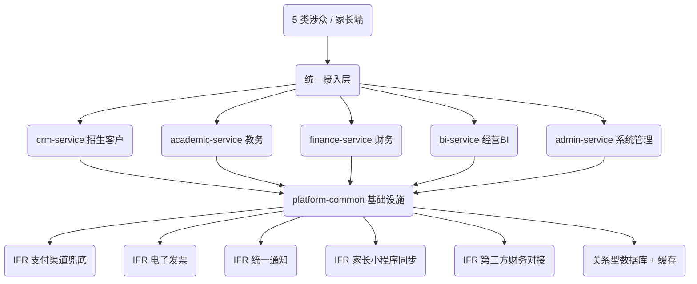

# 需求知识图谱 v1.0 · 正向图谱（设计意图）

> 生成方式：`build_knowledge_graph.py` 确定性解析基线 RTM，无 LLM、可复现。
> 图谱编号：KG-EDU-V1　来源基线：BL-20260623-01　源文件：RTM_BL-20260623-01_需求溯源矩阵.md
> 用途：① 作为 D11 ADR-001 架构选型的量化底座；② 作为 D12 MDS/DTS 模块划分种子；③ 作为 D15 CodeGraph 逆向比对的正向基准。
> 配套机器可读件：[knowledge-graph.json](knowledge-graph.json)。

## 一、图谱规模总览

| 指标 | 数值 |
|---|---|
| 功能需求 FR | 88 |
| 接口需求 IFR | 5 |
| 非功能需求 NFR | 17 |
| 业务组件 Component | 37 |
| 子系统 Subsystem | 6 |
| 接口边界 Interface | 5 |
| 约束 Constraint（NFR+CCB量化） | 25 |
| 基础模块 BaseModule | 10 |
| 节点总数 | 78 |
| 边总数 | 228 |

## 二、子系统 × 组件 × FR 分布

| 子系统 | 开发服务 | 组件数 | FR 数 |
|---|---|---|---|
| 财务管理 | finance-service | 9 | 24 |
| 教务管理 | academic-service | 10 | 21 |
| 经营管理 | bi-service | 7 | 15 |
| 系统管理 | admin-service | 7 | 14 |
| 招生与客户管理 | crm-service | 3 | 13 |
| 综合 | platform-common | 1 | 1 |

## 三、Component 节点清单（业务组件）

| 组件ID | 名称 | 子系统 | 业务目标 | FR数 | 关联建模 |
|---|---|---|---|---|---|
| COMP-CRM | 客户线索与画像 | 招生与客户管理 | BR-EDU-001 | 3 | uc_1_课程顾问 |
| COMP-ORDER | 报名订单与优惠 | 招生与客户管理 | BR-EDU-002 | 5 | act_01_报名优惠算价与审批、uc_1_课程顾问 |
| COMP-TRIAL | 试听名额与候补 | 招生与客户管理 | BR-EDU-001 | 5 | act_02_试听锁定与候补、uc_1_课程顾问 |
| COMP-ATT | 考勤与课时扣减 | 教务管理 | BR-EDU-003 | 5 | act_04_考勤与课时扣减、uc_2_教务老师 |
| COMP-CLS | 班级容量与候补 | 教务管理 | BR-EDU-003 | 2 | uc_2_教务老师 |
| COMP-FIN | 课消与课时费 | 教务管理 | BR-EDU-004 | 3 | uc_2_教务老师 |
| COMP-MAKEUP | 补课额度管理 | 教务管理 | BR-EDU-003 | 1 | uc_2_教务老师 |
| COMP-MCAM | 多校区数据 | 教务管理 | BR-EDU-003 | 1 | uc_2_教务老师 |
| COMP-RSCH | 调课管理 | 教务管理 | BR-EDU-003 | 2 | act_03_排课冲突检测、uc_2_教务老师 |
| COMP-SCH | 排课与冲突检测 | 教务管理 | BR-EDU-003 | 3 | act_03_排课冲突检测、uc_2_教务老师 |
| COMP-TREF | 教务退费 | 教务管理 | BR-EDU-005 | 1 | act_05_退费计算与审批、uc_2_教务老师 |
| COMP-TRF | 转班与费用 | 教务管理 | BR-EDU-005 | 2 | uc_2_教务老师 |
| COMP-TRP | 教务报表 | 教务管理 | BR-EDU-003 | 1 | uc_2_教务老师 |
| COMP-ACC | 权限模板与授权 | 系统管理 | BR-EDU-008 | 2 | uc_5_系统管理员 |
| COMP-AUDIT | 审计日志 | 系统管理 | BR-EDU-008 | 1 | uc_5_系统管理员 |
| COMP-BIZ | 业务规则配置 | 系统管理 | BR-EDU-008 | 3 | uc_5_系统管理员 |
| COMP-DR | 灾备与恢复 | 系统管理 | BR-EDU-008 | 3 | uc_5_系统管理员 |
| COMP-ORG | 组织架构 | 系统管理 | BR-EDU-008 | 2 | uc_5_系统管理员 |
| COMP-PAYIF | 支付接口兜底 | 系统管理 | BR-EDU-008 | 1 | act_06_日终对账、uc_5_系统管理员 |
| COMP-SEC | 安全策略与告警 | 系统管理 | BR-EDU-008 | 2 | uc_5_系统管理员 |
| COMP-APPROVAL | 关键财务审批 | 经营管理 | BR-EDU-007 | 1 | uc_4_校长 |
| COMP-CAMPUS | 分级审批与数据权限 | 经营管理 | BR-EDU-007 | 2 | uc_4_校长 |
| COMP-DASH | 经营看板 | 经营管理 | BR-EDU-007 | 2 | uc_4_校长 |
| COMP-ENROLL | 招生渠道分析 | 经营管理 | BR-EDU-007 | 4 | uc_4_校长 |
| COMP-FMN | 实时课消监控 | 经营管理 | BR-EDU-007 | 1 | uc_4_校长 |
| COMP-MINI | 家长端与小程序 | 经营管理 | BR-EDU-001 | 3 | uc_4_校长 |
| COMP-OPS | 教师效能与满班率 | 经营管理 | BR-EDU-007 | 2 | uc_4_校长 |
| COMP-ALERT | 异常预警中心 | 综合 | BR-EDU-008 | 1 | — |
| COMP-AUD | 财务审计追溯 | 财务管理 | BR-EDU-008 | 1 | uc_3_财务人员 |
| COMP-FEE | 欠费续费催缴 | 财务管理 | BR-EDU-006 | 1 | uc_3_财务人员 |
| COMP-FRP | 经营利润报表 | 财务管理 | BR-EDU-007 | 4 | uc_3_财务人员 |
| COMP-INV | 发票管理 | 财务管理 | BR-EDU-005 | 1 | act_05_退费计算与审批、uc_3_财务人员 |
| COMP-PAY | 收款认领与拆分 | 财务管理 | BR-EDU-006 | 5 | act_06_日终对账、uc_3_财务人员 |
| COMP-PAYROLL | 教师工资核算 | 财务管理 | BR-EDU-004 | 1 | uc_3_财务人员 |
| COMP-RECON | 支付对账 | 财务管理 | BR-EDU-006 | 5 | act_06_日终对账、uc_3_财务人员 |
| COMP-REF | 退费计算与审批 | 财务管理 | BR-EDU-005 | 5 | act_05_退费计算与审批、uc_3_财务人员 |
| COMP-REV | 收入确认 | 财务管理 | BR-EDU-004 | 1 | act_04_考勤与课时扣减、uc_3_财务人员 |

## 四、Interface 节点清单（外部边界）

| 接口ID | 名称 | 边界 | 所属子系统 |
|---|---|---|---|
| IFR-PAY-001 | 支付渠道回调与主动查单兜底 | 外部第三方/系统集成 | 财务管理 |
| IFR-INV-001 | 第三方电子发票平台开票/红冲接口 | 外部第三方/系统集成 | 财务管理 |
| IFR-FIN-001 | 第三方财务系统对接接口 | 外部第三方/系统集成 | 教务管理 |
| IFR-MSG-001 | 统一通知接口 | 外部第三方/系统集成 | 综合 |
| IFR-MINI-001 | 家长小程序数据实时同步接口 | 外部第三方/系统集成 | 经营管理 |

## 五、Constraint 节点清单（质量属性 + CCB 量化约束）

| 约束ID | 名称 | 类别 | 取值/影响 |
|---|---|---|---|
| NFR-PERF-001 | 手机号3秒聚合客户历史画像 | 性能 | 见 SRS §3.3 量化指标 |
| NFR-PERF-002 | 试听名额实时可见 | 性能 | 见 SRS §3.3 量化指标 |
| NFR-SEC-001 | 支付接口及对账操作的审计留痕 | 安全 | 见 SRS §3.3 量化指标 |
| NFR-REL-001 | 全链路操作留痕与不可篡改日志 | 可靠性 | 见 SRS §3.3 量化指标 |
| NFR-REL-002 | 财务数据至少保留三年可查可导 | 可靠性 | 见 SRS §3.3 量化指标 |
| NFR-PERF-003 | 周末数据聚合与数据刷新频率控制 | 性能 | 见 SRS §3.3 量化指标 |
| NFR-REL-003 | 日终自动对账 | 可靠性 | 见 SRS §3.3 量化指标 |
| NFR-SEC-002 | 基于角色的跨校区数据权限控制 | 安全 | 见 SRS §3.3 量化指标 |
| NFR-SEC-003 | 集团级资金安全对账强制统一 | 安全 | 见 SRS §3.3 量化指标 |
| NFR-PERF-004 | 权限模板变更的即时生效 | 性能 | 见 SRS §3.3 量化指标 |
| NFR-REL-004 | 核心数据的实时异地灾备与自动切换 | 可靠性 | 见 SRS §3.3 量化指标 |
| NFR-REL-005 | 周期性恢复演练与自动报告 | 可靠性 | 见 SRS §3.3 量化指标 |
| NFR-SEC-004 | 备份数据的安全管控 | 安全 | 见 SRS §3.3 量化指标 |
| NFR-SEC-005 | 全字段不可篡改的审计日志 | 安全 | 见 SRS §3.3 量化指标 |
| NFR-SEC-006 | 强安全策略执行 | 安全 | 见 SRS §3.3 量化指标 |
| NFR-SEC-007 | 高风险角色的双因素认证 | 安全 | 见 SRS §3.3 量化指标 |
| NFR-SEC-008 | 高危操作实时告警与安全日报 | 安全 | 见 SRS §3.3 量化指标 |
| CON-CCB-001 | 排课/试听占用缓冲 | 业务量化(CCB) | 默认5分钟，可配[1~30] |
| CON-CCB-002 | 赠送课时退费折价系数 | 业务量化(CCB) | 默认1.0，可配[0~1] |
| CON-CCB-003 | 发票自动开票审核阈值 | 业务量化(CCB) | 默认5000元，可配 |
| CON-CCB-004 | 续费提醒参数 | 业务量化(CCB) | 提前7天/间隔3天/最多3次 |
| CON-CCB-005 | 班级请假率预警阈值 | 业务量化(CCB) | 单周20%/单月30% |
| CON-CCB-006 | 核心库灾备 RTO | 业务量化(CCB) | 30分钟切换/零丢失 |
| CON-CCB-007 | 退费分级审批 | 业务量化(CCB) | 三级强制，大额绝不自动通过 |
| CON-CCB-008 | 试听名额并发独占 | 业务量化(CCB) | 锁定独占+15分钟倒计时释放 |

## 六、基础/通用模块（横切关注点，架构选型必纳入）

| 模块ID | 名称 | 类别 |
|---|---|---|
| BASE-GATEWAY | 支付网关 | 通用基础 |
| BASE-INTEGRATION | 第三方对接(短信/电票/小程序) | 通用基础 |
| BASE-CACHE | 缓存 | 通用基础 |
| BASE-SCHED | 定时任务(对账/催缴/灾备演练) | 通用基础 |
| BASE-NOTIFY | 通知中心 | 业务基础 |
| BASE-APPROVAL | 审批流引擎 | 业务基础 |
| BASE-RBAC | 账号权限(RBAC×校区) | 业务基础 |
| BASE-AUDIT | 日志审计 | 业务基础 |
| BASE-ORG | 校区组织隔离 | 业务基础 |
| BASE-CONFIG | 系统参数配置 | 业务基础 |

## 七、子系统级架构拓扑（Mermaid 可视化）

> 组件→FR 的细粒度边见 knowledge-graph.json；此处为子系统/接口/基础设施的可读拓扑。

## 八、五维度架构选型量化输入（供 ADR-001 / ASD）

> 下列五维直接喂入 D11 ADR-001 的架构选型评估，结论锚点全部来自本图谱与基线，不拍脑袋。

| 维度 | 量化画像（来自图谱/基线） |
|---|---|
| 功能复杂度 | 88 FR + 5 IFR 跨 37 业务组件 / 6 子系统，以 CRUD+审批+对账类事务为主，非算法密集 |
| 并发性能 | 约 100 并发、约 500 用户；关键路径 报名/缴费/查名额 ≤3s（试听 P99≤3s，目标≤1s）；无超高并发/秒杀级诉求 |
| 可扩展性 | 多校区数据隔离+汇总、规则可配置化（CCB 8 项量化约束多为可配），水平扩展诉求中等 |
| 团队规模 | 1 人全量执行（AI 辅助），无多团队并行开发诉求 |
| 运维能力 | 阿里云单体部署（实训本机等效）；灾备 RTO 30min / RPO≈5min；无独立 SRE/复杂分布式运维条件 |

**系统容量基线**：用户规模 约 500 用户；并发 约 100 并发；关键响应 报名/缴费/查名额 ≤3s（试听 P99≤3s，目标≤1s）；可用性目标 灾备 RTO 30min / RPO≈5min；部署 阿里云单体部署（实训本机等效）。

> 结论预判（详见 ADR-001）：功能复杂度中等且以事务型 CRUD+审批+对账为主、并发与运维诉求中等、单人开发——**四层分层架构（Controller→Service→Repository→Model）** 在 AI 代码生成适配性、落地成本、可校验性上最优；DDD（过度设计）与轻量微服务（运维成本不匹配）淘汰。
