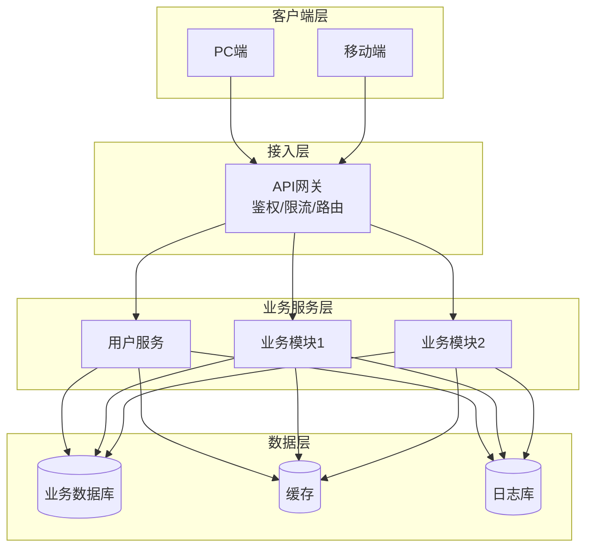
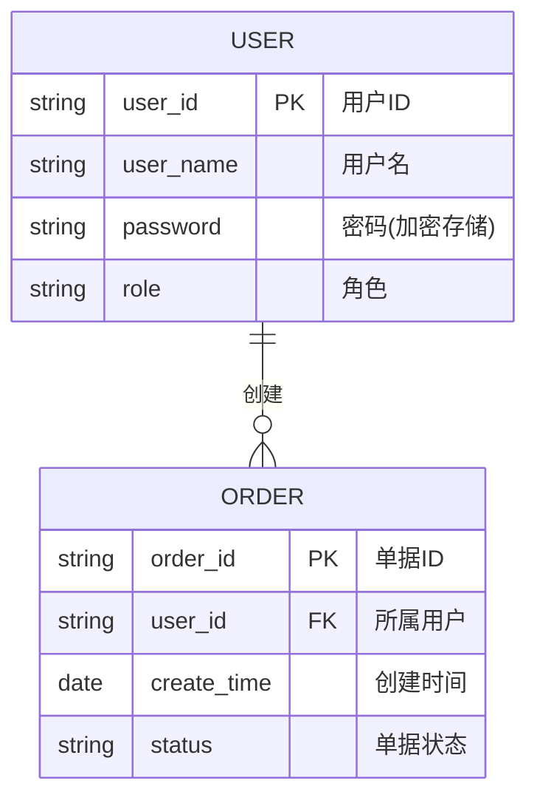
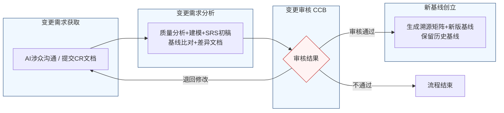

# 软件需求规格说明书（SRS）标准模板
**遵循标准**：GB/T 9385-2008、IEEE 830
**适用场景**：软件项目正式交付、基线管理、需求变更管控
> 说明：全文预留可填充位，图表区域附标准 Mermaid 代码，可直接在 Obsidian/在线编辑器渲染；需求条目统一编号、可追溯、可验证。

---

## 文档头部信息
| 项目项 | 内容 |
| ---- | ---- |
| 文档名称 | 软件需求规格说明书（SRS） |
| 项目名称 | 【填写项目全称】 |
| 项目编号 | 【填写项目编号】 |
| 文档版本 | Vx.y.z |
| 基线版本 | BL-YYYYMMDD-NN |
| 编制人 |  |
| 编制日期 | YYYY-MM-DD |
| 审核人 |  |
| 批准人 |  |
| 密级 | 公开 / 内部 / 机密 |

### 修订历史记录
| 版本号 | 修订日期 | 修订人 | 修订类型 | 修订内容简述 | 审批人 |
| ---- | ---- | ---- | ---- | ---- | ---- |
| V1.0.0 |  |  | 新建 | 文档初稿，确立初始需求基线 |  |
|  |  |  | 变更 | 【填写变更内容】 |  |

---

# 1 引言
## 1.1 编制目的
本文档定义 **【项目名称】** 的全部功能需求、非功能需求、接口需求、数据需求与约束条件。
本文档作为**系统设计、编码开发、单元/集成/系统测试、验收交付、运维、需求变更**的唯一依据，供项目经理、开发团队、测试团队、运维人员、客户及相关涉众使用。

## 1.2 文档范围
### 1.2.1 包含范围
1. 系统整体业务逻辑、全部功能模块与操作流程；
2. 系统用户角色、权限体系、正常/异常业务场景；
3. 内外接口定义、数据结构、数据流转规则；
4. 性能、可靠性、安全性、易用性等非功能指标；
5. 运行环境、设计约束、假设与依赖；
6. 需求基线规则、需求变更管理流程。

### 1.2.2 排除范围
1. 硬件设备底层驱动、第三方开源组件内部实现逻辑；
2. 代码具体实现方案、架构底层技术细节（仅描述“做什么”，不描述“怎么做”）；
3. 独立配套工具、外接第三方系统的自有需求。

## 1.3 引用文件
1. GB/T 9385-2008 计算机软件需求规格说明规范
2. IEEE 830 软件需求规格说明书标准
3. 【填写】用户需求调研报告（URD）
4. 【填写】相关业务规范、行业法规、等保要求
5. 【填写】对接系统接口文档、历史基线文档

## 1.4 术语、缩略语与定义
| 术语/缩略语 | 全称 | 定义说明 |
| ---- | ---- | ---- |
| SRS | Software Requirements Specification | 软件需求规格说明书 |
| CCB | Change Control Board | 变更控制委员会，负责需求变更评审 |
| CR | Change Request | 变更需求文档 |
| 需求基线 | - | 经CCB审批冻结、正式生效的SRS版本 |
| FR | Functional Requirement | 功能需求 |
| NFR | Non-Functional Requirement | 非功能需求 |
| 【自行补充】 |  |  |

## 1.5 业务背景概述
1. **业务背景**：【描述行业现状、项目立项原因、现存痛点、建设目标】
2. **业务目标**：【量化描述，例：提升业务处理效率30%、降低人工差错率至0.1%】
3. **目标使用群体**：整体用户画像、使用场景、使用频次。

---

# 2 总体描述
## 2.1 产品概述
简述系统定位、核心价值、整体架构思想，附系统整体架构图。

### 系统架构图（Mermaid 可直接渲染）


## 2.2 运行环境要求
### 2.2.1 硬件环境
- 服务器配置：CPU / 内存 / 硬盘 / 网络带宽
- 客户端配置：最低硬件要求

### 2.2.2 软件环境
- 操作系统：【Windows Server / CentOS / 国产操作系统】
- 中间件：【Web容器、消息队列、缓存等】
- 数据库：【MySQL / PostgreSQL / 国产数据库 版本号】
- 浏览器兼容：Chrome、Edge、Firefox 主流版本

## 2.3 用户角色与特征
| 角色名称 | 职责描述 | 操作权限 | 使用频次 | 技能要求 |
| ---- | ---- | ---- | ---- | ---- |
| 系统管理员 | 账号管理、权限配置、系统运维、日志查看 | 全功能权限 | 每日 | 具备基础系统运维能力 |
| 普通业务用户 | 日常业务操作、数据查询、单据提交 | 业务操作权限 | 每日 | 基础电脑操作 |
| 【新增角色】 |  |  |  |  |

## 2.4 系统运行模式
1. **正常运行模式**：全功能开放，正常受理业务请求；
2. **异常模式**：网络中断、服务过载、数据异常时的降级/容错策略；
3. **维护模式**：系统升级、数据维护时，限制普通用户访问。

## 2.5 设计与实现约束
1. **技术约束**：【指定开发语言、框架、技术栈、版本】
2. **合规约束**：【等保、数据安全、行业监管要求】
3. **接口约束**：必须兼容现有对接系统协议、数据格式；
4. **工期/资源约束**：【项目周期、服务器资源上限】

## 2.6 假设与依赖
### 2.6.1 前提假设
1. 所有操作人员具备对应岗位基础操作能力；
2. 对接的外部第三方系统接口长期稳定可用；
3. 网络环境满足最低带宽、连通性要求。

### 2.6.2 外部依赖
1. 依赖外部系统：【系统名称、用途】
2. 依赖第三方组件/服务：【组件名称、版本】

---

# 3 具体需求（核心章节）
## 3.1 功能需求（FR）
> 编号规则：FR-模块编码-流水号；优先级：P0(必实现) / P1(重要) / P2(次要)
### 3.1.1 模块一：用户管理
**FR-USER-001 用户登录**
- 优先级：P0
- 参与角色：普通业务用户、系统管理员
- 前置条件：客户端正常联网、系统服务正常运行
- 触发方式：用户点击【登录】按钮
- 业务流程：
  1. 用户输入账号、密码；
  2. 系统校验账号合法性、密码正确性；
  3. 校验通过，生成身份令牌并跳转首页；
  4. 校验失败，弹出对应错误提示。
- 业务规则：密码长度≥8位，连续输错5次锁定账号15分钟
- 后置状态：登录成功→进入系统主页；登录失败→停留在登录页
- 验收标准：登录响应时间≤1s，错误提示语义清晰，账号锁定规则生效

### 3.1.2 模块二：【自行扩展模块】
沿用以上格式逐条编写。

### 系统用例图（plantUML）
```plantUML
@startuml
' 样式优化，适配文档展示
skinparam actor {
  BackgroundColor #f0f8ff
  BorderColor #2c5282
}
skinparam usecase {
  BackgroundColor #f7f9fc
  BorderColor #4a5568
}

' 定义角色
actor 系统管理员 as Admin
actor 普通业务用户 as User

' 定义用例
(用户登录) as UC01
(业务单据提交) as UC02
(账号管理) as UC03
(权限配置) as UC04
(日志查询) as UC05

' 关联关系
User --> UC01
User --> UC02
Admin --> UC03
Admin --> UC04
Admin --> UC05

@enduml
```

## 3.2 外部接口需求（IFR）
> 编号规则：IFR-接口类型-流水号
### 3.2.1 内部接口（模块间调用）
### 3.2.2 外部系统接口
**IFR-API-001 外部数据同步接口**
- 对接系统：【外部系统名称】
- 协议：HTTPS
- 请求方式：POST
- 数据格式：JSON
- 调用方向：本系统 → 外部系统
- 核心字段：【字段名、类型、长度、必填项】
- 响应要求：95%请求响应≤200ms
- 安全策略：接口签名 + 数据传输加密
- 异常处理：超时自动重试2次，重试失败记录错误日志

## 3.3 非功能需求（NFR）
### 3.3.1 性能需求
1. 页面加载：95%页面首次加载 ≤ 2s；
2. 接口响应：99%业务接口响应 ≤ 500ms；
3. 并发能力：支持 **1000** 在线用户，峰值并发 **500** 请求；
4. 吞吐量：系统TPS ≥ 100 笔/秒。

### 3.3.2 可靠性需求
1. 系统可用率：年可用率 ≥ 99.9%；
2. 连续运行：无人工干预下连续稳定运行30天以上；
3. 故障恢复：服务异常后，恢复时间 MTTR ≤ 30分钟；
4. 数据容错：服务宕机/网络中断不丢失已持久化数据。

### 3.3.3 安全性需求
1. 身份认证：账号密码认证 + 会话超时自动登出；
2. 权限控制：基于RBAC角色权限模型，实现功能/数据权限隔离；
3. 数据安全：传输全程HTTPS，敏感数据存储加密、前端脱敏展示；
4. 攻击防护：防SQL注入、XSS、CSRF、接口防暴力破解；
5. 操作审计：所有关键操作留日志，日志保留时长 ≥ 6个月。

### 3.3.4 可维护性需求
1. 系统参数支持页面可视化配置，无需修改代码；
2. 模块低耦合、高内聚，单一职责；
3. 全链路日志完整，支持问题快速定位；
4. 配套部署、运维、故障排查文档齐全。

### 3.3.5 可扩展性需求
1. 应用层支持水平扩容，多实例集群部署；
2. 新增业务模块不影响现有功能运行；
3. 接口向下兼容，新旧版本接口可并行运行。

### 3.3.6 易用性需求
1. 核心业务操作步骤 ≤ 3步；
2. 错误提示、操作引导语义通俗、无专业壁垒；
3. 界面布局统一，符合常规操作习惯。

## 3.4 数据需求
### 3.4.1 实体关系图（E-R图 Mermaid）


### 3.4.2 数据字典
逐条定义数据表、字段、类型、主键/外键、默认值、说明。

### 3.4.3 数据管理策略
1. 数据备份：每日全量自动备份，保留最近30天备份文件；
2. 数据归档：历史业务数据满1年自动归档；
3. 数据留存：核心业务数据永久留存，操作日志留存≥6个月。

---

# 4 需求基线与变更管理
## 4.1 需求基线定义
1. 基线版本格式：`BL-YYYYMMDD-NN`（YYYYMMDD=日期，NN=当日流水号）；
2. 初始基线：经CCB审批通过、正式发布的第一版SRS；
3. 基线冻结：基线发布后，禁止无流程私自修改需求。

## 4.2 需求变更整体流程


## 4.3 变更详细流程（四阶段）
### 4.3.1 阶段一：变更需求获取
两种获取途径：
1. 涉众AI智能体与业务涉众沟通收集变更诉求；
2. 需求提出方直接提交正式 **CR变更需求文档**。

### 4.3.2 阶段二：变更需求分析（4个子阶段）
1. 子阶段1 需求质量分析：校验变更需求合理性、完整性、无歧义；
2. 子阶段2 项目建模：更新UML用例图、活动图等；
3. 子阶段3 SRS初稿生成：整合内容输出变更版SRS初稿；
4. 子阶段4 基线比对（基线智能体）：读取历史基线，生成**需求差异文档**（新增/修改/删除/未变更需求），优化新版SRS。

### 4.3.3 阶段三：变更审核（CCB评审）
1. 审核不通过：变更请求关闭，流程终止；
2. 审核退回修改：返回【变更需求获取】阶段重新梳理；
3. 审核通过：进入新基线创立环节。

### 4.3.4 阶段四：新基线创立
1. 生成**需求溯源矩阵**，建立变更前后条目映射关系；
2. 将审核通过的SRS定为新版正式基线；
3. 沿用版本规则生成新基线编号；
4. 历史基线文档完整归档、不覆盖、不删除。

## 4.4 变更记录台账
| 变更编号 | 变更日期 | 申请人 | 变更来源(AI/CR) | 变更简述 | 影响模块 | CCB结论 | 新版基线号 |
| ---- | ---- | ---- | ---- | ---- | ---- | ---- | ---- |
|  |  |  |  |  |  |  |  |

---

# 5 附录
## 附录A 全量图表汇总
集中存放架构图、用例图、E-R图、流程图（Mermaid代码+渲染图）。

## 附录B 验收标准总表
| 需求编号 | 需求名称 | 验收标准 | 优先级 |
| ---- | ---- | ---- | ---- |
|  |  |  |  |

## 附录C 参考资料与外部文档链接

---

# 使用说明
1. 本模板所有 Mermaid 代码块可直接复制到 `mermaid.live`、Obsidian、语雀、飞书文档渲染；
2. 需求条目严格遵循 **可验证、无歧义、可追溯** 原则，禁止“大概、尽量、快速”等模糊描述；
3. 每次需求变更必须更新「修订历史」「变更台账」并生成新版基线；
4. 基线版本、文档版本分开管理，历史版本全部归档留存。